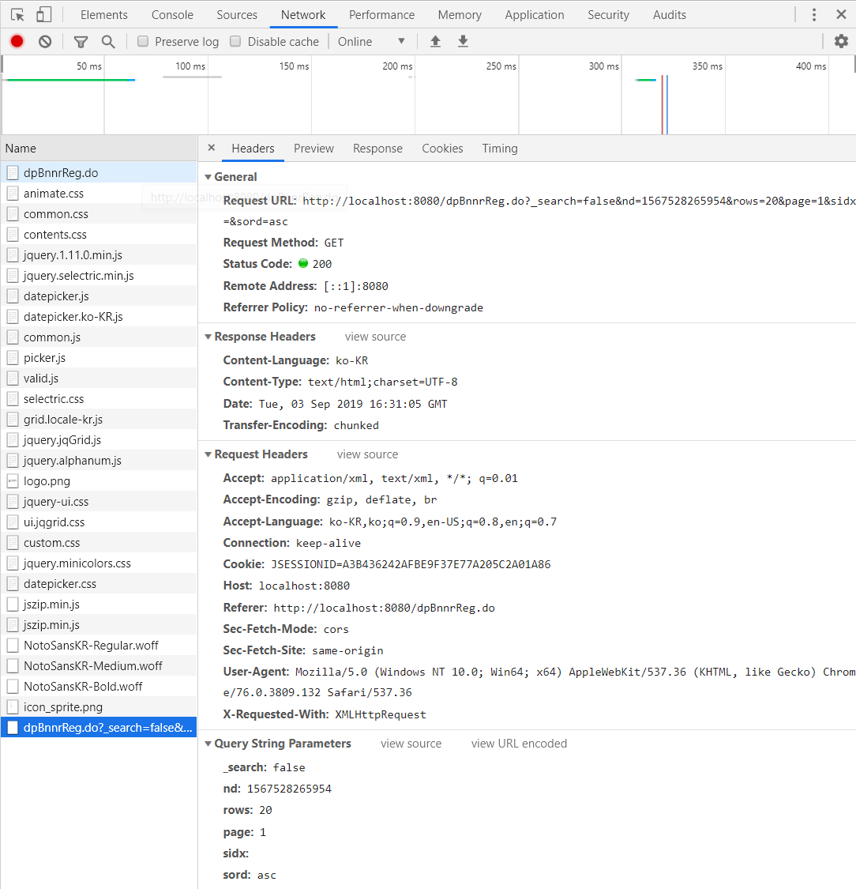
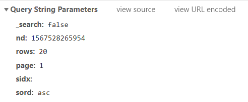

# Javascript JqGrid

List
* [JqGrid 생성](#jqgrid-init)
*


## Init

| Property	| Type	| Description	Default|
|:---|:---|:---|
| cellEdit | boolean | Enables (disables) cell editing. When this option is set to true, onSelectRow event can not be used, and hovering is disabled (when mouseover on the rows).	false |
| cellsubmit | string |	Determines where the contents of the cell are saved - can have two values: 'remote' or 'clientArray'. If remote the content of the cell if anything is changed is immediately saved to the server using the cellurl property, via ajax. The rowid and the cell content are added to the url by default. If you have the “mtype” setting set to post, the key value pears will be send as post variables. For example, if we save the cell named mycell,{id: rowid, mycell: cellvalue} is added to the url. If cellsubmit is 'clientArray', no ajax request is made and the content of the changed cell can be obtained via the method getChangedCells or thru a event.	remote |
| cellurl |	string |	the url where the cell is to be saved. You need to set this only when you use cellsubmit as 'remote'.	null |
| ajaxCellOptions |	object |	This option allow to set global ajax settings for the cell editiing when we save the data to the server. Note that with this option is possible to overwrite all current ajax setting in the save request including the complete event.	empty object |


cellsubmit은 두 가지 속성 'remote'와 'clientArray'가 있는데 remote는 저장하는 순간 cellurl로 ajax를 타고 간다. cellurl속성도 밑에 있다. 일반 ajax와 타는 방식은 같다. 하지만 clientArray로 속성을 주게 되면 ajax를 타지 않고 어떤 다른 이벤트 (클릭해서 저장같은) 를 통해서 데이터를 처리해줘야한다. 즉, 바로 ajax태우지 않을 것이라는 것이다.

## Jqgrid Init

```javascript
$("#dpBnnrDtl").jqGrid({

    url    	 	: "<c:url value='/bnnrDtlList.do'/>",
    colModel 	: [
        {label 	: "배너관리번호",  name : "bnnrMngNo",   width : 60,  align : "center",   hidden : true},
        {label  : "배너내용",      name : "bnnrText",    width : 150, align : "left"},
        {label  : "배너이미지",    name : "imgAttcFile", width : 200, align : "left"},
        {label  : "URL",          name : "cnntUrl",     width : 130, align : "center"},
        {label  : "노출순서",      name : "sortSeq",     width : 50,  align : "center"}, // formatter
        {label  : "구분",	  name : "btn",         width : 50,  align : "center", formatter : gubunBtn} // 사용자 호출 콜백함수 gubunBtn() 추가
    ],
    autowidth	: true,
    cellEdit	: true,          // ajax를 타지 않고 어떤 다른 이벤트 (클릭해서 저장같은) 를 통해서 데이터를 처리해줘야한다. 즉, 바로 ajax태우지 않을 것이라는 것이다.
    cellsubmit	: "clientArray", // default : "remote" // jqGrid 테이블을 변경할 때매다, Ajax를 실행하려는 기본 설정을, 변경될 때마다, 배열에 저장하도록 설정
    datatype	: "local",

    // [args] rowid: 선택한row Id, icol: 선택한 행 번호, cellVal: 선택한 행의 값, e: event
    onCellSelect: function(rowid, colIndex) {
    }
});
```

> 주요 속성

* datatype : Grid
* onCellSelect : jquery의 Click Event Handler와 같은역활을 하는 이벤트로, Grid를 클릭할때 마다 발생하는 이벤트 핸들러


# Event

## jqGrid Ajax Event Setting

## setGridParam()
$Target.setGridParam().trigger("reloadGrid"): ajax를 태워 데이터를 가져오고, 가져온 데이터를 테이블에 삽입하고 리로드 하는 기능

```java
$("#jqGrid").setGridParam({

  datatype    : "json",

  loadComplete  : function(data) {

    console.log("data : ", data);
  }

}).trigger("reloadGrid");
```

## getGridParam()
jqGrid 타켓의 속성을 가져오는 메서드

* colModel 속성 가져오기
```java
// 타켓의 jqGrid의  colModel 속성을 가져오는 메소드(속성이 배열임으로 배열 리턴)
var colModelArr	= $dpBnnrDtl.getGridParam("colModel");
```

## jqGrid()
* 테이블의 rowId를 가져오기
```java
// 타켓의 jqGrid의 rowId 전부를 배열로 리턴해주는 메소드
// 배열 리턴
var idsArr		= $dpBnnrDtl.jqGrid("getDataIDs");
```


## addRowData()

* 테이블에 row 추가하기
```java
// 테이블에 row 한줄 추가 // 테이블의 row의 갯수에 수를 더해 유니크한 row 생성
// Args1: 테이블에 유니크한 Row의 ID, Args2: 로우에 들어갈 데이터 값
$dpBnnrDtl.addRowData(rowID, rowData);
```

## delRowData()

* 테이블의 row 삭제하기
```java
    // 유니크한 row ID
	$("#dpBnnrDtl").delRowData(rowId);
```

## getRowData()

그리드의 모든 데이터를 배열로 리턴해주는 메서드

```javascript

var gridRowData = $("#dpBnnrDtl").getRowData();

var idsArr =  $("#dpBnnrDtl").jqGrid("getDataIDs")
```


# jqgird 가 쿼리스트링으로 이동할 때 간단한 설정 확인 방법

크롬 F12 개발 관리자 도구 -> Network -> 쿼리스트링으로 이동한 페이지 -> Header



디테일하게



이 설정들 중에 중요하게 확인해야 할 것은

* rows : 20
    * 그리드의 최대 보여지는 로우의 수 설정
* page : 1
    * 그리드의 현재 페이지
* sord : asc
    * 정렬 순서가 오름차순으로 정렬
