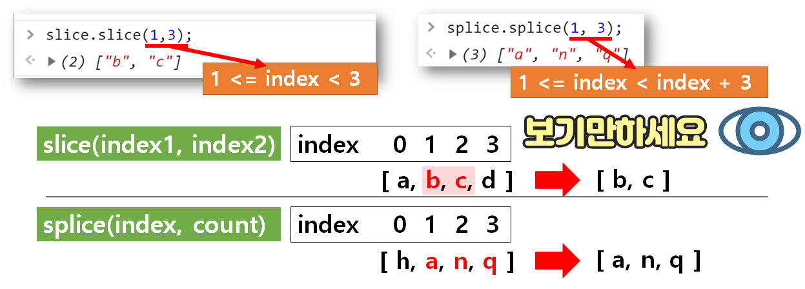

# Array

## 배열의 값을 추출하는 메서드 2가지 slice vs splice

```javascript

    var sliceArr = ["A", "B", "C", "D", "E"];
    var spliceArr1 = ["A", "B", "C", "D", "E"];
    var spliceArr2 = ["A", "B", "C", "D", "E"];

    sliceArr.slice(3)    // ["D", "E"]
    sliceArr.selice(0, 3) // ["A", "B", "C"]

     spliceArr.length // 5
     spliceArr //  ["A", "B", "C", "D", "E"];

     spliceArr1.splice(1, 3) // ["B", "C", "D"]
     spliceArr2.splice(3,1) //["D"]

     spliceArr1.length // 2
     spliceArr2.length //4

     spliceArr1 // ["A", "E"]
     spliceArr2 // ["A", "B", "C", "E"]
```



* slice(index1, index2)
    + 원하는 배열의 값을 추출하는 메서드
    + Args: 배열의 주소 or 배열 주소의 범위
    + 배열은 변하지 않는다. 배열에서 원하는 값을 추출할 때 사용한다.
* splice(index, count)
    + 원하는 배열의 값을 추출하는 메서드
    + Args: 배열의 주소 or 배열 주소의 범위
    + 결과물이 실제 배열에서 빠진다. 즉 원하는 내용을 배열에서 삭제할 수 있다.
