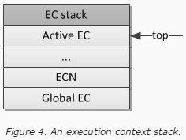
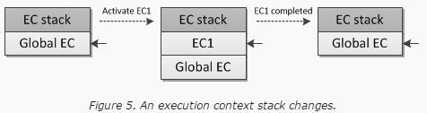

# JavaScript
Categoris

* [JavaScript](#javascript)
* [Javascript Data Type](#javascript-data-type)
* [Javascript Basic Method](#basic-method)
* [Dom](#dom)
* [Javascript Variable](#javascript-variable)

# JavaScript

좋은 정보

https://30secondsofcode.org/index


* 웹 브라우저에 내장되어 있는 스트립트 언어
* 객체지향 프로그래밍
* 인터 프리터 방식 프로그램 <-> 컴파일러 방식
  + 컴파일러 방식(컴파일 타임과 런타임을 구분) : 소스코드를 컴파일해 머신코드로 변환하는 컴파일 타임과 컴파일 된 결과인 머신코드를 실행하는 결과 시간인 런타임이 구분
  + 인터프리터 방식(컴파일 타임과 런타임을 동시) : 소스코드를 컴파일해 머신코드로 변환하는 컴파일 타임과 컴파일 된 결과인 머신코드를 실행하는 결과 시간인 런타임이 동시 실행
* 1994년 Brenden Eich가 개발
* 모든 웹 브라우저에 내장된 클라이언트 측 스트립트 언어
* 2005년 초 Ajax 기술의 보급
* 2008년 부터 웹 브라우저 간의 자바스크립트 엔진 성능 경쟁
* 서버 측에서의 자바스크립트 프로그래밍
* 2009년 Ryan Dahl이 Node.js 개발
* HTML 5의 중심에 놓여 웹 표준으로 위상
* 모바일 환경에서 응용 범위를 세움
* 2007년 아이폰 등장과 함께 시작된 스마트폰 열풍
* 엄청난 모바일 웹 시장 성장
* 스마트 폰 플랫폼의 다양성이 문제의 발단
  - 개발 비용의 증가, 유지보수 비용 증가
* 모바일 웹 브라우저의 신속한 HTML5 지원(모바일웹앱)
* jQuery Mobile, Sench Touch와 같은 모바일 웹앱 개발 프레임워크 등
  - 모바일 웹앱: 단점
* 하이브리드 모바일 앱 프레임워크
* 모바일 시대의 앱 개발에 있어 자바스크립트의 위상과 중요성이 날로 높아짐


## 통합 개발 환경

* Eclipse
* Bisual Studio
* aptana Studio
    + 멀티플랫폼 통합개발환경 Eclipse 기반으로 한 오픈소스 자바스크립트 편집기

## JavaScript 사용 2가지 방식

JavaScript를 사용하기 위해서는 2가지 방법을 기술할 수 있다.

1. 인라인 스크립트 방식
2. 외부 스크립트 방식

### 인라인 스크립트 방식
HTML DOM 에서 script 태그를 사용하여 자바스크립트 코드를 직접 작성

### 외부 스크립트 방식
자바스크립트 코드를 외부 파일(* .js) 확장자에 작성하고, 작성된 js 파일을 Include 하는 방법

외부 스크립트와 인라인 스크립트는 동시에 작성 불가(인라인 스크립트의 내용은 무시된다.)


# JavaScript Data Type

자바스크립트의 DATA Type은 총 7개가 있으며 아래와 같다.

1. Boolean
2. Null
3. Undefined
4. Number
5. String
6. Symbol (ES6 에서 추가)
7. Object
> 위 리스트에서 6번까지는 primitive type 이며  Object 는 primitive가 아니다.  여기서 각 type별로 선언하는 여러가지 방법이 있지만 Object는 아래와 같이 주로 선언한다.


## 자바스크립트 변수

변수 : 프로그램이 어떤 값을 메모리에 저장해 두고 다시 사용하기 위한 공간

var 키워드 : 자바스크립트는 값을 저장하기 위한 공간을 확보하기 위해 var 키워드를 사용해서 변수 선언
```JavaScript
  var name [=초기값];
```
__변수 선언 시 초기값을 지정하기 않을 경우(할당하기 전까지), 값을 저장할 때까지 해당 변수는 undefined 상태로 유지__

* 변수의 범위
* 호이스팅

자바스크립트의 변수범위와 호이스팅이 작동하는 원리를 이해하는것은 필수적입니다.
이 두가지 컨셉은 직관적이면서도 이해하기가 쉽지 않습니다.
거기에는 미묘한 차이가 있으며, 자바스크립트 프로젝트에서 성공하기 위해서는 반드시 이해해야 합니다.\

즉 자바스크립트에서 변수는 선언하는 위치를 반드시 신경을 써줘야 합니다. 그 변수의 위치에 따라 변수가 의미하는 바가 달라지기때문입니다.


### 변수 범위 (Variable Scope)
변수 범위는 변수가 존재하는 컨텍스트입니다.
이것은 어디에서 변수에 접근할 수 있는지, 그 컨텍스트에서 변수에 접근할 수 있는지를 명시적으로 나타납니다.

변수는 지역 범위(local scope)와 전역 범위(global scope) 둘 중 하나를 가집니다.

즉, 코드의 어떤 부분에서든 접근하게 해줄것이냐 아니면 필요한 부분에서만 사용할것인지를 결정하는 부분입니다.
프로그램 상에서 변수의 활용범위는 전역변수 > 지역변수 이지만 변수의 영향력은 전역변수 < 지역변수 입니다. 전역변수보다 지역변수가 우선순위를 가지게 됩니다.

보통은 전역변수를 만들때는 함수내부가 아닌 전역에서 var를 통한 변수를 선언하여 전역변수를 정의 하지만, 대부분 프로그래머의 실수로 인해 var 를 사용하지 않고 그냥 변수를 선언해 변수가 전역화가 되는 경우도 있습니다.
var를 사용하지 않고 선언한 변수가 왜 전역변수가 되는지는 아래의 변수 생성과정을 통해 더욱 자세히 설명하겠습니다.

```JavaScript
var globalValue = “i’m global”;
function func(){
    globalValueTwo = “i’m global. too”;
}
```

변수의 선언에 있어서 유념해야 하는 부분은 '변수의 선언 = 메모리' 라는 개념입니다. 그냥 전역변수를 무분별하게 선언하고 사용하면 결국 메모리 누수가 발생하게 되어 어플리케이션의 성능에 문제가 될수 있습니다.

물론 브라우저들의 성능이 무척이나 좋아지고 브라우저가 스스로 쓰지 않는 변수들을 이래저래 잘 정리를 해주지만 그래도 쓸데없는 변수의 선언은 피하는것이 좋습니다.

그리고 무엇보다 중요한 부분은 전역번수를 함수를 여기저기서 접근하다 보면 의도치 않게 값이 변경이 되어 원하는 결과를 얻지 못하는 경우가 있습니다.

항상 전역스코프는 깔끔하게 유지해두는것이 좋습니다.
이런 문제를 해결하기 위해서 ES6부터는 const, let등 추가적으로 변수를 선언하는 방법들이 소개되고 있지만 아무튼 전역변수의 사용은 항상 조심해야 하는 부분입니다.

### 지역 변수 (함수 수준 범위)
대부분의 프로그래밍 언어와 달리, 자바스크립트는 블럭-수준(block-level)의 범위를 가지고 있지 않습니다.
대신, 자바스크립트는 함수-수준(function-level)의 범위를 가집니다.

변수가 전역과 지역이라는 특정범위에서 유효한 영향 가진다는 것을 알게 되었습니다. 변수의 유효한 범위를 스코프라고 합니다.

스코프의 핵심은 함수단위의 유효범위 입니다.

이 한가지 사실이 모든 것을 설명합니다. 즉, 해당 함수에 정의된 함수는 해당 함수내에서만 유효한 값을 행사한다는 의미입니다.

```JavaScript
function callYOU(){
     var myname = “james”;
     callAdam();
}

function callAdam(){
     return myname;
}
callYOU();
```

어떤 결과가 리턴이 될까요? james 라는 결과를 예상할수 있지만 이 경우에는 에러가 발생합니다.

우리가 기대할때는 callAdam을 호출하는 시점에 분명 myname변수가 함수내에 선언이 되어있고 그 다음에 호출하는 callAdam이 myname 변수에 접근을 할수 있을 것이라고 기대를 합니다.
그러나 에러가 발생합니다.
이유는 변수는 함수가 호출하는 시점이 아닌 **함수가 정의 되는 시점** 에 생성이 되기 때문입니다. callAdam이 정의 되는 시점에 myname이라는 변수는 callYOU 함수 안에서만 존재합니다. 당연히 지역변수입니다. 즉, 외부 함수에서는 접근이 안된다는 말입니다.

지금 당장 함수의 정의 시점에 따라 접근가능한 변수가 달라진다는 말에 의아해하실수도 있는데 앞으로 다룰 실행컨택스트의 변수객체와 this의 개념을 이해하시면 자연스럽게 이해가 되실내용입니다. 지금은 유효범위는 함수단위로 정해진다라고만 이해하시고 넘어가겠습니다.

함수내에 정의된 변수는 지역 범위를 가지며, 해당 함수와 내부 함수에서만 접근이 가능합니다.
내부 함수에서 외부 함수의 변수 접근에 관한 더 자세한 내용은 클로저(Closure)를 설명한 글을 참조하시기 바랍니다.

## 실행 컨택스트

자바스크립트에서의 코드는 크게 세가지로 분류가 됩니다. global 코드, function 코드, eval 코드. 그리고 이 모든 코드는 실행컨택스트에 들어와 실행이 됩니다. 즉 자바스크립트에서 실행되는 모든 것들을 관리하는 부분이 바로 실행컨택스트부분입니다.

글로벌 컨택스트의 경우에는 오직 하나만 존재하는 반면에 function, eval 컨택스트는 하나의 프로그램 내에서 여러개가 존재할수 있습니다.

만약에 함수가 하나 호출이 되면 실행의 흐름이 함수 컨택스트로 들어가게되고 eval이 실행이 되면 이도 eval 컨택스트로 들어가서 실행이 되게 됩니다. 기본적으로 하나의 함수는 무한대의 컨택트스를 생성합니다. 아래의 예를 보겠습니다.

```javascript
function foo(bar){}
foo(10)
foo(20)
foo(30)
```

함수가 각기 다른 인자를 가지고 세번 호출이 되었습니다. 이경우에는 서로다른 실행컨택스트가 생성이 됩니다.  즉 동일한 함수의 실행이라도 이미 존재하는 컨택스트를 재활용하는 것이 아닌 새로운 컨택스트를 계속 생성하게 됩니다.

그럼 실행 컨택스트의 내부가 어떤 식으로 동작을 하는지 알아 보겠습니다.
실행컨택스트는 실행컨택스트의 스택이라는 영역에 저장이 됩니다. 실행컨택스트의 스택은 나중에 들어온 컨택스트가 스택의 최상단에 위치하게 됩니다. 즉 현재 실행이 되고 있는 컨택스트를 의미하고 이를 callee라고 부릅니다. 실행 컨택스트 내에서 다른 컨택스트를 실행시키기 위해서 필요한게 caller이고 caller를 통해 다른 컨택스트를 실행하게 됩니다.

예를들면 다음과 같습니다.

caller가 어떠한 context를 실행하게 되면 기존에 caller가 동작시키고 있던 실행의 흐름이 새롭게 동작하는 context, 즉 callee로 변경이 됩니다. 이때 callee는 실행컨택스트의 최상단에 위치하게 되고 Active Context라는 이름을 가지게 됩니다.
그리고 이 callee, 즉 active context의 동작이 끝이 나면 실행흐름을 다시 caller에게 전달하여 다른 context쪽으로 실행의 흐름을 변경하는 작업이 반복되게 됩니다. 그리고 동작을 마친 예전callee는 간단하게 return을 하거나 exception과 함께 exit을 하게 됩니다.




프로그램이 일단 실행이 되면 모두 글로벌 실행 컨택스트(global exceution context)로 들어오게 됩니다.
그리고 이 글로벌 컨택스트는 실행 컨택스트 스택의 제일 아래에 존재하며 이는 최초로 생성된 컨택스트를 의미하기도 합니다.

그후에 글로벌 코드들이 몇몇 초기화 작업을 진행하며 필요한 객체나 함수들을 생성을 합니다. 이렇게 글로벌 컨택스트가 실행이되는 동안 새로운 함수들이 생성이되고 실행이 되면서 스택내로 들어와 글로벌 컨택스트 위로 차곡차곡 쌓이게 됩니다.

일단 초기화가 끝이 나면 runtime 시스템은 사용자의 클릭이나 글로벌하게 발생하는 함수 실행같은 이벤트가 발생하기를 기다립니다.
그리고 이벤트가 발생이 하게 되면서 실행컨택스트 내의 컨택스트들이 하나하나동작을 하게 됩니다.

위와 같은 일련의 과정을 그림으로 나타내면 아래와 같습니다.



이와 같은 형태가 EXMAScript, 즉 우리가 사용하는 자바스크립트에서 코드의 실행을 관리하는 형태입니다.

출처: https://yubylab.tistory.com/entry/자바스크립트-변수로-자바스크립트-이해하기#recentComments [Yuby's Lab.]


변수를 선언할 때 var를 사용하지 않아도 가능하지만
__변수의 범위(Scope) 때문에 자바스크립트에서 변수를 선언 할때는 var를 사용하는 것을 권장한다__

## Javascript Convention

1. 첫번째 문자는 [A-Za-z_$] 만 사용한다.
2. 나머지 문자는 [A-Za-z_$0-9] 만 사용한다.
3. 자바스크립트 예약어는 사용할 수 없다.

## 값에 의한 데이터 타입 결정

자바스크립트는 지정되는 값에 따라 변수의 데이터 타입이 변한다.

```JavaScript

var k = 10;       // 정수형 데이터 저장(정수형 데이터 타입)
var l = "문자열"; // 문자열 데이터 저장(문자열 데이터 타입)
l = 12            // 문자열 변수에 정수를 넣을 경우 데이터 타입이 변경되 변수 l은  정수형 데이터 타입으로 변한다.
```

## 값을 저장하는 기본형 데이터 타입
자바스크립트에서 기본적으로 저장하는 값은 크게 3가지와 예외적인 2가지가 있다.

<center>Data Type</center> |  <center> Explanation </center> |
|:--------|:--------|
| 숫자 | 자바스크립트는 정수 값과 실수 값을 구분하지 않는다. 모든 숫자는 IEEE 754 표준에 의해 정해진 8 바이트 크기의 실수로 표현한다. |
| 문자열(string) | 유니코드 문자나 숫자, 문장부호들의 시퀀스로 텍스트를 표현합니다. 작은 따옴표('') 혹은 큰 따옴포)("") 쌍으로 문자열을 둘러싸서 문자열을 표현합니다. 단일 문자 표현은 길이가 1인 문자열로 표현합니다.(자바스크립트에서는 문자값은 없고 문자열 값만 존재한다.) |
| 참or거짓(boolean) | 불리안 형은 참/거짓 진리 값 두개를 표현하며, True or False 값을 가진다. |
| Null | 예약어 null은 보통 참조 타입과 함께 쓰여, 어떠한 객체도 나타내지 않은 특수한 값으로 사용 |
| Undefined | undefined 는 변수의 선언되어 있으나, 값이 할당된 적이 없는 변수에 접근하거나, 존재하지 않는 객체 프로퍼티에 접근 할 경우 반환된다. |

## 참조값을 저장하는 참조형 데이터 타입

<center>Data Type</center> |  <center> Explanation </center> |
|:--------|:--------|
|배열(Array) | 배열은 데이터 값들의 모음으로, 배열의 각 데이터 값은 0부터 시작하는 인덱스 번호로 배열의 데이터에 접근한다.  |
|객체(Object) | 객체는 이름이 붙은 값들의 모음으로, 이 이름이 붙은 값들을 프로퍼티라고 명칭한다. 객체 프로퍼티는 객체명 다음에 점(,)과 프로퍼티 명으로 접근하거나, 객체명 다음에 ([])안에 프로퍼티 명을 넣어서 접근 할 수 있다. |
|함수(Funtcion) | 자바스크립트에서 함수는 객체 프로퍼티에 할당될 수 있는 실행가능한 코드를 가지고 있는 데이터 타입이다.(함수 리터럴)|

### 함수-수준 범위의 예제

```JavaScript
var name = "Richard";
function showName() {
     var name = "Jack"; // 지역 변수; showName()함수에서만 접근가능.
     console.log(name); // Jack
}
console.log(name); // Richard : 전역 변수
```

### 잘못된 예제. (블럭-수준 범위로 오해할 경우)

```JavaScript
var name = "Richard";
// 아래의 if문은 name변수에 대한 지역-범위를 생성하지 않습니다.
if (name) {
     name = "Jack";
     console.log(name); // Jack : 전역 변수
}
// name은 여전히 전역변수이며 if문에서 변경되었습니다.
console.log(name); // Jack
```

>지역변수를 선언하지 않는다면 문제를 일으킬 가능성이 높아집니다.

### 지역 변수와 전역 변수

항상 지역변수를 사용하기 이전에 선언하도록 하십시오. JSHint를 사용하면 코드의 문법 오류나 스타일을 체크할 수 있습니다. 다음은 지역변수를 선언하지 않음으로 인해 문제가 발생한 경우입니다.

```JavaScript
// 지역변수를 var키워드로 선언하지 않았을 경우, 그것은 전역-범위(global-scope)가 됩니다.
var name = "Michael Jackson";
function showCelebrityName() {
     console.log(name);
}
function showOrdinaryPersonName() {
     name = "Johnny Evers";
     console.log(name);
}
showCelebrityName(); // Michael Jackson
// name 은 지역변수가 아닙니다. 이것은 전역변수 name을 변경해 버립니다.
showOrdinaryPersonName(); // Johnny Evers
// 이제 전역변수 name은 Johny Evers입니다. 더이상, 셀럽의 이름은 없습니다. -.-;;
showCelebrityName(); // Johnny Evers
// 해결책은 지역변수 선언시 var 키워드를 사용하는 것입니다.
function showOrdinaryPersonName() {
     var name = "Johnny Evers"; // 이제 name은 항상 지역변수이며, 전역변수를 덮어쓰지 않습니다.
     console.log(name);
}
```

>지역번수는 함수내에서 전역번수보다 높은 우선순위를 가집니다.

만약, 같은 이름의 전역변수와 지역변수가 존재할 경우 이 변수를 함수내에서 사용한다면, 지역변수가 우선권을 갖게 됩니다.

```JavaScript
var name = "Paul";
function users() {
     var name = "Jack";
     console.log(name);
}
users(); // Jack
```


전역 변수
함수의 외부에서 선언된 모든 변수는 전역 범위(global scope)를 가집니다. 브라우저에서, 전역 컨텍스트(또는 scope)는 window 객체를 가리킵니다.

그러므로, 전역변수는 전체 어플리케이션에서 사용이 가능합니다.

그러므로, 전역변수는 전체 어플리케이션에서 사용이 가능합니다.

```JavaScript
// 전역변수는 아래와 같이 선언될 수 있습니다.
var myName = "Richard";
// 또는
firstName = "Richard";
// 또는
var name;
name;
```

모든, 전역 변수는 window객체와 연결됩니다. 그러므로, 아래와 같이 window객체를 통해 모든 전역 변수에 접근이 가능합니다.

```JavaScript
console.log(window.myName); // Richard
// 또는
console.log("myName" in window); // true
console.log("firstName" in window); // true
```

만약, 변수가 최초 선언 없이(var 키워드를 사용하여) 초기화 되었다면, 이 변수는 자동으로 전역 컨텍스트에 추가됩니다:

```JavaScript
function showAge() {
     // age는 전역 변수입니다.
     age = 90;
     console.log(age);
}
showAge(); // 90
// age는 전역 변수이므로, 이런식으로도 호출될 수 있습니다.
console.log(age); // 90
```

아래의 firtName은 둘다 전역 범위입니다. 두번째, firstName은 {} 블럭으로 쌓여있지만, 자바 스크립트는 블럭단위 범위를 지원하지 않는다는 것을 기억하기 바랍니다.

```JavaScript
var firstName = "Richard";
{
     var firstName = "Bob";
}
console.log(firstName); // Bob
다른 예제:

for (var i=1; i<=10; i++) {
     console.log(i); // 1~10까지 출력
}
// 변수 i는 전역 변수입니다. 그러므로, 아래 함수 호출시 i는 for문에서 실행된 후 마지막 값을 가르키게 됩니다.
function aNumber() {
     console.log(i);
}
aNumber(); // 11
```

setTimeout 변수는 전역 범위에서 실행됩니다.

setTimeout 안에서 선언된 모든 함수는 전역 범위에서 실행됩니다. 다음 예제를 주의해서 보십시오.
```JavaScript
// setTimeout 함수내에서 사용된 "this"객체는 myObj가 아니라, window객체를 참조합니다.
var highValue = 200;
var constantVal = 2;
var myObj = {
     highValue: 20,
     constantVal: 5,
     calculateIt: function() {
          setTimeout(function() {
               console.log(this.constantVal * this.highValue);
          }, 2000);
     }
}
// 전역변수인 highValue와 constantVal을 사용하여 계산됩니다. 200*2.
myObj.calculateIt(); //400
```

전역 범위를 오염시키지 마십시오

자바스크립트 전문가가 되려면, 가급적 전역 범위에 변수를 생성하는것을 피하도록 해야 합니다.


자바스크립트 전문가가 되려면, 가급적 전역 범위에 변수를 생성하는것을 피하도록 해야 합니다.

```JavaScript
// 다음 두 변수는 전역 범위에 있습니다.
var firstName, lastName;
function fullName() {
     console.log("Full Name : " + firstName + " " + lastName);
}
다음은, 개선된 코드로서 전역범위를 덜 오염시킵니다.

// 함수내에 선언함으로서 이것은 지역변수 입니다.
function fullName() {
     var firstName = "Michael", lastName = "Jackson";
     console.log("Full Name : " + firstName + " " + lastName);
}
```
위의, 예제에서 fullName() 함수 역시 전역 범위에 있습니다.

## 자바스크립트 배열

```JavaScript
var hanq = {
    test: "한큐"
}

hanq.test
> "한큐"

hanq["test"]
> "한큐"

var twoq = "test"
hanq[twoq]
>"한큐"
```
자바스크립트 배열에 대괄호에는 0, 1, 2, 3 같은 인덱스만 들어가는 것이 아니라, 문자열도 들어갈 수 있다.


### 자바스크립트 원시

리터럴 : 내가 변수에 넣을 값을 표현하는 것.

원시 : 데이터, 값, 벨류
원시를 넣은 변수는 원시변수

5가지 인스턴스
  1. 문자열
  2. 숫자
  3. 불리언
  4. Null
  5. Undefined


  ### Object Literal(객체 리터럴)

  **Object는 다음과 같이 주로 선언한다.**

  ```JavaScript
  var obj1 = {};
  var obj2 = new Object();
  ```

  위 코드에서 obj1 과 obj2는 객체는 동일한 역할을 하게 된다. 즉 아무것도 없는 빈 객체를 생성해서, 향후 프로퍼티 또는 메소드를 추가할 수 있는 객체가 된다.

  책, 자료에서는 아래와 같은 방식을 좋은 패턴이라고 말한다.

  ```JavaScript
  var obj1 = {}; //good pattern
  ```

  위 코드를 바로 literal 표기법이라고 한다. 간단하게 객체를 선언할 수 있으며 아래와 같은 코드에서는 가독성 또한 좋아진다.

  ```JavaScript
  //객체 생성과 할당
  var obj1 = {
    a: 1,
    b: 2
  };
  //객체 생성한 후 할당
  var obj2 = new Object();
  obj2.a = 1;
  obj2.b = 2;
  ```

  ---

  #### Object Literal(객체 리터럴)을 권장하는 이유
  그렇다면 단순히 가독성을 위해서 {} 를 new Object에 비해 권장하는 것일까?

  **1. {} 과  new Object()는  동일한 객체를 생성할까?**

  우선 Literal 기법과 new 기법으로 생성된 객체는 동일한 객체이다. ( 의미적으로 동일하다는 말이다. [참고]로 String 은 다르다).

  [참고]

  ```JavaScript
  var str1 = "";
  var str2 = new String();
  console.log( typeof str1 ); // "string"
  console.log( typeof str2 ); // "object"
  ```

  위 코드에서  str1 과 str2 는 다르다. str1 은 type이 string 이지만 str2는 object 이다.

  **2. 그렇다면 {}를 권장하는 이유는 무엇인가?**

  {}를 권장하는 이유에 대해 조사해 보았다.
  권장하는 이유에 대해 3가지 설명은 아래와 같다.

  **2-1. 가독성**

  Literal 기법이 대체적으로 더 짧고 직관적이며 객체를 생성하기도 더욱 용이하다. 위에서 살펴 보았듯이 생성과 할당에 더 적합하다. 또한 가장 기본적인 데이터를 선언하는데 있어서 new 표현을 덜 쓰면서, 가독성도 더 좋아진다.

  **2-2. 속도**

  이미 여러가지 실험을 통해 Literal기법이 속도가 더 빠르다는것이 증명되었다. [링크](http://jsperf.com/new-array-vs-literal/26)(약 12.14% 빠르다.)

  **2-3 Overriden에 따른 예방**

  우선 자바스크립트는 기본 함수 조차도 Overriden이 된다. overriden이란 재정의란 의미로 Object 도 어떻게 보면 자바스크립트에서 함수이기도 하다. 예제 참고

  ```JavaScript
  Object = function(){
   alert("재정의");
  };
  var obj1 = new Object(); //alert 발생
  ```

  즉 Object 란  내장함수 조차도 재정의 되어서 전혀 예상치 못한 결과를 초래할 수 있다.

  이렇게 literal기법으로 선언 하는것이 더욱 효과적이며 해당 근거는 위에 3가지 정도로 요약할 수 있다.

---

# Basic Method

DOM - Javascript Method

### javascript

```JavaScript
function submitFn(menu) {
  if (menu === "a") {
    return "a...";
  } else {
    return "b...";
  }
}
```

### DOM

```HTML
<a onclick="submitFn('a')" href="#" />
```
---


# Parameter Data
jsp(View)의 Form 테그(이하 a테그 등) Controller로 데이터를 보내서 제어를 하려는 경우 받는 방법을 소개한다.

**Controller** 측에서 즉(java코드)로 제어가 가능하며, 배운 방법은 3가지 이다.
  1. HttpServletRequest
  2. @RequestParam
  3. @ModelAttribute

## 즉시 실행 함수

```JavaScript
// 즉시실행함수, ->함수가 호출되서 실행되는것이 아니고 즉시 함수가 실행
// 함수의 실행 결과값을 변수에 할당한다. ->
// 함수의 결과는 return으로 주로 표현
// return 문이 없으면 결과값이 없기 때문에 undifined가 들어간다.

// static을 사용 유무로 객체 리터럴 방식보다 좋은 이유
// 객체 리터럴방식은 public,
// 즉시 실행 함수 방식은 private
// 내부함수 or 중첩함수
// 내수함수명은 앞에 "_"를 붙인다.
// 내부함수의 접근방법 -> return
```

## HTML DOM Data 속성 값 가져오기

```JavaScript
$this.data("name");

//Target
$("data-name");
```

## Validation 예외 설정

### 공백(스페이스) 제거 정규식

```JavaScript
$this.val().replace(/(\s*)/g, ""):
    replace() 함수를 활용하여, 빈공백(" ") 뛰어쓰기를 전부 없애주는 정규식

Args:
    (/(\s*)/g, "") : 빈 공백을 제거해주는 정규식

Return:
    공백을 제거한 문자열 데이터 리턴

Example:
    >>> var removeBlankData = $this.val().replace(/(\s*)/g, "");
```

## DOM

문서 객체 모델(DOM; Document Object Model)은 객체 지향 모델로써 구조화된 문서를 표현하는 형식이다. DOM은 플랫폼/언어 중립적으로 구조화된 문서를 표현하며, 표준은 [W3C의 공식 (https://www.w3.org/DOM/)](https://www.w3.org/DOM/)이다.

DOM 은 프로그래밍 언어는 아니지만 DOM 이 없다면 자바스크립트 언어는 웹 페이지 또는 XML 페이지 및 요소들과 관련된 모델이나 개념들에 대한 정보를 갖지 못하게 된다. 문서의 모든 element - 전체 문서, 헤드, 문서 안의 table, table header, table cell 안의 text - 는 **문서를 위한 document object model 의 한 부분이다.** 때문에, **이러한 요소들을 DOM 과 자바스크립트와 같은 스크립팅 언어를 통해 접근하고 조작할 수 있는 것이다.**  

페이지 콘텐츠(the page content)는 DOM 에 저장되고 자바스크립트를 통해 접근하거나 조작할 수 있다. 이것을 방정식으로 표현하면 아래와 같다:

API (web or XML page) = DOM + JS (scripting language)

DOM 은 프로그래밍 언어와 독립적으로 디자인되었다. 때문에 문서의 구조적인 표현은 단일 API 를 통해 이용가능하다.  이 문서에서는 자바스크립트를 주로 사용하였지만, DOM 의 구현은 어떠한 언어에서도 가능하다.

이 문서는 objects 와 types 을 최대한 간단하게 설명하려 한다. API 에는 우리가 반드시 알고 있어야 할 수많은 data types 이 있다는 사실을 염두해 두기 바란다.  이 문서에서는 nodes 는 elements 로, 노드의 arrays 는 nodeLists(또는 elements), attribute 노드들은 attributes 로 표현하였다.

아래의 표는 이러한 data types 에 대한 간략한 설명이다.

<center>Data Type</center> |  <center> Description </center> |
|:--------|:--------|
| **document**  | member 가 document type 의 object 를 리턴할 때(예를 들어 element의 ownerDocument property 는 그것이 속해 있는 document 를 return 한다. ), 이 object 는 root document object 자체이다. 는 document object 에 대한 설명은 [DOM document Reference](https://developer.mozilla.org/en-US/docs/Web/API/document) 챕터를 참조하라.
| **element** | element 는 DOM API 의 member 에 의해 return 된 element 또는 element type 의 node 를 의미한다. [document.createElement()](https://developer.mozilla.org/en-US/docs/Web/API/Document/createElement) method 가 node 를 참조하는 object 를 리턴한다고 말하는 대신, 이 method 가 DOM 안에서 생생되는 element 를 리턴한다고 좀 더 단순하게 말할 수 있다. element 객체들은 DOM Element interface 와 함께 좀 더 기본적인 Node interface 를 구현한 것이기 때문에 이 reference 에는 두 가지가 모두 포함되었다고 생각하면 된다. |
| **node** | odeList 는 elements 의 배열이다. ([document.getElementsByTagName()](https://developer.mozilla.org/en-US/docs/Web/API/Document/getElementsByTagName) method 에 의해 리턴된 것과 같은) nodeList의 Items 은 index 를 통해 접근 가능하며, 다음과 같이 두 가지 방식이 있다.(list.item(1), list[1]) 위의 방식들은 동일한 것이다. item()method는 nodeList object 의 단일 method 이다. 두번째 방식은 list 에서 두번째 item 을 fetch 하는 전형적인 array syntax 이다.    |
| **attribute** | attribute 가 member 에 의해 리턴되는 것은(예를 들어 createAttribute() method 호출에 의한 리턴), attribute 에 대한 특별한 인터페이스를 노출하는 object reference 이다. attributes 는 DOM 에서 elements 와 같은 nodes 이다. elements 만큼 많이 사용되지는 않는다.  |
| **namedNodeMap** | namedNodeMap 는 array 와 유사하지만 items 은 name 또는 index 에 의해 접근 가능하다. 리스트는 특별한 정렬이 적용되지 않았기 enumeration 할 때 index 를 주로 사용한다. namedNodeMap 는 이를 위해 item() method 가 있으며, namedNodeMap 에 item 을 추가하거나 삭제할 수 있다. |

# Javascript Variable

자바스크립트의 변수 선언문 var, let, const 차이

# var, let, const 차이점은?
- `var`는 `function-scoped`이고, `let`, `const`는 `block-scoped`입니다.

- `function-scoped`와 `block-scoped`가 무슨말이냐?

## var(function-scoped)
[jsfiddle 참고주소](https://jsfiddle.net/LeoHeo/u9j4u5vh/1/)

```javascript

// var는 function-scope이기 때문에 for문이 끝난다음에 i를 호출하면 값이 출력이 잘 된다.
// 이건 var가 hoisting이 되었기 때문이다.
for(var j=0; j<10; j++) {
  console.log('j', j)
}
console.log('after loop j is ', j) // after loop j is 10


// 아래의 경우에는 에러가 발생한다.
function counter () {
  for(var i=0; i<10; i++) {
    console.log('i', i)
  }
}
counter()
console.log('after loop i is', i) // ReferenceError: i is not defined
```

그럼 항상 function을 만들어서 호출해야 할까? 그건 아니다.

javascript에서는 `immediately-invoked function expression (or IIFE, pronounced "iffy")`라는것이 있다.

`IIFE`로 `function-scope`인거 처럼 만들 수가 있다.

```javascript
// IIFE를 사용하면
// i is not defined가 뜬다.
(function() {
  // var 변수는 여기까지 hoisting이 된다.
  for(var i=0; i<10; i++) {
    console.log('i', i)
  }
})()
console.log('after loop i is', i) // ReferenceError: i is not defined
```

근데 javascript는 여기서 좀 웃긴 부분이 있다.

위에서 잠깐 말했지만 `IIFE`는 `function-scope`처럼 보이게 만들어주지만 `결과가 같지는 않다.`

```javascript
// 이 코드를 실행하면 에러없이 after loop i is 10이 호출된다.
(function() {
  for(i=0; i<10; i++) {
    console.log('i', i)
  }
})()
console.log('after loop i is', i) // after loop i is 10
```

위에 코드가 아무 에러 없이 실행되는 이유는 `i`가 hoisting이 되어서 `global variable`이 되었기 때문이다.

그래서 아래와 같이 된 것이다.

```javascript
var i
(function() {
  for(i=0; i<10; i++) {
    console.log('i', i)
  }
})()
console.log('after loop i is', i) // after loop i is 10
```

`IIFE`는 쓰는데 이렇게 hoisting이 된다면 무슨 소용이 있겠는가?!

그래서 이런 `hoisting`을 막기 위해 `use strict`를 사용한다.

```javascript
// 아까랑 다르게 실행하면 i is not defined라는 에러가 발생한다.
(function() {
  'use strict'
  for(i=0; i<10; i++) {
    console.log('i', i)
  }
})()
console.log('after loop i is', i) // ReferenceError: i is not defined
```

어떤가? 뭔가 변수 선언때문에 너무 많은 일을 한다고 생각하지 않는가?

그럼 `let`, `const`에 대해서 알아보자.

## let, const(block-scoped)
- es2015에서는 `let`, `const`가 추가 되었다.

javascipt에는 그동안 `var`만 존재했기 때문에 아래와 같은 문제가 있었다.

```javascript
// 이미 만들어진 변수이름으로 재선언했는데 아무런 문제가 발생하지 않는다.
var a = 'test'
var a = 'test2'

// hoisting으로 인해 ReferenceError에러가 안난다.
c = 'test'
var c
```

위와 같은 문제점으로 인해 javascript를 욕 하는 사람이 참 많았다.

하지만 `let`, `const`를 사용하면 `var`를 사용할때보다 상당히 이점이 많다.

두개의 공통점은 var와 다르게 `변수 재선언 불가능`이다.

`let`과 `const`의 차이점은 변수의 `immutable`여부이다.

`let`은 변수에 재할당이 가능하지만,

`const`는 변수 재선언, 재할당 모두 불가능하다.

```javascript
// let
let a = 'test'
let a = 'test2' // Uncaught SyntaxError: Identifier 'a' has already been declared
a = 'test3'     // 가능

// const
const b = 'test'
const b = 'test2' // Uncaught SyntaxError: Identifier 'a' has already been declared
b = 'test3'    // Uncaught TypeError:Assignment to constant variable.
```

`let`, `const`가 hoisting이 발생하지 않는건 아니다.

`var`가 `function-scoped`로 hoisting이 되었다면

`let`, `const`는 `block-scoped`단위로 hoisting이 일어나는데

```javascript
c = 'test' // ReferenceError: c is not defined
let c
```

위에 코드에서 `ReferenceError`가 발생한 이유는 `tdz(temporal dead zone)`때문이다.

`let은 값을 할당하기전에 변수가 선언 되어있어야 하는데 그렇지 않기 때문에` 에러가 난다.

이건 `const`도 마찬가지인데 좀 더 엄격하다.

```javascript
// let은 선언하고 나중에 값을 할당이 가능하지만
let dd
dd = 'test'

// const 선언과 동시에 값을 할당 해야한다.
const aa // Missing initializer in const declaration
```

이렇게 javascript에 `tdz`가 필요한 이유는 동적언어이다 보니깐 `runtime type check` 가 필요해서이다.
## Reference
- [js-interview-prep/temporal-dead-zone](https://github.com/ajzawawi/js-interview-prep/blob/master/answers/es6/temporal-dead-zone.md)
- [why-tdz](http://2ality.com/2015/10/why-tdz.html)
