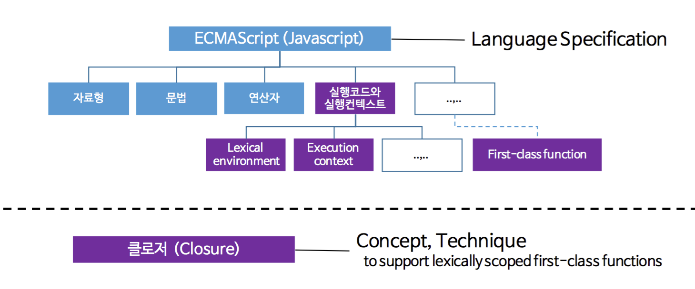
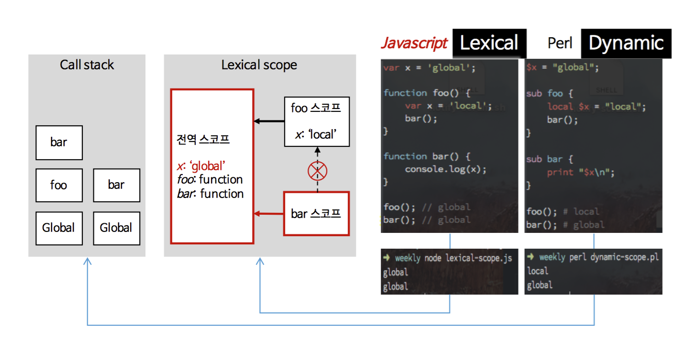

# JavaScript Close Scope




기본적으로 자바스크립트는 ECMAScript 언어 명세를 따르고 있다.

실행코드와 실행컨텍스트 부분에서 스코프에 관한 동작 방식을 확인할 수 있으며, 또 중요한 개념인 1급 객체로서의 함수는 그 특징을 명세의 전반적인 부분에서 나타내고 있다.
그리고, 클로저(Closure)에 대한 정의는 없다. 클로저는 자바스크립트가 채용하고 있는 기술적 기반 혹은 컨셉으로, 자바스크립트는 클로저를 이용하여 스코프적 특징과 일급 객체로서의 함수에 대한 명세를 구현한 것이다.


# Scope

자바스크립트(ES6)는 함수 레벨과 블록 레벨의 렉시컬 스코프규칙을 따른다.

## 스코프 레벨
자바스크립트는 전통적으로 함수 레벨 스코프를 지원해왔고, 얼마 전까지만 해도 블록 레벨 스코프는 지원하지 않았다.
하지만 가장 최신 명세인 ES6(ECMAScript 6)부터 블록 레벨 스코프를 지원하기 시작했다.

**<span style="color:red " >함수 레벨 스코프</span>**

자바스크립트에서 var키워드로 선언된 변수나, 함수 선언식으로 만들어진 함수는 함수 레벨 스코프를 갖는다.
즉, 함수 내부 전체에서 유효한 식별자가 된다.

아래 코드는 아무런 문제없이 blue를 출력한다.

```javascript
function foo() {
    if (true) {
        var color = 'blue';
    }
    console.log(color); // blue
}
foo();
```

만약 var color가 블록 레벨 스코프였다면, color는 if문이 끝날 때 파괴되고 console.log에서 잘못된 참조로 에러가 발생할 것이다.
> 그렇지만 color는 함수 레벨의 스코프이기 때문에 foo 함수 내부 어디에서든 에러 발생 없이 참조할 수 있다.


**<span style="color:red">블록 레벨 스코프</span>**
ES6의 let, const키워드는 블록 레벨 스코프 변수를 만들어 준다.

```javascript
function foo() {
    if(true) {
        let color = 'blue';
        console.log(color); // blue
    }
    console.log(color); // ReferenceError: color is not defined
}
foo();
```

let color를 if블록 내부에서 선언하였다.
때문에 if블록 내부에서 참조할 수 있으며, 그 밖의 영역에서 잘못된 참조로 에러가 발생한다.

**<span style="color:blue">var vs let, const</span>**

ES6가 표준화되면서, 블록 레벨과 함수 레벨을 모두 지원하게 되었다. "You don't know JS" 시리즈의 저자인 Kyle Simpson은 var, let, const가 서로 다르기에 필요한 상황에 알맞게 사용할 줄 알아야 한다고 설명하고 있다.

그렇지만 요즈음 ES6 코드 대부분은 var를 사용하지 않는다. var는 let과 const로 모두 대체가 가능하고, var자체가 함수 레벨의 스코프를 가지기 때문에 블록 레벨 스코프보다 더 많은 혼란을 야기하기 때문이다.


## 렉시컬 스코프
렉시컬 스코프(Lexical scope)는 보통 동적 스코프(Dynamic scope)와 많이 비교한다.

위키피디아를 보면 동적 스코프와 렉시컬 스코프를 다음과 같이 정의하고 있다.

* 동적 스코프
    The name resolution depends upon the program state when the name is encountered which is determined by the execution context or calling context.

*렉시컬 스코프 (정적 스코프(Static scope) 또는 수사적 스코프(Rhetorical scope))
    The name resolution depends on the location in the source code and the lexical context, which is defined by where the named variable or function is defined.

동적 스코프는 프로그램의 런타임 도중의 실행 컨텍스트나 호출 컨텍스트에 의해 결정되고, 렉시컬 스코프에서는 소스코드가 작성된 그 문맥에서 결정된다. 현대 프로그래밍에서 대부분의 언어들은 렉시컬 스코프 규칙을 따르고 있다.

동적 스코프와 렉시컬 스코프는 자바스크립트와 Perl을 비교하여 확인할 수 있다. 아래는 자바스크립트와 Perl로 같은 코드를 작성하였을 때 나오는 결과이다.




<style>
.trLine {
	border : 4px solid #f00;
}
</style>


<div class="trLine"> 동적 스코프와 렉시컬 스코프는 자바스크립트와 Perl을 비교하여 확인할 수 있다. 아래는 자바스크립트와 Perl로 같은 코드를 작성하였을 때 나오는 결과이다.  </div>
