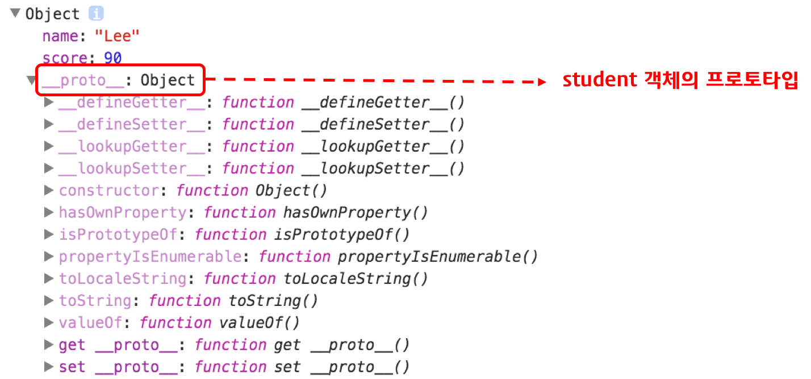
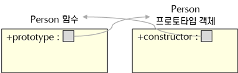
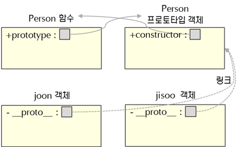
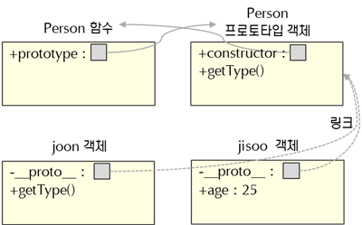
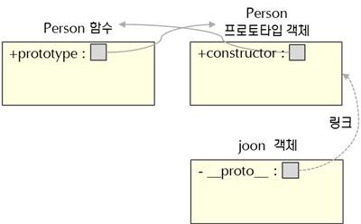
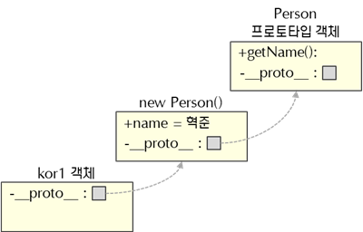
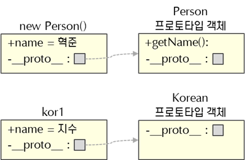

# Javascript Prototype

JavaScript는 클래스라는 개념이 없습니다.
그래서 기존의 객체를 복사하여(cloning) 새로운 객체를 생성하는 프로토타입 기반의 언어입니다.

프로토타입 기반 언어는 객체 원형인 프로토타입을 이용하여 새로운 객체를 만들어냅니다.
이렇게 생성된 객체 역시 또 다른 객체의 원형이 될 수 있습니다.
프로토타입은 객체를 확장하고 객체 지향적인 프로그래밍을 할 수 있게 해줍니다.

프로토타입은 크게 두 가지로 해석됩니다.
프로토타입 객체를 참조하는 prototype 속성과 객체 멤버인 proto 속성이 참조하는 숨은 링크가 있습니다.


이 둘의 차이점을 이해하기 위해서는 JavaScript 함수와 객체의 내부적인 구조를 이해 해야합니다. 이번 글에서는 JavaScript의 함수와 객체 내부 구조부터 시작하여 프로토타입에 대해 알아보겠습니다.

## 1. 프로토타입 객체

자바스크립트의 모든 객체는 자신의 부모 역할을 담당하는 객체와 연결되어 있다. 그리고 이것은 마치 객체 지향의 상속 개념과 같이 부모 객체의 프로퍼티 또는 메소드를 상속받아 사용할 수 있게 한다. 이러한 부모 객체를 Prototype(프로토타입) 객체 또는 줄여서 Prototype(프로토타입)이라 한다.

Prototype 객체는 생성자 함수에 의해 생성된 각각의 객체에 공유 프로퍼티를 제공하기 위해 사용한다.

```javascript
var student = {
  name: 'Lee',
  score: 90
};

// student에는 hasOwnProperty 메소드가 없지만 아래 구문은 동작한다.
console.log(student.hasOwnProperty('name')); // true

console.dir(student);
```




[ECMAScript spec](https://tc39.es/ecma262/#sec-ordinary-and-exotic-objects-behaviours)에서는 자바스크립트의 모든 객체는 [[Prototype]]이라는 인터널 슬롯(internal slot)를 가진다. [[Prototype]]의 값은 null 또는 객체이며 상속을 구현하는데 사용된다. [[Prototype]] 객체의 데이터 프로퍼티는 get 액세스를 위해 상속되어 자식 객체의 프로퍼티처럼 사용할 수 있다. 하지만 set 액세스는 허용되지 않는다.

[[Prototype]]의 값은 Prototype(프로토타입) 객체이며 __proto__ accessor property로 접근할 수 있다. __proto__ 프로퍼티에 접근하면 내부적으로 Object.getPrototypeOf가 호출되어 프로토타입 객체를 반환한다.

student 객체는 __proto__ 프로퍼티로 자신의 부모 객체(프로토타입 객체)인 Object.prototype을 가리키고 있다.

```javascript
var student = {
  name: 'Lee',
  score: 90
}
console.log(student.__proto__ === Object.prototype); // true
```

객체를 생성할 때 프로토타입은 결정된다. 결정된 프로토타입 객체는 다른 임의의 객체로 변경할 수 있다. 이것은 부모 객체인 프로토타입을 동적으로 변경할 수 있다는 것을 의미한다. 이러한 특징을 활용하여 객체의 상속을 구현할 수 있다.


## 2. [[Prototype]] vs prototype 프로퍼티

모든 객체는 자신의 프로토타입 객체를 가리키는 [[Prototype]] 인터널 슬롯(internal slot) 을 갖으며 상속을 위해 사용된다.

함수도 객체이므로 [[Prototype]] 인터널 슬롯을 갖는다. 그런데 함수 객체는 일반 객체와는 달리 prototype 프로퍼티도 소유하게 된다.

> 주의해야 할 것은 prototype 프로퍼티는 프로토타입 객체를 가리키는 [[Prototype]] 인터널 슬롯은 다르다는 것이다. prototype 프로퍼티와 [[Prototype]]은 모두 프로토타입 객체를 가리키지만 관점의 차이가 있다.

```javascript
function Person(name) {
  this.name = name;
}

var foo = new Person('Lee');

console.dir(Person); // prototype 프로퍼티가 있다.
console.dir(foo);    // prototype 프로퍼티가 없다.
```

* [[Prototype]]
    * 함수를 포함한 모든 객체가 가지고 있는 인터널 슬롯이다.
    * 객체의 입장에서 자신의 부모 역할을 하는 프로토타입 객체를 가리키며 함수 객체의 경우 Function.prototype를 가리킨다. 그 이유에 대해서는 4.2 생성자 함수로 생성된 객체의 프로토타입 체인을 참조하기 바란다.
    ```javascript
    console.log(Person.__proto__ === Function.prototype);
    ```
* prototype 프로퍼티
    * 함수 객체만 가지고 있는 프로퍼티이다.
    * 함수 객체가 생성자로 사용될 때 이 함수를 통해 생성될 객체의 부모 역할을 하는 객체(프로토타입 객체)를 가리킨다.
    ```javascript
    console.log(Person.prototype === foo.__proto__);
    ```


## 3. constructor 프로퍼티

프로토타입 객체는 constructor(생성자) 프로퍼티를 갖는다. 이 constructor 프로퍼티는 객체의 입장에서 자신을 생성한 객체를 가리킨다.

예를 들어 Person() 생성자 함수에 의해 생성된 객체를 foo라 하자. 이 foo 객체를 생성한 객체는 Person() 생성자 함수이다. 이때 foo 객체 입장에서 자신을 생성한 객체는 Person() 생성자 함수이며, foo 객체의 프로토타입 객체는 Person.prototype이다. 따라서 프로토타입 객체 Person.prototype의 constructor 프로퍼티는 Person() 생성자 함수를 가리킨다.

```javascript
function Person(name) {
  this.name = name;
}

var foo = new Person('Lee');

// Person() 생성자 함수에 의해 생성된 객체를 생성한 객체는 Person() 생성자 함수이다.
console.log(Person.prototype.constructor === Person);

// foo 객체를 생성한 객체는 Person() 생성자 함수이다.
console.log(foo.constructor === Person);

// Person() 생성자 함수를 생성한 객체는 Function() 생성자 함수이다.
console.log(Person.constructor === Function);
```

https://poiemaweb.com/js-prototype


# 예제로 살펴보기

## 1. 함수와 객체의 내부 구조

Javascript에서는 함수를 정의하고, 파싱단계에 들어가면, 내부적으로 수행되는 작업이 있다.
함수 맴버로 존재하는 prototype 속성에 대한것으로. 이 속성은 다른 곳에서 생성된 함수이름의 프로토타입 객체를 참조한다. 프로토타입 객체의 맴버인 Constructor 속성은 함수를 참조하는 내부구조를 가진다.(생성자)



```javascript
function Person() {};
```

속성이 하나도 없는 Person 이라는 함수가 정의되고, 파싱단계에 들어가면, Person함수 Prototype속성은 프로토타입 객체를 참조한다.
프로토타입 객체 맴버인 Constructor 속성은 Person 함수를 참조하는 구조를 가진다.

Person함수의 Prototype 속성이 참조하는 프로토타입 객체는 new라는 연산자와 Person 함수를 통해생성된 모든 객체의 원형이 되는 객체이다. 생성된 모든 객체가 참조한다는 것을 기억해야 한다.



```javascript

function Person() {}

var joon = new Person;
var jsoo = new Person;
```

**Javascrip에서는 기본 데이터 타입인 boolean, number, string, 그리고 특별한 값은 null, undefined 빼고는 모두 객체다.**

사용자가 정의한 함수도 객체이고, new라는 연산자를 통해 생성된 것도 객체입니다.
객체 안에는 __proto__(비표준) 속성이 있다. 이 속성은 객체가 만들어지기 위해 사용도니 원형인 프로토타입 객체를 숨은 링크로 참조하는 역활을 한다.

## 2. 프로토타입 객체

함수를 정의하면 다른 곳에 생성되는 프로토타입 객체는 자신이 다른 객체의 원형이 되는 객체로, 모든 객체는 프로토타입 객체에 접근할 수 있다.
프로토타입 객체도 동적으로 런타임에 맴버를 추가할 수 있다. 같은 원형을 복사로 생성된 모든 객체는 추가된 맴버를 사용할 수 있다.


```javascript
function Persion() {}

var joon = new Person();
var jisoo = new Persion();

Person.prototype.getType = function() {
    return "인간";
}

console.log(joon.getType());    //인간
console.log(jisoo.getType());   //인간
```

위 예제에서 prototype 속성을 이용하여 맴버를 추가하였다. 프로토타입 객체 getType()이라는 메서드를 추가하면, 이 메서드 맴버를 추가하기 전에 생성된 객체에서도 추가된 맴버를 사용할 수 있다. 즉 같은 프로토타입을 이용하여 생성된 joon과 jisoo 객체는 getType()을 사용할 수 있다.

여기서 알아두어야 할 것은 프로토타입 객체에 맴버를 추가, 수정, 삭제할 때는 반드시 함수 안의 prototype 속성을 사용해야 한다. 하지만 프로토타입 맴버를 읽을 때는 함수안의 prototype이나, 객체명을 통해 접근이 가능하다.



```javascript
joon.getType = function (){
    return "사람";
};

console.log(joon.getType());   // 사람
console.log(jisoo.getType());  // 인간

jisoo.age = 25;

console.log(joon.age);   // undefined
console.log(jisoo.age);  // 25
```

위 소스는 joon 객체를 이용하여 getType() 리턴 값을 사람으로 수정했다. 그리고 joon과 jisoo에서 각각 getType() 메서드를 호출하면, 서로 결과가 다르게 된다.

생성된 객체를 이용하여 프로토타입 객체의 맴버를 수정하면, 프로토타입 객체에 있는 맴버를 수정하는 것이 아니라 자신의 객체에 맴버를 추가하는 것이다. joon객체를 사용하여, getType() 메서드를 호출하면 프로토타입 객체의 메서드를 호출한게 아니라 joon 객체에 추가된 getType() 메서드를 호출한 것이다.
프로토타입 객체의 맴버를 수정할 경우는 맴버 추가와 같이 함수의 prototype속성을 이용하여 수정한다.


결론을 내리면, 프로토타입 객체는 새로운 객체가 생성되기 위한 원형이 되는 객체로, 같은 원형으로 생성된 객체가 공통으로 참조하는 공간이다.
프로토타입 객체의 맴버를 읽는 경우에는 객체 또는 함수의  prototype속성을 통해 접근할 수 있다.

**하지만, 추가, 수정, 삭제는 함수의 prototype속성을 통해 접근해야 한다.**


## 3. 프로토타입

javascript에서 기본 데이터 타입을 제외한 모든 것이 객체이다.
객체가 만들어지기 위해서는 자신을 만드는 데 사용된 원형인 프로토타입 객체를 이용하여 객체를 만든다.
이때 만들어진 객체 안에 __proto__ 속성이 자신을 만들어낸 원형을 의미하는 프로토타입 객체를 참조하는 숨겨진 링크가 있다.
이 숨겨진 링크를 프토토타입이라고 정의한다.



```javascript
function Person() {}

var joon = new Person();
```

joon 객체의 맴버인 __proto__ 속성이 프로토타입 객체를 가리키는 숨은 링크가 프로토타입 속성이라고 한다.
프로토타입을 크게 두가지로 해석한다면,
* 함수 맴버인 prototype 속성은 프로토타입 객체를 참조하는 속성
* 함수와 new 연산자가 만나 생성한 객체의 프로토타입 객체를 지정해주는 역활을 하는 속성

객체 안의 proto 속성은 자신을 만들어낸 원형인 프로토타입 객체를 참조하는 숨겨진 링크로 프로토타입을 의미한다.

javascript에서는 숨겨진 링크가 있어 프토타입 객체 맴버에 접근할 수있다.

> 그래서 이 프로토타입 링크를 사용자가 정의한 객체에 링크가 참조되도록 설정하면 코드의 재사용와 객체 지향적인 프로그래밍이 가능하다.

## 4. 코드의 재사용

코드의 재사용 하면 떠오르는 단어는 바로 상속이다.
클래스라는 개념이 있는 Java에서는 중복된 코드를 상속받아 코드 재활용이 가능하다.
하지만, Javascript에서는 클래스가 없는 프로토타입 기반 언어로, 프로토타입을 이용하며 코드를 재사용화 할 수 있다.

이 방법에도 크게 두가지로 분류할 수 있다.
* classical : new 연산자를 통해 생성한 객체를 사용하여 코드를 재사용 하는 방법
* prototypal : 리터럴 또는 Object.create()를 이용하여 객체를 생성하고 확장해 가는 방법

두가지 장법 중 javascrip에서는 prototypal 방식을 더 선호한다.
이유는 classical 방식보다 간결하게 구현할 수 있기 때문이다.

### (1). 기본방법(classical)

부모에 해당하는 함수르리용하여 객체를 생성한다.
자식에 해당하는 함수의 prototype속성을 부모 함수를 이요하여 생성한 객체를 참조하는 방법



```javascript
function Person(name) {
    this.name = name || "혁준";
}

Person.prototype.getName = function() {
    return this.name;
}

function Korean(name) {}
Korean.prototype =  new Person();

var kor1 = new Korean();
var kor2 = new Korean("지수");
```
위 소스 을 보면 부모에 해당하는 함수는 Person입니다.
10라인에서 자식 함수인 Korean 함수 안의 prototype 속성을 부모 함수로 생성된 객체로 바꿨습니다.

이제 Korean 함수와 new 연산자를 이용하여 생성된 kor 객체의 __proto__ 속성이 부모 함수를 이용하여 생성된 객체를 참조합니다.
이 객체가 Korean 함수를 이용하여 생성된 모든 객체의 프로토타입 객체가 됩니다.

kor1에는 name과 getName() 이라는 속성이 없지만, 부모에 해당하는 프로토타입객체에 name이 있습니다.

이 프로토타입객체의 부모에 getName()을 가지고 있어 kor1에서 사용할 수 있습니다.
이 방법에도 단점이 있습니다.
 부모 객체의 속성과 부모 객체의 프로토타입 속성을 모두 물려받게 됩니다.
대부분의 경우 객체 자신의 속성은 특정 인스턴스에 한정되어 재사용할수 없어 필요가 없습니다.

또한, 자식 객체를 생성할 때 인자를 넘겨도 부모 객체를 생성할 때 인자를 넘겨주지 못합니다.
소스 하단 두 번째 줄에서 kor2 객체를 생성할 때 Korean 함수의 인자로 지수라고 주었습니다.
객체를 생성한 후 getName()을 호출하면 지수라고 출력될 거 같지만, 부모 생성자에 인자를 넘겨주지 않았기 때문에 name에는 default 값인 혁준이 들어있습니다.
객체를 생성할 때마다 부모의 함수를 호출할 수도 있습니다. 하지만 매우 비효율적입니다. 그래서 다음 방법은 이 방법의 문제점을 해결하는 방법을 알아보겠습니다.

### (2). 생성자 빌려쓰기

이 방법은 기본 방법의 문제점인 자식 함수에서 받은 인자를 부모 함수로 인자를 전달하지 못했던 부분을 해결합니다. 부모 함수의 this에 자식 객체를 바인딩하는 방식입니다.




```javascript
function Person(name) {
    this.name = name || "혁준";
}

Person.prototype.getName = function(){
    return this.name;
};

function Korean(name){
    Person.apply(this, arguments);
}

var kor1 = new Korean("지수");
console.log(kor1.name);  // 지수
```

(3) 생성자 빌려 쓰고 프로토타입 지정해주기
이 방법은 방법 1과 방법 2 문제점들을 보완하면서 Java에서 예상할 수 있는 동작 방식과 유사합니다.


[그림 9]
```javascript
function Person(name) {
    this.name = name || "혁준"; }

Person.prototype.getName = function(){
    return this.name;
};

function Korean(name){
    Person.apply(this, arguments);
}
Korean.prototype = new Person();

var kor1 = new Korean("지수");
console.log(kor1.getName());  // 지수
```

[소스 9]

위 소스 9 9라인에서 부모 함수 this를 자식 함수 this로 바인딩합니다. 11라인에서 자식 함수 prototype 속성을 부모 함수를 사용하여 생성된 객체로 지정했습니다. 부모객체 속성에 대한 참조를 가지는 것이 아닌 복사본을 통해 내 것으로 만듭니다. 동시에 부모객체의 프로토타입 객체에 대한 링크도 참조됩니다. 부모객체의 프로토타입 객체 멤버도 사용할 수 있습니다. 그림 7과 비교했을 때 kor1 객체에 name 멤버가 없는 반면 그림 9에서는 name 멤버를 가지고 있는 것을 확인할 수 있습니다. 그림 8과 비교했을 때는 프로토타입 링크가 부모 함수로 생성한 객체에 대해 참조도 하고 있습니다. 그리고 부모 객체의 프로토타입 객체도 링크로 연결된 것을 볼 수 있습니다. 이 방법에도 문제점이 있습니다. 부모 생성자를 두 번 호출합니다. 생성자 빌려 쓰기 방법과 달리 getName()은 제대로 상속되었지만, name에 대해서는 kor1 객체와 부모 함수를 이용하여 생성한 객체에도 있는 것을 볼 수 있습니다.

(4) 프로토타입공유
이번 방법은 부모 생성자를 한 번도 호출하지 않으면서 프로토타입 객체를 공유하는 방법입니다.


[그림 10]
```javascript
function Person(name) {
    this.name = name || "혁준";
}

Person.prototype.getName = function(){
    return this.name;
};

function Korean(name){
    this.name = name;
}
Korean.prototype = Person.prototype;

var kor1 = new Korean("지수");
console.log(kor1.getName());  // 지수
```
[소스 10]

위 소스 10 12라인에서 자식 함수의 prototype 속성을 부모 함수의 prototype 속성이 참조하는 객체로 설정했습니다. 자식 함수를 통해 생성된 객체는 부모 함수를 통해 생성된 객체를 거치지 않고 부모 함수의 프로토타입 객체를 부모로 지정하여 객체를 생성합니다. 부모 함수의 내용을 상속받지 못하므로 상속받으려는 부분을 부모 함수의 프로토타입 객체에 작성해야 사용자가 원하는 결과를 얻게 됩니다. 그림 9와 비교했을 때 중간에 부모 함수로 생성한 객체가 없고 부모 함수의 프로토타입 객체로 링크가 참조되는 것을 볼 수 있습니다.

(5) prototypal한 방식의 재사용

이 방법은 Object.create()를 사용하여 객체를 생성과 동시에 프로토타입객체를 지정합니다. 이 함수는 첫 번째 매개변수는 부모객체로 사용할 객체를 넘겨주고, 두 번째 매개변수는 선택적 매개변수로써 반환되는 자식객체의 속성에 추가되는 부분입니다. 이 함수를 사용함으로 써 객체 생성과 동시에 부모객체를 지정하여 코드의 재활용을 간단하게 구현할 수 있습니다.

```JavaScript
var person = {
    type : "인간",
    getType : function(){
        return this.type;
    },
    getName : function(){
        return this.name;
    }
};

var joon = Object.create(person);
joon.name = "혁준";

console.log(joon.getType());  // 인간
console.log(joon.getName());  // 혁준
```
[소스 11]

위 소스 1라인에서 부모 객체에 해당하는 person을 객체 리터럴 방식으로 생성했습니다. 그리고 11라인에서 자식 객체 joon은 Object.create() 함수를 이용하여 첫 번째 매개변수로 person을 넘겨받아 joon 객체를 생성하였습니다. 한 줄로 객체를 생성함과 동시에 부모객체의 속성도 모두 물려받았습니다. 위의 1 ~ 4번에 해당하는 classical 방식보다 간단하면서 여러 가지 상황을 생각할 필요도 없습니다. JavaScript에서는 new 연산자와 함수를 통해 생성한 객체를 사용하는 classical 방식보다 prototypal 방식을 더 선호합니다.

5. 마치며
지금까지 JavaScript 프로토타입에 대해 정리했습니다. 처음 프로토타입을 공부할 땐, 자바 OOP 관점에서 접근하여 혼란스러웠습니다. 하지만 함수의 내부구조부터 차근차근 접근하였더니 쉽게 이해할 수 있었습니다. 그리고 코드의 재사용 방식에 대해 공부하였던 것도 JavaScript 언어 자체를 이해하는 데 많은 도움이 되었습니다.
이 글이 JavaScript를 처음 접하거나 프로토타입에 대해 공부하는 분들에게 많은 도움이 되었으면 합니다.

http://www.nextree.co.kr/p7323/
