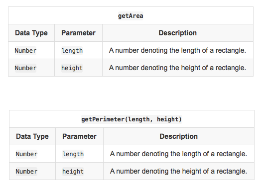

# Arithmetic Operators

## Task

Complete the following functions in the editor below:

1. getArea(length, width): Calculate and return the area of a rectangle having sides $length$ and $width$.
2. getPerimeter(length, width): Calculate and return the perimeter of a rectangle having sides $length$ and $width$.

The values returned by these functions are printed to stdout by locked stub code in the editor.

## Input Format


## Constrains

* $ 1 < length, width < 1000$
* $length$ and $width$ are scaled to at most three decimal places.

## Output Format

| Function | Retunr type | Description |
|:--|:--|:--|
| getArea | Number | The area of a rectangle having sides $length$ and $width$. |
| getPerimeter | Number | The perimeter of a rectangle having sides $length$ and $width$.

# Input
```js
3
4.5
```

# Output
```js
13.5
15
```

# Explanation

The area of the rectangle is $length * width = 3 * 4.5 = 13.5$
The perimeter of the rectangle is $2 (length + width) = 2 (3 + 4.5) = 15$

# Dev

```js
'use strict';

process.stdin.resume();
process.stdin.setEncoding('utf-8');

let inputString = '';
let currentLine = 0;

process.stdin.on('data', inputStdin => {
    inputString += inputStdin;
});

process.stdin.on('end', _ => {
    inputString = inputString.trim().split('\n').map(string => {
        return string.trim();
    });

    main();    
});

function readLine() {
    return inputString[currentLine++];
}

/**
*   Calculate the area of a rectangle.
*
*   length: The length of the rectangle.
*   width: The width of the rectangle.
*   
*	Return a number denoting the rectangle's area.
**/
function getArea(length, width) {
    let area = length * width;
    // Write your code here

    return area;
}

/**
*   Calculate the perimeter of a rectangle.
*
*	length: The length of the rectangle.
*   width: The width of the rectangle.
*   
*	Return a number denoting the perimeter of a rectangle.
**/
function getPerimeter(length, width) {
    let perimeter = 2 * (length + width);
    // Write your code here

    return perimeter;
}

```
