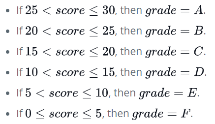

# Conditional Statements: If-else

Task

Complete the getGrade(score) function in the editor. It has one parameter: an integer, $score$, denoting the number of points Julia earned on an exam. It must return the letter corresponding to her $grade$ according to the following rules:




## Input Format

Stub code in the editor reads a single integer denoting $score$ from stdin and passes it to the function.

## Constraints

$ 0 < score < 30$

## Output Format
The function must return the value of $grade$ (i.e., the letter grade) that Julia earned on the exam.

# Input
```
11
```

# Output

```js
D
```

# Dev
```js
'use strict';

process.stdin.resume();
process.stdin.setEncoding('utf-8');

let inputString = '';
let currentLine = 0;

process.stdin.on('data', inputStdin => {
    inputString += inputStdin;
});

process.stdin.on('end', _ => {
    inputString = inputString.trim().split('\n').map(string => {
        return string.trim();
    });

    main();    
});

function readLine() {
    return inputString[currentLine++];
}

function getGrade(score) {
    let grade;
    // Write your code here
    if      (score > 25) grade = 'A';
    else if (score > 20) grade = 'B';
    else if (score > 15) grade = 'C';
    else if (score > 10) grade = 'D';
    else if (score > 5)  grade = 'E';
    else                 grade = 'F';

    return grade;
}

```
