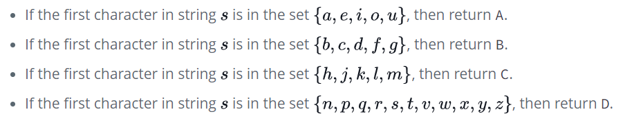

# Conditional Statement Swithch

Task

Complete the getLetter(s) function in the editor. It has one parameter: a string, $s$, consisting of lowercase English alphabetic letters (i.e., a through z). It must return A, B, C, or D depending on the following criteria:



**Hint**: You can get the letter at some index  in  using the syntax s[i] or s.charAt(i).

## Input Format

Stub code in the editor reads a single string denoting  from stdin.

## Constraints
* $ 1 < |s| < 100$, where $|s|$ is the length of $s$.
* String $s$ contains lowercase English alphabetic letters only.

## Output Format
Return either A, B, C, or D according to the criteria given above.

# Dev
```js
'use strict';

process.stdin.resume();
process.stdin.setEncoding('utf-8');

let inputString = '';
let currentLine = 0;

process.stdin.on('data', inputStdin => {
    inputString += inputStdin;
});

process.stdin.on('end', _ => {
    inputString = inputString.trim().split('\n').map(string => {
        return string.trim();
    });

    main();    
});

function readLine() {
    return inputString[currentLine++];
}

function getLetter(s) {
    let letter;

    // Write your code here
    switch(s.charAt(0)) {
        case 'a':
        case 'e':
        case 'i':
        case 'o':
        case 'u':
            letter = 'A';
            break;
        case 'b':
        case 'c':
        case 'd':
        case 'f':
        case 'g':
            letter = 'B';
            break;
        case 'h':
        case 'j':
        case 'k':
        case 'l':
        case 'm':
            letter = 'C';
            break;
        default:
            letter = 'D';
            break;''
    }

    return letter;
}

```

## Javascript Switch Syntax

```js
switch(expression) {
  case 'a':
    // code block
    break;
  case y:
    // code block
    break;
  default:
    // code block
}
```
