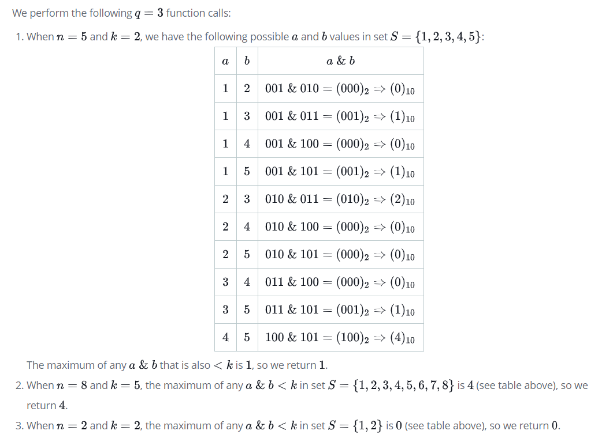

# Bitwise Operators

We define $S$ to be a sequence of distinct sequential integers from $1$ to $n$; in other words, $S=(1,2,3,4,5...,n)$. We want to know the maximum bitwise AND value of any two integers, $a$ and $b$ (where $a<b$ ), in sequence $S$ that is also less than a given integer, $k$.

Complete the function in the editor so that given $n$ and $k$, it returns the maximum $a$ & $b < k$.

### Input Format

The first line contains an integer, $q$, denoting the number of function calls.
Each of the $q$ subsequent lines defines a dataset for a function call in the form of two space-separated integers describing the respective values of $n$ and $k$.

### Constraints

* $1 \le q \le 10^3$
* $2 \le n \le 10^3$
* $2 \le k \le n$

### Output Format
Return the maximum possible value of $a$ & $b$ < kfor any $a<b$ in sequence $S$.

# Sample Input 0
```
3
5 2
8 5
2 2
```

# Sample Output 0
```
1
4
0
```

# Explanation 0



# Dev
```js
'use strict';

process.stdin.resume();
process.stdin.setEncoding('utf-8');

let inputString = '';
let currentLine = 0;

process.stdin.on('data', inputStdin => {
    inputString += inputStdin;
});

process.stdin.on('end', _ => {
    inputString = inputString.trim().split('\n').map(string => {
        return string.trim();
    });

    main();    
});

function readLine() {
    return inputString[currentLine++];
}

function getMaxLessThanK(n, k) {
    let resultVal = 0;
    for (let i = 1; i < n; i++) {
        for (let j = i+1; j <= n; j++) {
            const temp = i & j;
            if (temp < k) temp > resultVal ? resultVal = temp : '';
        }
    }
    return resultVal;
}


function main() {
    const q = +(readLine());

    for (let i = 0; i < q; i++) {
        const [n, k] = readLine().split(' ').map(Number);

        console.log(getMaxLessThanK(n, k));
    }
}
```


# Bitwise Operators in Javascript
Before discussing bitwise operators, let's review the following:
* Binary numbers
* Base-10(decimal number) to base-2(binary number) conversions.
* Base-2(binary number) to base-10(decimal number) conversions.
* Representing negatibe base-10 numbers in base-2

## Binary Numbers and Bit Manipulation
[This article provides some additional background on these topics](https://www.hackerrank.com/topics/bit-manipulation)
