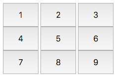
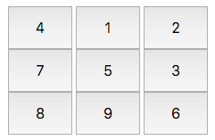
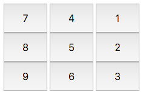

# Container

### Task
We want to create nine buttons enclosed in a div, laid out so they form a  grid. Each button has a distinct label from  to , and the labels on the outer buttons must rotate in the clockwise direction each time we click the middle button.

Complete the code in the editor so that it satisfies the following criteria:
* Initial State. The initial layout looks like this:


* Element IDs. Each element in the document must have an id, specified below:

  + The button container div's id must be btns.
  + The initial innerHTML labels must have the following button ids:

  | innerHTML |  id |
  | :--: | :--: |
  | 1	 | btn1 |
  | 2 |	btn2 |
  | 3	| btn3 |
  | 4	| btn4 |
  | 5	| btn5 |
  | 6	| btn6 |
  | 7	| btn7 |
  | 8	| btn8 |
  | 9	| btn9 |

* Styling. The document's elements must have the following styles:
  + The width of btns is , relative to the document body's width.
  + Each button (i.e., btn1 through btn9) satisfies the following:
    + The width is , relative to its container width.
    + The height is 48px.
    + The font-size is 24px.
* Behavior. Each time btn5 is clicked, the innerHTML text on the grid's outer buttons (i.e., bt1, btn2, btn3, btn4, btn6, btn7, btn8, btn9) must rotate in the clockwise direction. Do not update the button id's.


### Explanation

Initially, the buttons look like this:


After clicking btn5  time, they look like this:click1



After clicking btn5  more time (for a total of  clicks), they look like this:click2



# Dev

### index.HTML
```html
<!-- Enter your HTML code here -->
<!DOCTYPE html>
<html>
    <head>
        <meta charset="utf-8">
        <title>Buttons Grid</title>
        <link rel="stylesheet" href="css/buttonsGrid.css" type="text/css">
    </head>
    <body>
        <script src="js/buttonsGrid.js" type="text/javascript"> </script>
    </body>
</html>
```

### buttonGrid.CSS
```css
#btns {
    width: 75%;
}
.btn {
    width: 30%;
    height: 48px;
    font-size: 24px;
}
```

### buttonGrid.js
```js
var container = document.createElement('div');
container.className = 'buttonContainer';
container.id = 'btns';

var button = [9];

for (var i = 0; i < 9; i++) {
    button[i] = document.createElement('button');
    button[i].className = 'button';
    button[i].id = 'btn' + (i + 1);
    button[i].innerHTML = (i + 1);

    container.appendChild(button[i]);
}

document.body.appendChild(container);

function getNextLabel(value) {
    var labelData = [1, 4, 7, 8, 9, 6, 3, 2];

    return labelData[(labelData.indexOf(+(value)) + 1) % labelData.length];
}

function updateLabel() {

    for (var i = 0; i < 9; i++) {
        if (i != 4) {
            button[i].innerHTML = getNextLabel(button[i].innerHTML);
        }
    }
}

btn5.addEventListener('click', function() {

    updateLabel();
});

```
