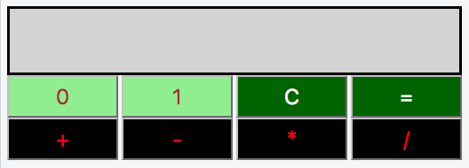
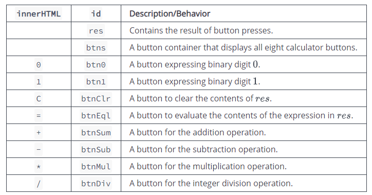

# Binary Calculator

### Task

Implement a simple calculator that performs the following operations on binary numbers: addition, subtraction, multiplication, and division. Note that division operation must be integer division only;

The calculator's initial state must look like this:


* Element IDs. Each element in the document must have an id, specified below:

* Styling. The document's elements must have the following styles:

* body has a width of 33%.
* res has a background-color of lightgray, a border that is solid, a height of 48px, and a font-size of 20px.
* btn0 and btn1 have a background-color of lightgreen and a color of brown.
* btnClr and btnEql have a background-color of darkgreen and a color of white.
* btnSum, btnSub, btnMul, and btnDiv have a background-color of black, a color of red.
* All the buttons in btns have a width of 25%, a height of 36px, a font-size of 18px, margin of 0px, and float value left.

### Constraints

All expressions in the test dataset are entered in the form $Operater1 -> Operator -> Operator2$ , where $Operator1$  is the first binary number, $Operator2$  is the second binary number, and $Operator$ is in the set `{+, -, *, /, =}`.
Both operands will always be positive integers when converted from base-$2$ to base-$10$.
All expressions will be valid.


# Dev

### index.html
```html
<!-- Enter your HTML code here -->
<!DOCTYPE html>
<html>
    <head>
        <meta charset="utf-8">
        <title>Binary Calculator</title>
        <link rel="stylesheet" href="css/binaryCalculator.css" type="text/css">
    </head>
    <body>
        <div id="container">
            <div id="res"></div>
            <div id="btns">
              <button id="btn0" class="numberic" onclick="clickNumber(0)">0</button>
              <button id="btn1" class="numberic" onclick="clickNumber(1)">1</button>
              <button id="btnClr" onclick="clickClear()">C</button>
              <button id="btnEql" onclick="clickResult()">=</button>
              <button id="btnSum" onclick="clickOperation('+')">+</button>
              <button id="btnSub" onclick="clickOperation('-')">-</button>
              <button id="btnMul" onclick="clickOperation('*')">*</button>
              <button id="btnDiv" onclick="clickOperation('/')">/</button>
            </div>        
          </div>
        <script src="js/binaryCalculator.js" type="text/javascript"></script>
    </body>
</html>

```

### binaryCalculator.css
```css
body {
  width: 33%;
}

#res {
  background-color: lightgray;
  border: solid;
  height: 48px;
  font-size: 20px;
}

#btns button {
  width: 25%;
  height: 36px;
  font-size: 18px;
  margin:0;
  float: left;
}

#btn0, #btn1 {
  background-color: lightgreen;
  color: brown;
}

#btnClr, #btnEql {
  background-color: darkgreen;
  color: white;
}

#btnSum, #btnSub, #btnMul, #btnDiv {
  background-color: black;
  color: red;
}
```

### binaryCalculator.js

```js

var operatorValue = '';

function calculator(firstNum, secondNum, operator) {

    var result = 0;

    switch(operator) {
        case '+':
            result = eval(firstNum + secondNum);
            break;
        case '-':
            result = eval(firstNum - secondNum);
            break;
        case '*':
            result = eval(firstNum * secondNum);
            break;
        default:
            result = eval(firstNum / secondNum);
            break;
    }

    return result;
}

function clickNumber(number) {
    document.getElementById('res').innerHTML += number;
}

function clickClear() {
    document.getElementById('res').innerHTML = "";
    operatorValue = '';
}

function clickOperation(operator) {

    if (operatorValue === '') {
        document.getElementById('res').innerHTML += operator;
        operatorState = operator;
    }
}

function clickResult() {
    if (operatorState !== '') {
        var numbers = document.getElementById('res').innerHTML.split(operatorState);

        document.getElementById('res').innerHTML = eval(parseInt(numbers[0], 2) + operatorState + parseInt(numbers[1], 2)).toString(2);

        operatorValue = '';
    }
}

```
