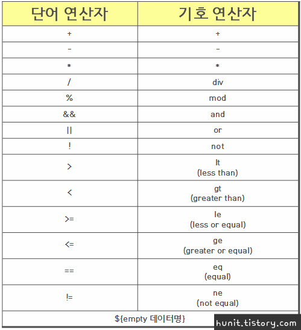

# JSP EL Tag & JSTL Tag
JSP파일에 자바형식의 코드를 사용하면 불편한 점을 한방에 해결할 수 있는 EL (Expression Language) 과 JSTL (Jsp Standard Tag Library)를 이용해 코드를 간결하게 사용하는 방법에 대해 포스팅하도록 하겠습니다.

EL의 개념은 해석 그대로 표현 언어를 이해하고 속성 값들을 편리하게 출력하기 위해 제공된 언어이며, JSTL은 표준 액션태그로 처리하기 힘든 부분을 담당합니다.

JSP 2.0버전에서 새로 추가된 스크립트 언어인 EL(Expression Language)은 `<%= abc %>`를 `${abc}`로 간단하게 사용할 수 있게 하였으며, JSTL의 Core에서 c를 이용해 <%= if%>문을 <c:if>, <%=for%>문을 <c:forEach>로 대체하여 사용합니다. 그럼 따로따로 살펴보도록 하겠습니다. 둘을 같이 묶어서 포스팅하는 이유는 제 게시판 프로젝트에 같이 사용되기 때문입니다.

# EL (Expression Language)
<%= %> , out.println()과 같은 자바코드를 더 이상 사용하지 않고 좀더 간편하게 출력을 지원하기 위한 도구.
배열이나 컬렉션에서도 사용되고, JavaBean의 프로퍼티에서도 사용됩니다.
* JSP에서 4가지 기본 객체가 제공하는 영역의 속성을 사용
  + 4가지 기본 객체
    + page
    + request
    + session
    + application
  + 4가지 기본 객체의 Attribute, Parameter 속성 사용
* 집합 객체에 대한 접근 방법 제공
  + 배열이나 List를 호출해서 사용 가능
* 수치연산, 관계연산, 논리연산 제공
  + EL의 문법안에서만 사용가능
* 자바 클래스 메소드 호출 기능 제공
* EL태그 만의 기본 객체 제공

### 기본문법
```JSP
// i.e) ${기본객체.속성키}
      : ${requestScope.name}
```
* Attribute형식에서는 ${cnt + 1}로 쓰고,
* Parameter형식에서는 ${param.abc}으로 씁니다.

여기서 cnt는 자바에서는 변수 이름이고, EL 식에서는 Attribute의 이름으로 해석되는데요.
값을 찾을때 Attribute는 작은 Scope에서 큰 Scope로 찾습니다.
(page → request → session → application)

### attribute란?
메소드를 통해 저장되고 관리되는 데이터
* PageContext / Request에서 사용될때
  + setAttribute("key", value) → 값을 넣는다.
  + getAttribute("key") → 값을 가져온다.
  + removeAttribue("key") → 값을 지운다.
* session에서 사용될때
  + set / get / remove 동일하고 추가로++
  + invalidate( ) → 값을 전부 지운다.

### 연산자


### EL테그 기본 내장객체

* pageScope → 페이지Scope에 접근
* request Scope → 리퀘스트Scope에 접근
* sessionScope → 세션Scope에 접근
* applicationScope → 어플리케이션Scope에 접근
* param → 파라미터값 얻어올때 ( 1개의 Key에 1개의 Value )
* paramValues → 파라미터값 배열로 얻어올때( 1개의 Key에 여러개의 Value)
* header → 헤더값 얻어올때 ( 1개의 Key에 1개의 Value )
* headerValues → 헤더값 배열로 얻어올때 ( 1개의 Key에 여러개의 Value )
* cookie → ${cookie. key값. value값}으로 쿠키값 조회
* initParam → 초기 파라미터 조회
* pageContext → 페이지컨텍스트 객체를 참조할때

### paramValues & headerValues 사용법

1. $ { paramValues . boadDto [0] }
2. $ { paramValues ["bardDto"] [1] }

Values 옆에 점을 찍는 방법과 대괄호로 묶어 사용하는 2가지 방법이 있습니다.
대신 ①번에서는 인덱스가 0부터 시작하고 ②번에서는 인덱스가 1부터 시작하네요.


  https://hunit.tistory.com/203
  http://blog.naver.com/PostView.nhn?blogId=hankk20&logNo=70024683960
