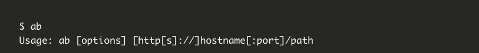
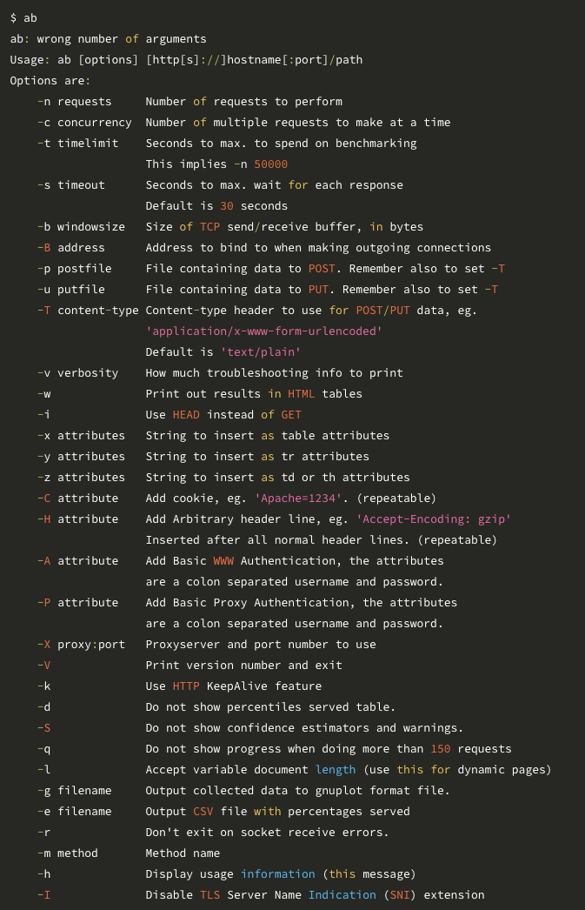
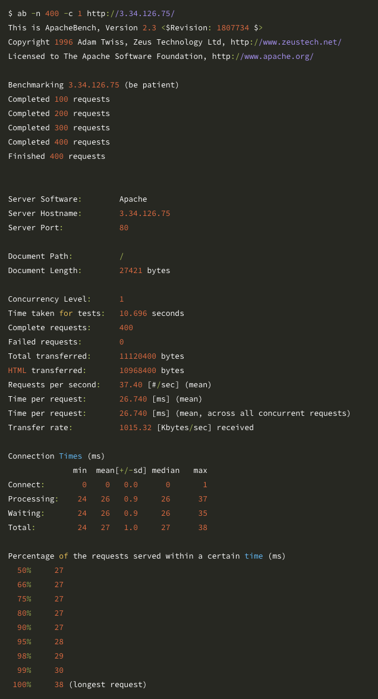
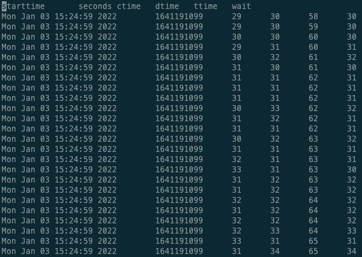
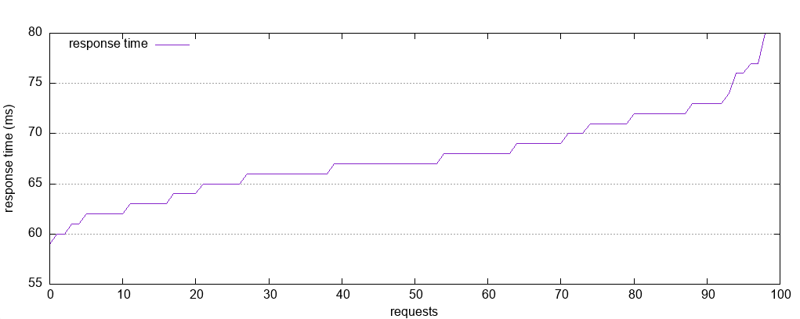

# AB(Apache http server Benchmarking tool)
* [ab(Apache http server Benchmarking tool) 아파치 웹서버 성능검사 도구 메뉴얼](https://httpd.apache.org/docs/2.4/programs/ab.html)

* AB는 커맨드 라인을 황용한 매우 가볍고 유용한 웹 서버 테스트 도구
* 간단한 REST API나 정적 컨텐츠에 대한 성능 테스트 시 빠르고 간편하게 벤치마킹 정보를 얻어 올 수 있다.

## 어떤 경우 AB를 사용하나?
* 웹서버 성능 측정을 위해 만들어진 도구
* 세션을 사용한 복잡한 인증절차등을 포함한 페이지를 테스트하기에는 부적합
* 간단한 API(헤더 정보는 활용 가능)나 정적 컨텐츠 서비스 성능 측정
* 웹서버의 한계치를 측정하거나 튜닝할 때 간단하게 Response Time의 성능 측정가 필요할 떄 유용

## AB 참고사항
* HTML이나, CSS, image등은 해석하지 않는다. -> 단순히 response time만 출력
* `HTTP 1.0` 클라이언트 사용 -> 확인 필요
  + - HTTP 1.0 클라이언트이기 때문에 Transfer-Encoding: chunked 옵션은 사용할 수 없다.
* 동적 페이지는 Content-Length 헤더 내용을 미리 작성할 수 없기 때문에 -k KeepAlive 옵션이 동작하지 않는다.
* **request간에 delay를 주는 옵션은 없으므로 DDOS attack으로 간주 될 수 있다.**


## 사용법




* `-n`: 성능을 검사하기 위해 보내는 요청 수
* `-c`: 동시에 요청하는 요청(프로세스) 수


## Frontman-scg 동시성 테스트

* client1
```cmd
ab -T application/json \
-H 'AccessKey: 6FH5314_C4CB08006F59C68DE053106A1BAC64C5S' \
-H 'App-Code: tmap' \
-H 'App-Version: 9.0.0' \
-H 'Os-Type: AND' \
-H 'Os-Version: 1.0.0' \
-H 'Device-Id: ffffffff-a7a2-80bb-ffff-ffffffffff' \
-H 'Carrier: SKT' \
-H 'Model-No: TEST-T002' \
-H 'Build-No: 123456' \
-H 'Using: MAIN' \
-H 'Req-Time: 20210000000000' \
 -c 2 -n 1000 -g result1.plot 'http://localhost:8080/flerken/api/v2/car-info/$userKey'
```
* client2
```cmd
ab -T application/json \
-H 'AccessKey: 6FH5449_C4CB20672BACC881E053106A1BAC4D6FS' \
-H 'App-Code: tmap' \
-H 'App-Version: 9.0.0' \
-H 'Os-Type: AND' \
-H 'Os-Version: 1.0.0' \
-H 'Device-Id: ffffffff-a7a2-80bb-ffff-ffffffffff' \
-H 'Carrier: SKT' \
-H 'Model-No: TEST-T003' \
-H 'Build-No: 123456' \
-H 'Using: MAIN' \
-H 'Req-Time: 20210000000000' \
 -c 2 -n 1000 -g result2.plot 'http://localhost:8080/flerken/api/v2/car-info/$userKey'
```

## AB 실행 결과


* 요청을 전체 처리한 시간
* 요청 당 평균 걸린 시간

## gnuplot 사용하여 요청 로그 그래프 그리기

* -g 옵션을 통해 log 파일 저장


* 요청 로그 파일


  + starttime : request가 시작된 시간
  + seconds : starttime을 unix timestamp로 표현
  + ctime : connection 시간으로 request를 write하기 위해 서버와 socket을 여는 시간
  + dtime : processing 시간 -> 결과를 반환받기 위해 wait하는 시간 + 서버 작업 시간 + 결과 반환 시간.
  + dtime = ttime – ctime
  + ttime : request가 전체 수행된 시간(ttime = ctime + dtime)
  + wait : request를 보내고나서 response를 받기 전까지 서버사이드에서 처리되는 시간
  + network 시간 = dtime – wait


* gnuplot 스크립트 설정
```ruby
# 터미널 사이즈 조정(이미지 사이즈)
set terminal png size 1024,768

# 가로, 세로 비율
set size 1,0.5

# 결과 파일 설정
set output "result.png"

# 범례/key 위치
set key left top

# y축 grid line
set grid y

# Label the x-axis
set xlabel 'requests'

# Label the y-axis
set ylabel "response time (ms)"

# Tell gnuplot to use tabs as the delimiter instead of spaces (default)
set datafile separator '\t'

# Plot the data
plot "${fileName}" every ::2 using 5 title 'response time' with lines
exit
```

* script를 `gnuplot` 으로 실행


---
## 설치

```ruby
yum install httpd-tools
```

* 우분투

```ruby
$ sudo apt-get update

$ sudo apt-get install apache2-utils
```


* 명령어

```cmd
# ab -c {클라이언트 수} -n {요청수} -t {시간} URL
# ex) ab -c 100 -n 200 -t 60 https://www.naver.com
```


* 사이트 정리 https://sysops.tistory.com/77
