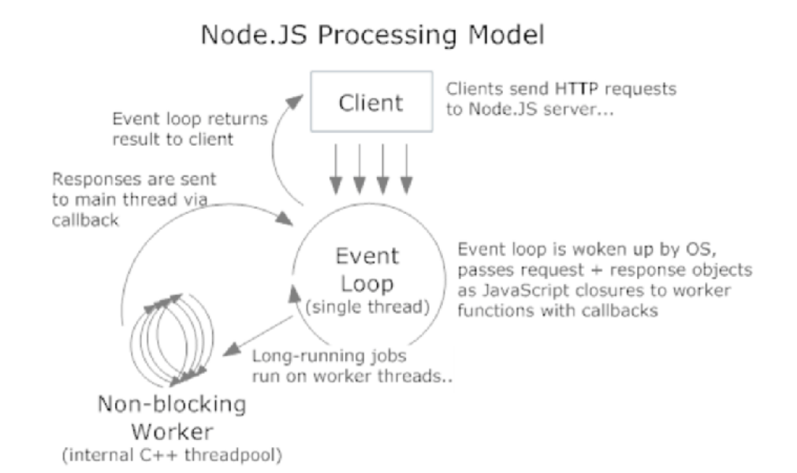

[Node.js Documentation](https://nodejs.org/dist/latest-v8.x/docs/api/synopsis.html)

확장성 있는 네트워크 애플리케이션 개발에 사용되는 소프트웨어 플랫폼으로, 자바스크립트를 활용해서 Non-blocking I/O와 단일 스레드 이벤트 루프를 통한 높은 처리 성능을 가지고 있다.

내장 HTTP 서버 라이브러리를 포함하고 있어, 웹 서버에서 아파치 등으 ㅣ별도의 소프트웨어 없이 동작하는 것이 가능하며, 이를 통해 웹 서버의 동작에 있어 많은 통제를 가능하게 해 주는 특징이 있다.

V8(자바스크립트 엔진)으로 빌드 된 이벤트 기반 자바스크립트 런타임이다. 웹 서버와 같이 확장성 있는 네트워크 프로그램 제작을 위해 고안되었다.
파이썬으로 만든 트위스티드, 펄로 만든 펄 객체 환경, 루비로 만든 이벤트머신과 그 용도가 비슷하다. 대부분의 자바스크립트가 웹 브라우저에서 실행되는 것과는 달리, 서버 측에서 실행된다. 일부 CommonJS 명세[3]를 구현하고 있으며, 쌍방향 테스트를 위해 REPL 환경을 포함하고 있다.

# Node.js

* 브라우저 밖에서 자바스크립트 코드를 실행 할 수 있다.
* 크롬에서 사용하는 V8 엔진을 사용한다
* 이벤트 기반의 비동기 I/O 프레임워크
* CommonJS를 구현한 모듈 시스템
  + 기본 모듈
  + 사용자 모듈
  + 서드파티 라이브러리 모듈




성능을 높히려면 여러개의 서비스를 병렬적으로 사용하는 방법으로 단일 스레드로 무거운 잡을 워커에게 전달하고, 워커는 멀티 스레드로 워커가 무거운 잡을 끝내면, 이벤트 루프에 리턴하여 클라이언드에게 전송한다.

한 사이클에 다 못하는 인풋 아웃풋 잡

인풋(사용자 입력, 마우스 클릭, 키보드 입력)
아웃풋잡(DB조회, 서버통신)

워커에게 일을 할당하여 비동기적으로 서비스를 처리한다.


## Module

* 기본 모듈
```js
const util = require('util')

const name = 'World'
const msg = uilt.format('Hello %s', name)

console.log(msg);
```

* 사용자 모듈
```js
//math.js
const math = {
  add(a,b) {
    return a + b
  }
}
module.exports = math //이 한줄로 math.js가 모듈이 된다.

// index.js
const math = require('./math') // 모듈을 사용하기 위해서 경로 입력, .js는 생략
console.log(math.add(1,2)) // print '3'
```
* 서드파티 라이브러리 모듈

# 비동기
노드는 기본적으로 비동기로 동작함
readFIle() vs readFileSync()

```js
// test.txt
테스트 파일입니다.

// index.js
const fs = require('fs')

// callback method
const callback = (err, file) => {
  console.log(file)
}

// 동기 처리 // 파일을 다 읽을 때 까지 wait한다.
const file = fs.readFileSync('test.txt'. {encoding: 'uft8'}), (err, data) => console.log(file)) // 테스트 파일입니다.

// 비동기 처리 // 파일을 다 읽으면 콜백 이벤트 루프 함수가 호출된다.
const file = fs.readFile('test.txt', {encodig: 'utf'}, callback), (err, data) => console.log(file)  // undefind
```

# Node.js Create Server

```js
const http = require('http');

const hostname = '127.0.0.1';
const port = 3000;

const server = http.createServer((req, res) => {
  res.statusCode = 200;
  res.setHeader('Content-Type', 'text/plain');
  res.end('Hello World!\n');
});

server.listen(port, hostname, () => {
  console.log(`Server running at http://${hostname}:${port}/`);
});
```

### Request server

```cmd
curl localhost:3000
```

```return
Hellow World
```
