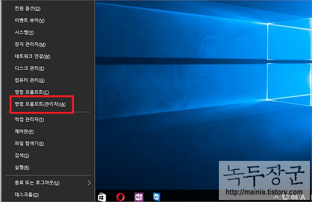
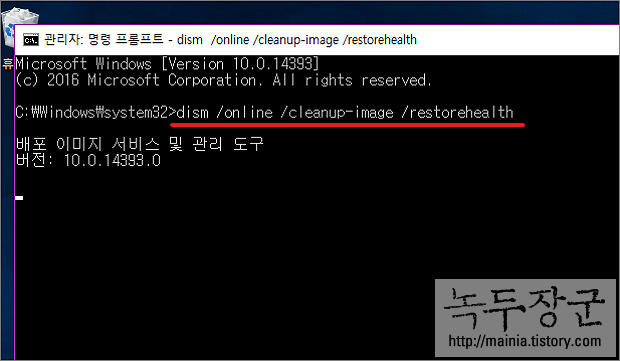
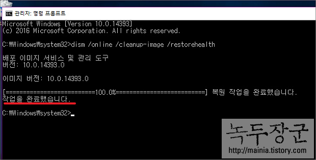
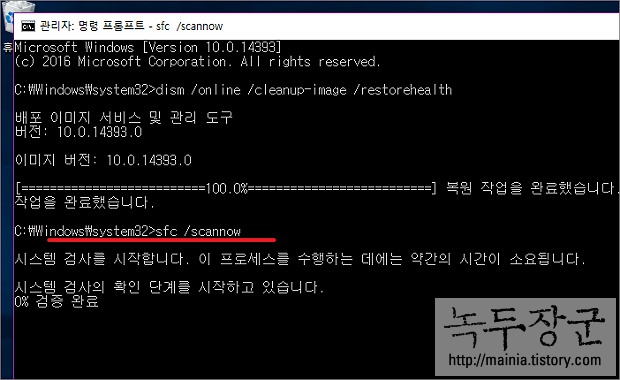

# Window Error Recovery & Scan

https://mainia.tistory.com/5038

▼ 단축키 [윈도우키 + X] 를 눌러 [고급 실행] 메뉴를 띄웁니다. 그리고 팝업 메뉴에서 명령 프롬프트(관리자) 를 선택합니다.

▼ 관리자 콘솔에서 아래 텍스트를 입력합니다. dism 유틸은 윈도우 시스템에 필요한 파일이 없거나 문제가 생겨서 복원할 파일이 필요할 때 쓰입니다. 복원에 사용할 파일이 없더라도 자동으로 파일을 다운로드 해서 문제를 고치게 됩니다. /online 파라미터가 그 의미를 담고 있습니다.

> dism /online /cleanup-image /restorehealth

▼ dism 유틸 실행 후 “배포 이미지 서비스 및 관리 도구” 가 나오면서 깜빡입니다. 복원 과정은 약 15분 정도 걸립니다. 복구가 끝나면 문제가 되었던 부분은 해결 되었을 겁니다.

▼ sfc 는 System File Checker(시스템 파일 확인) 의 약자 입니다. 윈도우에 생긴 거의 모든 손상이나 비정상적인 상태를 바로 잡을 수 있습니다. sfc /scannow 를 콘솔에 입력하고 Enter 를 누릅니다. 바로 시스템 검사를 시작하게 됩니다. 검사가 끝나면 4가지 결과 메시지가 나오게 됩니다.

    ● Windows 리소스 보호에서 무결성을 발견하지 못했습니다.
    누락되거나 손상된 시스템 파일이 없다는 것을 의미합니다.

    ● Windows 리소스 보호에서 요청 된 작업을 수행할 수 없습니다.
    문제 해결을 위해서 안전모드로 하고 %windir%\WinSxS\Temp 폴더를 확인해 보세요.

    ● Windows 리소스 보호가 손상 된 파일을 발견 및 성공적으로 복구 했습니다. 자세한 정보는 CBS.log 를 참조하십시오.
    시스템 복원을 성공적으로 완료했으며 상세정보는 %windir%\CBS\cbs.log 있습니다.

    ● Windows 리소스 보호가 손상 된 파일을 발견했지만 일부 파일을 복구 하지 못했습니다. 자세한 내용은 CBS.log 를 참조하십시요
    %windir%\CBS\cbs.log 에 있는 내용을 열어보고 문제가 있는 파일을 찾습니다. 예를들어 아래 그림과 같은 로그 내용이 있다고 합시다. 자세히 보시면 파일명이 있을 겁니다. 손상된 파일 이므로 동일한 파일을 다운받아 대체해 주시면 됩니다.
