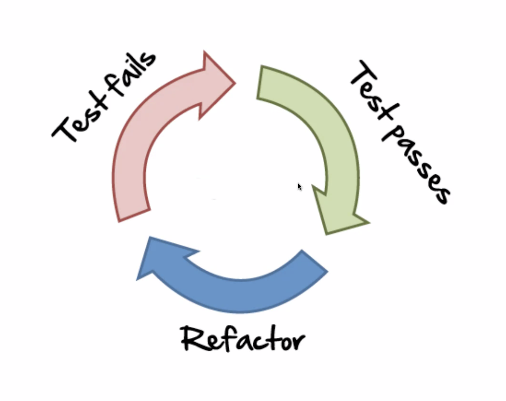
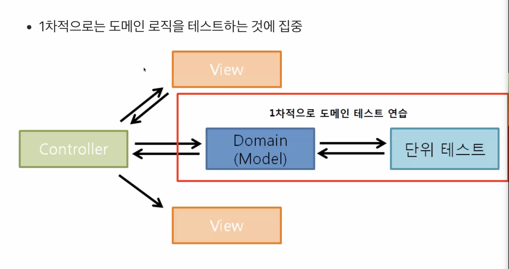
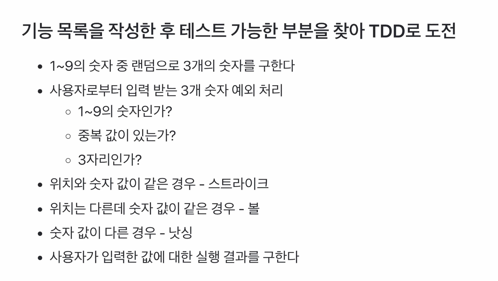
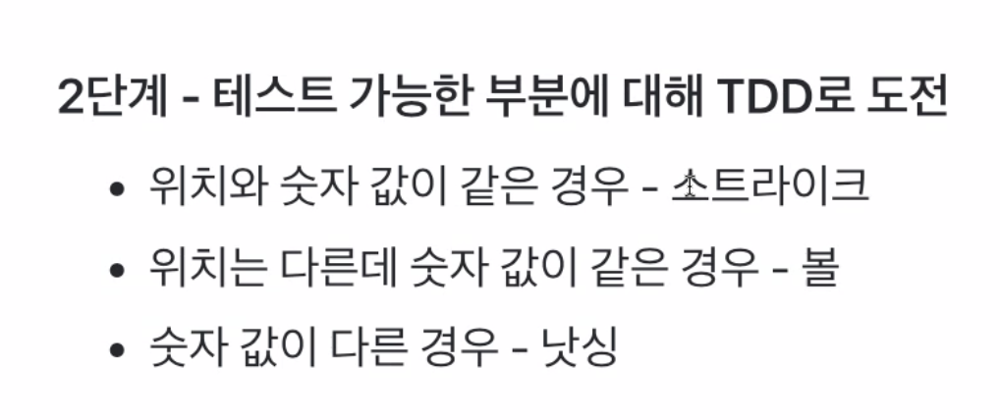

# 1 Week

* 개발자로서의 삶의 전환점
* 프로그래머로 어떻게 성장해야 할지
* 효과적으로 프로그래밍을 학습하는 방법
* 어떤 철학을 가지고 살아갈지 대한 고찰

코드 리뷰어
* 코드 리뷰어는 수료생 중 개발자에서 선정
* 리뷰어는 각 미션별로 랜덤 배정, 같은 리뷰어가 배정되지 않는다.(미션이7~8개 이기때문에, 모든 리뷰어를 배정 받을 수 있다.)
* 리뷰 요청 후 24시간 이내에 피드백을 주는 것을 목표로 함.

1주차 - 자동차 경주
* 단위 테스트 기반 코딩
2주차 - 로또
* TDD 기반으로 프로그래밍 경험
* 메소드 분리 + 클래스 분리하는 리팩토링 경험
* 점진적으로 리팩토링 하는 경험

3주차 - 지하철 노선도 JPA

4주차 - ATDD
* ATDD Cycle
* 인수 테스트 기반 개발

5주차 - 지하철 노선도

6주차 - 지하철 노선도
* 래거시 코드 리팩터링 with 테스트
* 멀티 모듈, DDD

7주차 - 시스템 아키텍쳐 설계
* 서비스 구성 및 배포

8주차 - SQL 최적화
* 서비스 진단 및 화면 응답 개선하기

9주차 - 마무리 및 네트워킹 시간

---

## TDD 란

* TDD = TFD(Test First Development) + 리팩토링(설계 활동)
  + 테스트 코드를 먼저 만들고, 프로덕션 코드를 구현하면서, 리펙토링하는 과정
* TDD란 프로그래밍 의사결정과 피드백 사이의 간극을 의식하고 이를 제어하는 기술
* TDD는 분석 기술이며, 설계 기술이다.
* TDD를 잘 만들기 위해서는 To-Do-List가 잘 설계되있어야 한다.

## TDD를 해야 하는 이유

* 디버깅 시간을 줄여준다.
* 동작하는 문서 역활을 한다.
* 변화에 대한 두려움을 줄여준다.

## TDD 사이클

1. 실패하는 테스트를 구현
2. 테스트가 성공 하도록 프로덕션 코드를 구현
3. 프로덕션 코드와 테스트 코드를 리팩토링

## TDD 원칙

* 실패하는 단위 테스트를 작성할 때까지 프로덕션 코드를 작성하지 않는다.
* 컴파일은 실패하지 않으면서 실행이 실패하는 정도로만 단위 테스트를 작성한다.
* 현재 실패하는 테스트를 통과할 정도로만 실제 코드를 작성한다.(오버 엔지니어를 하는 경우를 방지)

---

## 도메인 지식, 객체 설계 경험이 있는 경우

* 요구사항 분석을 통해 대략적인 설계 - 객체 추출
* UI, DB 등과 의존관계를 가지지 않는 핵심 도메인 영역을 집중 설계

## 구현할 기능 목록 작성하기

* 구현할 기능 목록을 작성한 후에 TDD로 도전
* 기능 목록을 작성하는 것이 역량
* **도메인 지식 쌓기**

> 아무것도 없는 상태에서 개발하는 것보다, 래거시 코드가 있는 상태에서 개발하는 것이 더 어렵다.

---

# 야구게임

## To Do List

* 완료한 기능과, 완료하지 못한 기능을 나누어서 업데이트를 하면서 개발
* 알고리즘 문제를 이용하면서 테스트 코드로 작성 연습

