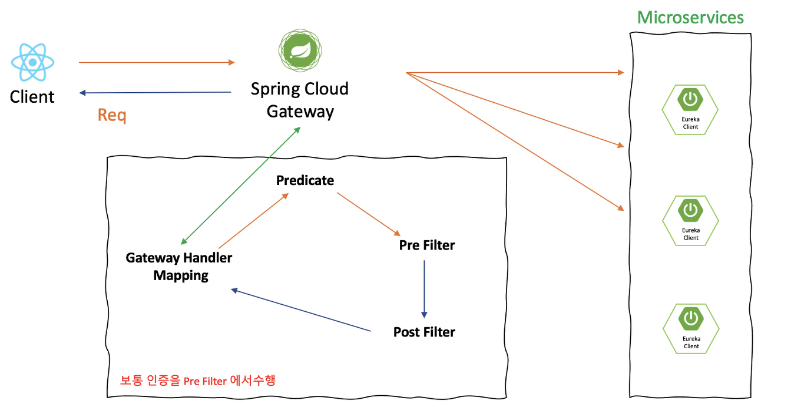
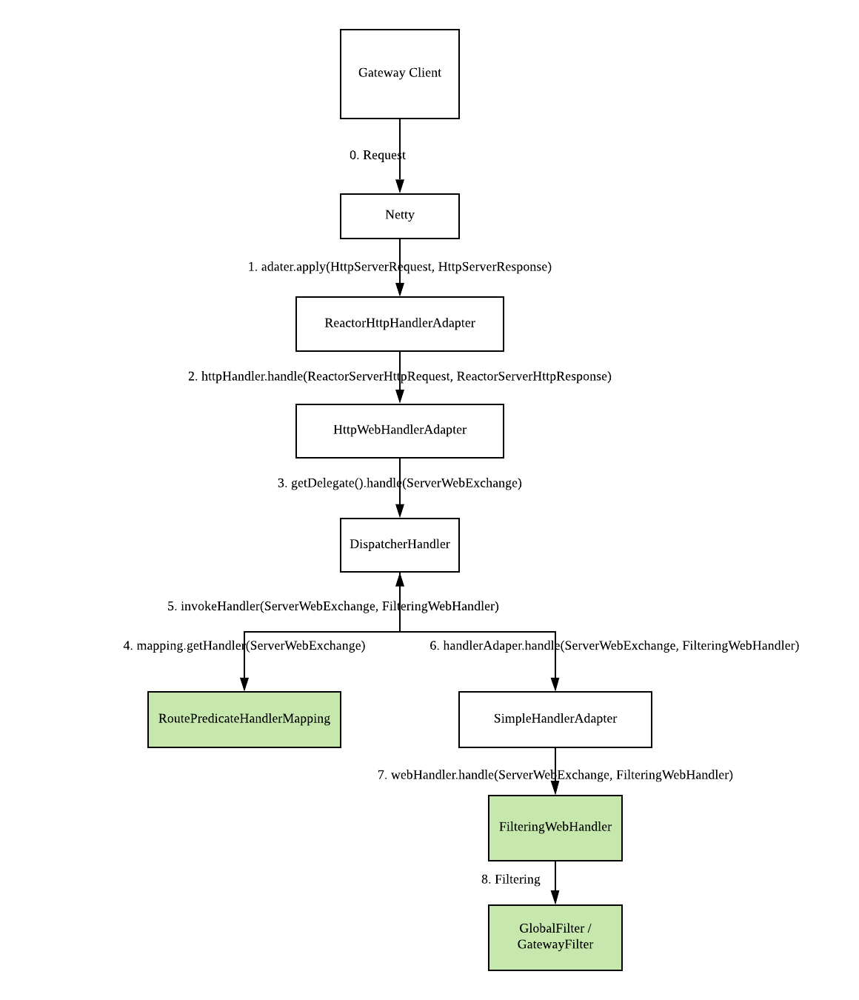
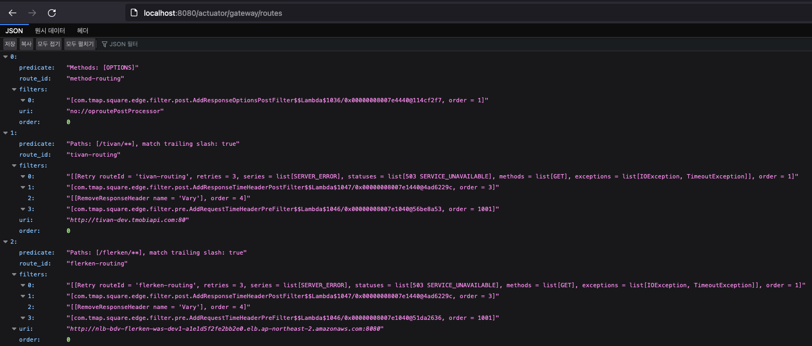
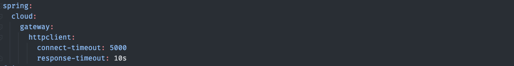

# SCG(Spring cloud gateway)
* [Spring cloud gateway Docs](https://cloud.spring.io/spring-cloud-gateway/reference/html/)
* [Spring io - Spring cloud gateway Docs](https://spring.io/projects/spring-cloud-gateway)
* SCG는 MSA 환경에서 간편하면서도 효과적인 API 라우팅 방법을 제공하고, 보안 모니터링, 메트릭, 복원력 문제를 해결하는 것을 목표
* SCG는 Netty 런타임 기반으로 동작
---

## SCG API Gateway를 사용하는 이유
* 유입되는 모든 요청/응답이 통하기 때문에 인증/보안 적용
* URI에 따라 서비스 엔드포인트를 다르게 가져가는 동적 라우팅이 가능
  + 예를 들면 도메인 변경없이 레거시 시스템을 신규 시스템으로 점진적으로 교체해 나가는 작업을 쉽게 진행할 수 있다.
* 모든 트래픽이 통하기 때문에 모니터링 시스템 구성이 단순
* 동적 라우팅이 가능하므로 신규 스팩을 서비스 일부에만 적용하거나 트래픽을 점진적으로 늘려나가는 테스트를 수행하기에 수월

## SCG 기능 구조



* Gateway Handler Mapping
  + SCG가 Client로 부터 어떤 요청이 들어왔는지 확인하고, `Route Service`와 맵핑
  + `Predicate`의 설정들에 일치하는지 확인
* Route
  + 라우트는 목적지 URI, 조건자 목록과 필터의 목록을 식별하기 위한 고유 ID로 구성
  + Predicate 조건의 설정을 통해 어떤 서비스로 `Routing` 목적지 정의
* Predicate
  + 각 요청을 처리하기 전에 실행되는 로직
  + `Routing` 목적지를 구분하는 조건
  + URL로 `Service` 목적지를 구분하고 있다.
    ```yaml
      predicates: - Path=/{$service}/**  # 요청하는 URL Depth로 Routing하는 Service 결정
    ```
* Filter
  + 들어오고 나가는 요청과 응답을 특정 필터를 적용 가능
  + 주로 헤더를 조작하거나, 요청/응답 정보를 업데이트, 로깅 등에 사용
  + `Handler Mapping`이 된 후 들어온 요청에 대한 필터 작업을 수행
  + `Pre Filter`
    - 특정 작업이 일어나지 전에 지정
  + `Post Filter`
    - 특정 작업이 끝난 후에 지정


##  SCG workflow 상세



1. 클라이언트는 Spring Cloud Gateway에 요청한다.
2. 게이트웨이 핸들러 매핑이 요청이 경로와 일치한다고 결정하면 게이트웨이 웹 핸들러로 전송된다.
3. 이 핸들러는 요청과 관련된 필터 체인을 통해 요청을 실행한다.
필터가 점선으로 구분되는 이유는 필터가 프록시 요청을 보내기 전후에 로직을 실행할 수 있기 때문이다.
4. 모든 pre 필터 로직 실행된다.
5. 프록시 요청 실행된다.
6. post 필터 로직가 실행된다.


## SCG Allow Query Param
SCG는 허용하는 query param을 `RFC3986` 스펙에 맞게 정의

* [spring cloud gateway query param](https://yangbongsoo.tistory.com/33?category=919800)

```ruby
query       = *( pchar / "/" / "?" )
—————
pchar       = unreserved / pct-encoded / sub-delims / ":" / "@"
unreserved  = ALPHA / DIGIT / "-" / "." / "_" / "~"
pct-encoded = "%" HEXDIG HEXDIG
sub-delims  = "!" / "$" / "&" / "'" / "(" / ")"
                  / "*" / "+" / "," / ";" / "="
```

# SCG Config Setting

## Gateway Route 조회

* {$host}/actuator/gateway/routes 를 통해 모든 Route 정보를 JSON 조회 가능

## HTTP Timeout

* `connect-timeout`: 밀리초 설정(5초)
* `response-timeout`: 초단위 설정(10초)

## Route 설정

```yaml
spring:
  cloud:
    gateway:
      routes:
        - id: method-routing
          uri: no://oproutePostProcessor
          predicates:
            - Method=OPTIONS
          filters:
            - AddResponseOptionsPostFilter

        - id: tivan-routing
          uri: "http://tivan-dev.tmobiapi.com"
          predicates:
            - Path=/tivan/**
          filters:
            - name: Retry
              args:
                retries: 3
                statuses: SERVICE_UNAVAILABLE
                backoff:
                  firstBackoff: 100ms
                  maxBackoff: 500ms
                  factor: 2
                  basedOnPreviousValue: false
            - AddRequestTimeHeaderPreFilter
            - AddResponseTimeHeaderPostFilter
            - RemoveResponseHeader=Vary

        - id: flerken-routing
          uri: "http://nlb-bdv-flerken-was-dev1-a1e1d5f2fe2bb2e0.elb.ap-northeast-2.amazonaws.com:8080"
          predicates:
            - Path=/flerken/**
          filters:
            - name: Retry
              args:
                retries: 3
                statuses: SERVICE_UNAVAILABLE
                backoff:
                  firstBackoff: 100ms
                  maxBackoff: 500ms
                  factor: 2
                  basedOnPreviousValue: false
            - AddRequestTimeHeaderPreFilter
            - AddResponseTimeHeaderPostFilter
            - RemoveResponseHeader=Vary

        - id: friday-routing
          uri: "https://friday-dev.tmobiapi.com"
          predicates:
            - Path=/friday/**
          filters:
            - AddRequestTimeHeaderPreFilter
            - AddResponseTimeHeaderPostFilter
            - RemoveResponseHeader=Vary

        - id: search-routing
          uri: "http://tmap-total-search-aws-dev.tmobiapi.com:8001"
          predicates:
            - Path=/search/**
          filters:
            - AddRequestTimeHeaderPreFilter
            - AddResponseTimeHeaderPostFilter
            - RemoveResponseHeader=Vary
            - DedupeResponseHeader=Access-Control-Allow-Origin Access-Control-Allow-Headers Access-Control-Allow-Methods

        - id: esc-routing
          uri: "http://nlb-bdv-escch-cloudwas-dev1-d868415f5b200c12.elb.ap-northeast-2.amazonaws.com:9070"
          predicates:
            - Path=/esc/**
          filters:
            - AddRequestTimeHeaderPreFilter
            - AddResponseTimeHeaderPostFilter
            - RemoveResponseHeader=Vary

        - id: webserver
          uri: "http://localhost:8000"
          predicates:
            - Path=/webserver/**
          filters:
            - StripPrefix=1

        - id: test
          uri: "http://localhost:9000"
          predicates:
            - Path=/test/**
          filters:
            - StripPrefix=1
            - name: Retry
              args:
                retries: 3
                statuses: SERVICE_UNAVAILABLE
                backoff:
                  firstBackoff: 100ms
                  maxBackoff: 500ms
                  factor: 2
                  basedOnPreviousValue: false
```
* `id`: route의 고유 id
* `uri`: route되는 proxy service url
* `predicates`: route의 조건으로, HTTP `OPTION` 메소드나, URL `/{$service}/**` 로 구분
  + [특정 시간(전, 후) 호출 설정](https://cloud.spring.io/spring-cloud-gateway/reference/html/#gateway-request-predicates-factories)(`Before`, `After`, `Between`)
  + [HTTP 메서드 설정](https://cloud.spring.io/spring-cloud-gateway/reference/html/#the-method-route-predicate-factory)(`GET`, `POST`...)
  + [URL PATH 설정](https://cloud.spring.io/spring-cloud-gateway/reference/html/#the-path-route-predicate-factory)
  + [API Gateway에서 group or weight 기반으로 가중치를 계산하여 라우팅 분배 가능](https://cloud.spring.io/spring-cloud-gateway/reference/html/#the-weight-route-predicate-factory)
* `filters`: route 마다 특정 필터 적용 가능
  + [Request Setting](https://cloud.spring.io/spring-cloud-gateway/reference/html/#the-addrequestheader-gatewayfilter-factory)
  + [Response Setting](https://cloud.spring.io/spring-cloud-gateway/reference/html/#the-addrequestheader-gatewayfilter-factory)
  + [HTTP Status Code 별 재시도 설정](https://cloud.spring.io/spring-cloud-gateway/reference/html/#the-retry-gatewayfilter-factory)


## Modify Request & Response Body
SCG는 Spring 5 WebFlux 기반으로 사용 된 SCG로 인해 Reactor 프로그래밍을 기반으로 작동하여, 요청 매개 변수에서 Request Body를 읽는 것은 쉽지 않다.
* https://ko.n4zc.com/article/programming/java/74vk8srx.html

* https://docs.spring.io/spring-cloud-gateway/docs/current/reference/html/#the-requestsize-gatewayfilter-factory
* https://docs.spring.io/spring-cloud-gateway/docs/current/reference/html/#modify-a-response-body-gatewayfilter-factory

* Java DSL 환경 설정으로(`커스텀 게이트웨이 필터를 만들지 않고`) 유일하게 해결 가능

```java
@Bean
public RouteLocator routes(RouteLocatorBuilder builder,
                           AddRequestTimeHeaderPreFilter addRequestTimeHeaderPreFilter,
                           AddResponseTimeHeaderPostFilter addResponseTimeHeaderPostFilter,
                           AddRequestTimeBase64EncodePreFilter addRequestTimeBase64EncodePreFilter) {

    String uri = "uri"

    return builder.routes()
            .route("owin-tmap-login-routing", r -> r
                    .path("/owin/oauth/tmapauth")
                    .filters(f -> f.rewritePath("/(?<base>.*?)/(?<segment>.*)", "/$\\{segment}")
                            .filter(addRequestTimeHeaderPreFilter.apply(new AddRequestTimeHeaderPreFilter.Config()))
                            .filter(addResponseTimeHeaderPostFilter.apply(new AddResponseTimeHeaderPostFilter.Config()))
                            .filter(addRequestTimeBase64EncodePreFilter.apply(new AddRequestTimeBase64EncodePreFilter.Config()))
                            .modifyResponseBody(String.class, String.class,
                                    (exchange, originBody) -> {
                                        if (AddRequestTimeBase64EncodePreFilter.isBase64DebugMode(exchange.getRequest()) && StringUtils.hasText(originBody)) {
                                            String decode = Base64Encoder.decode(originBody);
                                            log.info("Response Base64 is {}, Decode Body is: {}, ", originBody, decode);
                                            return Mono.just(decode);
                                        } else {
                                            return Mono.empty();
                                        }
                                    }))
                    .uri(uri))
            .build();
}
```
