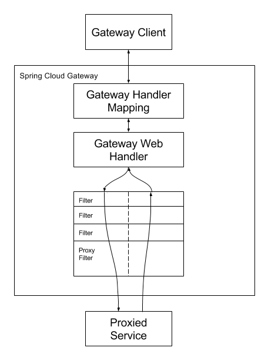

# Spring cloud gateway
* [Spring cloud gateway Docs](https://cloud.spring.io/spring-cloud-gateway/reference/html/)

##  Spring cloud gateway workflow



## Spring cloud Gateway Allow Query Param
spring cloud gateway는 허용하는 query param을 `RFC3986` 스펙에 맞게 정의

* [spring cloud gateway query param](https://yangbongsoo.tistory.com/33?category=919800)

```ruby
query       = *( pchar / "/" / "?" )
—————
pchar       = unreserved / pct-encoded / sub-delims / ":" / "@"
unreserved  = ALPHA / DIGIT / "-" / "." / "_" / "~"
pct-encoded = "%" HEXDIG HEXDIG
sub-delims  = "!" / "$" / "&" / "'" / "(" / ")"
                  / "*" / "+" / "," / ";" / "="
```
