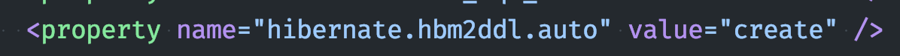
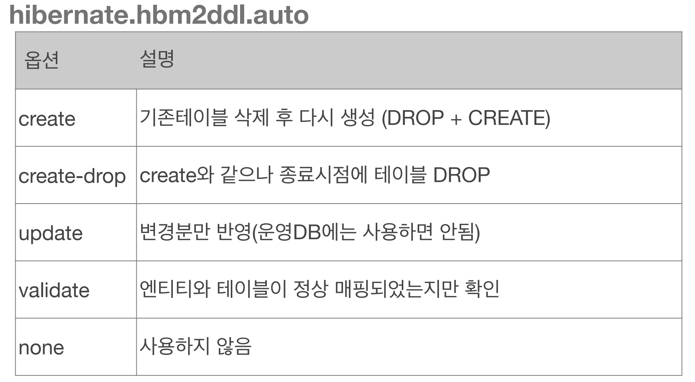
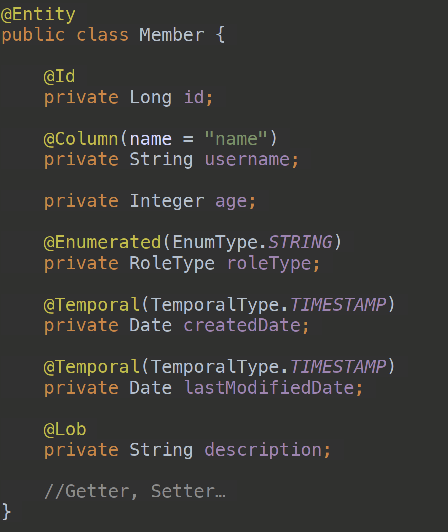
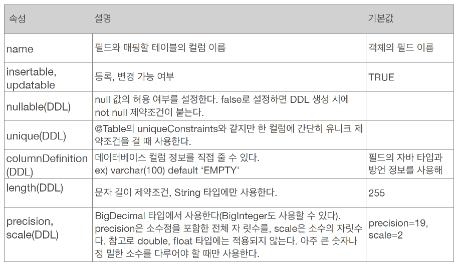
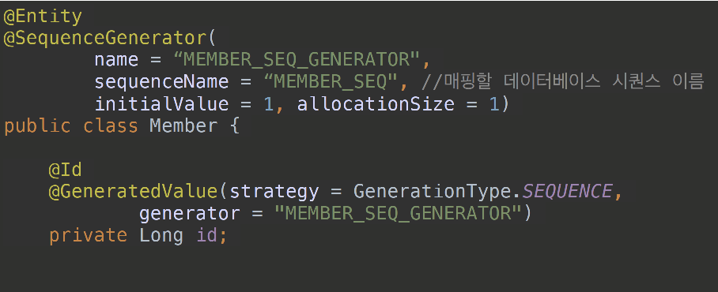
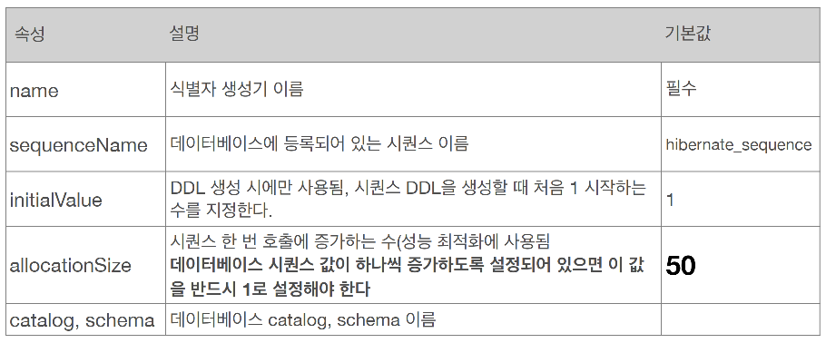

# Entity Mapping

* 객체와 테이블 맵핑: @Entity, @Table
* 필드와 컬럼 맵핑: @Column
* 기본 키(PK) 맵핑: @Id
* 연관관계 맵핑: @OnetoOne, @OneToMany..

# @Entity
JPA가 관리하는 엔티티 객체를 지정하는 어노테이션
> JPA를 사용해서 테이블과 맵핑할 클레스는 반드시 @Entity 필수

### 주의점
* 기본 생성자 필수(파라메터가 없는 생성자)
* final 클래스, enum, interface, inner 클래스 사용X
* 저장할 필드에 final 사용 X

### 속성

* name
  + JPA에서 사용할 엔티티 이름 지정
  + Default: 클래스 이름 그래도 사용
  + 같은 클래스 이름이 없으면 가급적 기본값을 사용


# @table
엔티티와 맵핑할 DB의 테이블 설정
* name: 맵핑할 테이블 이름
* catalog: 데이터베이스 catalog 맵핑
* schema: 데이터베이스 schema 맵핑
* uniqueConstraints: DDL 생성 시에 유니크 제약 조건 생성


## 데이터베이스 스키마 자동 생성
* DDL을 어플리케이션 실행 시점에 자동 생성
* 테이블 중심 개발 -> 객체 중심 개발로 전환(장점)
* 데이터베이스 방언을 활용해서 데이터베이스에 맞는 적절한 DDL 생성

hibernate ddl 설정



> 데이터베이스 스키마 자동 생성 - 주의점
운영 장비에는 절대 create, create-drop, update 설정을 사용하면 안된다.
> * 개발 초기 단계: create or update
> * 테스트 서버는 update or validate or none
> * 스테이징과 운영 서버: validate or **none**

## 컬럼 맵핑 및 제약조건
추가적으로 제약조건을 설정할 수 있다.




* 기본 키 맵핑
  ```java
  @Id
  @GemeratedValue
  ```
* 제약조건: 필수 데이터 필드 설정, 자리수 등
  ```java
  @Column(nullable = false, length = 10)
  ```
  
* 유니크 제약조건 추가
  ```java
  @Table(uniqueConstraints = {@UniqueConstraint( name = "NAME_AGE_UNIQUE",columnNames = {"NAME", "AGE"} )})
  ```
* enum 타입 맵핑
  ```java
  @Enumerated(EnumType.STRING) // enum 이름을 데이터베이스에 저장
  ```
* @Lob
  - 데이터베이스 BLOG, CLOG 타입과 맵핑
  - 맵핑하는 필드 타입이 문자면 CLOB, 나머지는 BLOB 맵핑

> DDL 생성 기능은 DDL을 자동 생성할 때만 사용되고, JPA 실행 로직에는 영향 X


## 기본 키 설정
* 직접 할당: @Id 만 사용
* 자동 생성: @GeneratedValue
  + strategy 속성 설정
    - IDENTITY: DB에 키 생성 위임
    - SEQUENCE: DB 스퀀스 오브젝트 사용(@SequnceGenverator 필요)
    - TABLE: 키 생성용 테이블 사용
    - AUTO: DB 방언에 따라 자동 지정

## 권장하는 식별자 전략
* 기본 키 제약 조건: Not null, unique, Not Change
* 미래까지 이 조건을 만족하는 자연키는 찾기 어렵다.
* **권장:  Long형, 대체키, 키 생성전략 사용**

### IDENTITY
* 기본 키 생성을 데이터베이스 위임
* **JPA는 보통 트랜잭션 커밋 시 쿼리 실행**
  + AUTO_INCREMENT 는 DB에 INSERT SQL을 실행 해야  KEY ID를 생성할 수 있음
  + **IDENTITY 전략은 Persist() 시점에 즉시 INSERT 쿼리 실행하여 영속 상태 동기화**

### SEQUENCE
DB 스퀀스는 유일한 값을 순서대로 생성하는 특별한 오브젝트

* 시퀀스 맵핑
  
  


# TABLE 전략


## Data
