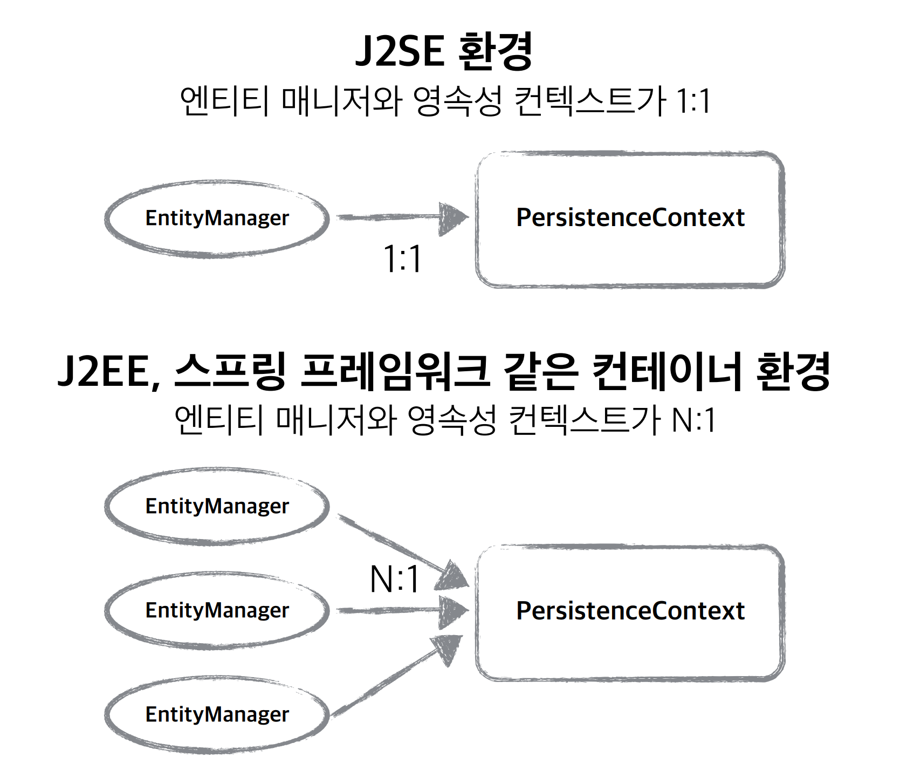
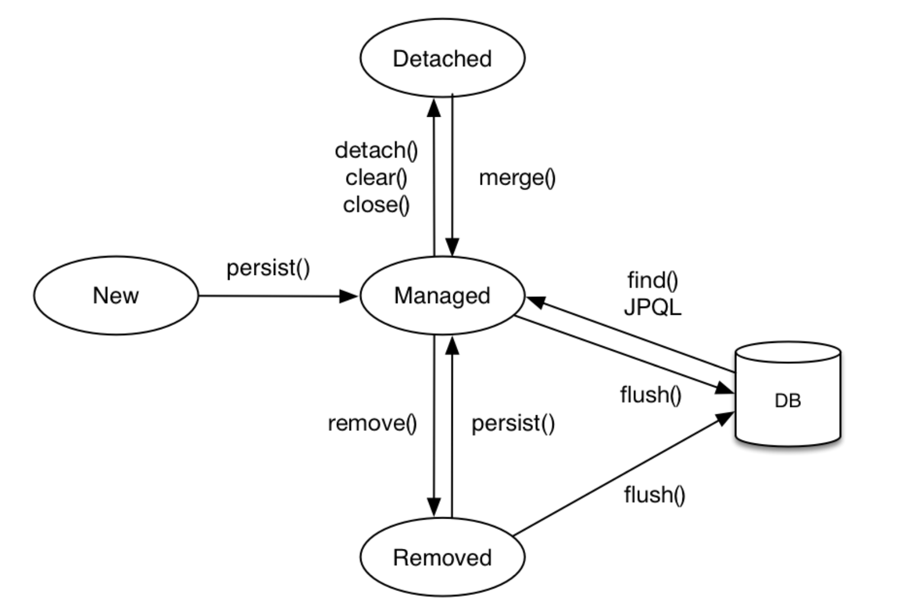
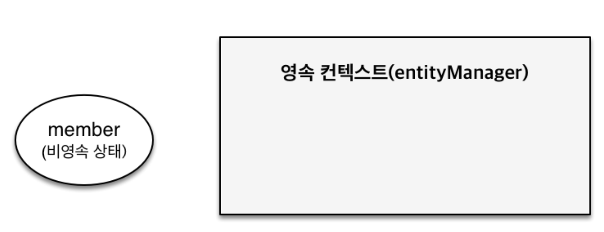
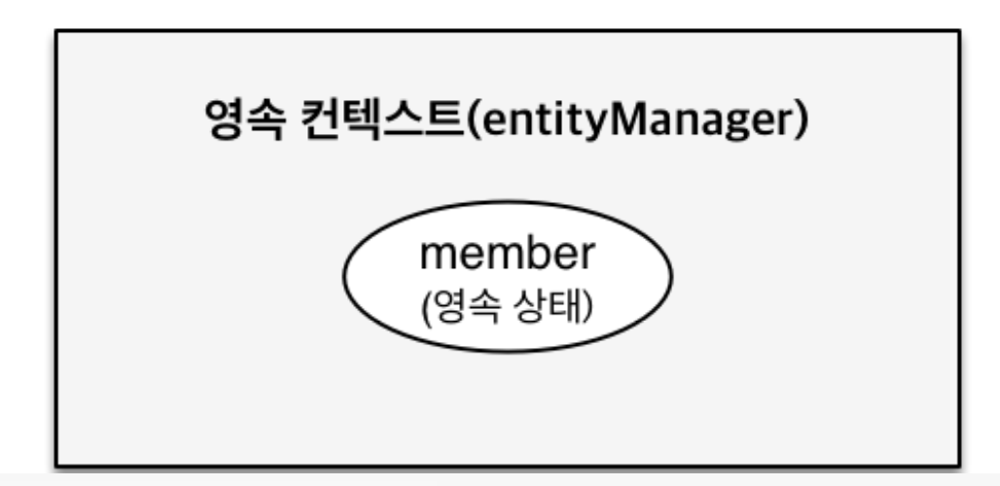
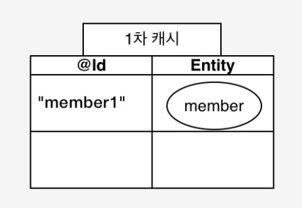

# 영속성 컨텍스트
영속성 컨텐스트란 엔티티를 영구 저장하는 환경이라는 뜻이다. 애플리케이션과 데이터베이스 사이에서 객체를 보관하는 가상의 데이터베이스 같은 역할을 한다. 엔티티 매니저를 통해 엔티티를 저장하거나 조회하면 엔티티 매니저는 영속성 컨텍스트에 엔티티를 보관하고 관리한다.
* 영속성 컨텍스트트 논리적인 개념
* 엔티티 매니저를 통해서 영속성 컨텍스트에 접근
* 트랜잭션 작업 단위와 동일한 생명 주기
> `ex)` EntityManager.persist(entity);
>> `persist()` 메서드는 DB에 저장하는 메서드가 아닌 영속성 컨텍스트에 저장하는 메서드


* 엔티티의 생명 주기
* 영속성 컨택스트의 특징

## 엔티티의 생명 주기


> 엔티티의 생명 주기 상태는 4가지로 분류


* 비영속(new/transient): 영속성 컨텍스트와 전혀 관계가 없는 **새로운** 상태
  
  ```java
  Member member = new Member();
  member.setId("member1");
  member.setName("테스트");
  ```


* 영속(managed): 영속성 컨텍스트에 **관리**되는 상태
  
  ```java
  //객체를 생성한 상태(비영속)
  Member member = new Member();
  member.setId("member1");
  member.setUsername(“회원1”);

  EntityManager entityManager = emf.createEntityManager();
  entityManager.getTransaction().begin();

  //객체를 저장한 상태(영속)
  entityManager.persist(member)
  ```

* 준영속(detached): 영속성 컨텍스트에 저장되었다가 **분리**된 상태
  ```java
  // 회원 엔티티를 영속성 컨텍스트에서 분리, 준영속 상태
  entityManager.detach(member);
  ```
* 삭제(removed): **삭제**된 상태
  ```java
  // 객체를 상태환 상태(삭제)
  entityManager.remove(member);
  ```

## 영속성 컨텍스트의 특징

* [1차 캐시](#1차-캐시)
* [동일성(identity) 보장](#동일성-보장)
* [쓰기 지연(transactional write-behind)](#쓰기-지연)
* [변경 감지(Dirty Checking)](#변경-감지)
* [지연 로딩(Lazy Loading)](#지연-로딩)

## 1차 캐시

영속성 컨텍스트 내부에는 캐시가 있는데 이를 1차 캐시라고 한다.
영속 상태의 엔티티를 이곳에 저장한다.
1차 캐시의 키는 식별자 값(데이터베이스의 기본 키)이고 값은 엔티티 인스턴스이다.
> 고객에 요청이 들어와서 비지니스 로직이 끝나면(트랜잭션) 1차 캐시 삭제

조회하는 방법은 다음과 같다.
```java
Member findMember = entityManager.find(Member.class, "member1");)
```

1. 1차 캐시에서 엔티티를 찾는다
2. 있으면 메모리에 있는 1차 캐시에서 엔티티를 조회한다.
3. 없으면 데이터베이스에서 조회한다.
4. 조회한 데이터로 엔티티를 생성해 1차 캐시에 저장한다. (엔티티를 영속상태로 만든다)
5. 조회한 엔티티를 반환한다.

> 어플리케이션 전체에서 공유하는 캐시 => 2차캐시

## 동일성 보장
```java
Member a = entityManager.find(Member.class, "1L");
Member b = entityManager.find(Member.class, "1L");
// a == b (true) // 동일성 비교 // 동일한 엔티티
```
+ 1 차 캐시로 반복 가능한 읽기(Repeatable Read) 등급의 트랜잭션 격리 수준을 데이터베이스가 아닌 애플리케이션 단위 차원에서 제공

> 실제 인스턴스가 같다.

## 쓰기 지연
트랜잭션에서 커밋하는 순간에 영속 컨텍스트에 쓰기 지연 SQL저장에 모아둔 SQL쿼리를 한번에 전송

#### 예외사항
JPA에서 기본키 @Id 를 생성하는 GeneratedValue 전략 중 IDENTITY 속성의 전략은 기본키 생성을 데이터베이스에 위임
* MySQL, DB2: AUTO_INCREMENT
  + AUTO_ INCREMENT는 데이터베이스에 INSERT SQL을 실행 한 이후에 ID 값을 알 수 있음
  + IDENTITY 전략은 em.persist() 시점에 즉시 INSERT SQL 실행 하고 DB에서 식별자를 조회

> 그러므로, @Id 생성 관련 Persist 가 일어나면, 예외적으로 바로 DB에 Insert 문을 전달하여, 기본키를 생성하여 1차 캐쉬에 저장함으로서 영속 상태로 만든다.

## 변경 감지
JPA로 엔티티를 수정할 때는 단순히 엔티티를 조회해서 데이터를 변경하면 된다.

+ 자바 컬렉션을 다루듯이 사용 가능(값을 변경하면, persist()없이 변경)
+ 영속된 엔티티의 변경이 일어나면, 자동으로 감지하여 Update or Delete 쿼리 전송
+ 영속성 컨텍스트가 관리하는 영속 상태에서 적용

변경감지의 흐름
1. 트랙잭션을 커밋하면 엔티티 매니저 내부에서 먼저 플러시가 호출된다.
2. 엔티티와 스냅샷을 비교하여 변경된 엔티티를 찾는다.
3. 변경된 엔티티가 있으면 수정 쿼리를 생성해서 쓰기 지연 SQL 저장소에 저장한다.
4. 쓰기 지연 저장소의 SQL을 플러시한다.
5. 데이터베이스 트랜잭션을 커밋한다.

## 지연 로딩


## JPA 적용
커밋하는 시점
1. 내부적으로 flush가 호출
2. 1차 캐시에서 entity와 스냅샷을 비교(스냅샷: DB에서 조회했을때 값을 저장)
3. 스냅샷가 다른 변경된 entity는 update쿼리를 쓰기 지연 SQL 저장소에 생성
4. DB에 적용


## Flush
영속성 컨텍스트의 변경내용을 데이터베이스에 반영

> 영속성 컨택스트에 저장된 쿼리들을  DB에 전송

Flush 사용 흐름
1. 변경 감지
2. 수정된 엔티티 쓰기 지연 SQL저장소에등록
3. 등록, 수정 삭제 쿼리 전송

> * 영속성 컨텍스트를 비우지 않음
> * 영속성 컨텍스트의 변경 내용을 데이터베이스와 동기화
> * 트랜잭션이라는 작업 단위가 중요 -> 커밋 직전에만 동기화

### 영속성 컨텍스트를 플러시 하는 방법

* em.flush() : 직접 호출
  - 영속성 컨텍스트의 쓰기 지연 SQL저장소에 저장되 있던 쿼리들을 DB에 전송
  - **1차 캐시가 갱신되지 않는다.**
* transaction commit : 비지니스 로직 한 사이클이 실행되 트랜젝션 커밋되는 경우
* JPQL쿼리 실행
  - JPQL 쿼리 실행시, 쿼리문 전에 자동으로 Flush가 호출된다.

## Flush Option Mode Setting

* FlushModeType.AUTO: 커밋이나 쿼리를 실행할 때 플러시(**Default**)
* FlushModeType.COMMIT: 커밋할 때만 플러시

## 준영속 상태
* 영속 -> 준영속 상태 변경 가능
* 영속 상태의 엔티티가 영속성 컨텍스트에서 분리(detached)
  - 변경 감지 or 쓰기 지연 등 영속성 컨텍스트의 영향 범위를 벗어난다.
* 영속성 컨텍스트가 제공하는 기능을 사용하지 못함

### 준영속 상태 만드는 방법

* em.detach(entity): 특정 엔티티만 준영속 상태로 전환
* em.clear(): EntityManager의 영속성 컨텍스트를 완전히 초기화
* em.close(): 영속성 컨텍스트를 종료


# JPA
