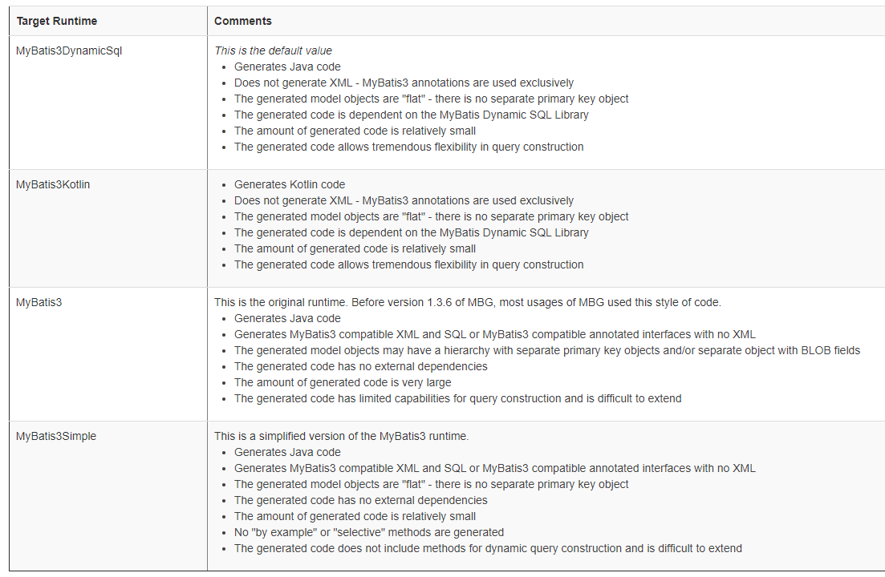

# Mybatis Generator
[ Generator Quick Start Guide](https://mybatis.org/generator/quickstart.html)


### MyBatis Generator Quick Start Guide

MyBatis Generator (MBG) generates code in different styles depending on how it is configured. This is controlled by specifying the $targetRuntime$ attribute on a $<context>$ configuration element. The table below summarizes the different options.

마이바티스 제너레이터의 버전업에 따라, 생성되는 제너레이터 코드의 종류가 4가지로 나뉘였다. 
기존의 제너레이터 형식의 생성되는 코드환경을 설정하려면, $Target Runtime$을 설정해 주어야 했다.

> 설정 방법은 아래와 같다.

### Target Runtime Information and Samples



### Sample Configuration for MyBatis3DynamicSql
```xml
<!DOCTYPE generatorConfiguration PUBLIC
 "-//mybatis.org//DTD MyBatis Generator Configuration 1.0//EN"
 "http://mybatis.org/dtd/mybatis-generator-config_1_0.dtd">
<generatorConfiguration>
  <context id="dsql" targetRuntime="MyBatis3DynamicSql">
    <jdbcConnection driverClass="org.hsqldb.jdbcDriver"
        connectionURL="jdbc:hsqldb:mem:aname" />

    <javaModelGenerator targetPackage="example.model" targetProject="src/main/java"/>

    <javaClientGenerator targetPackage="example.mapper" targetProject="src/main/java"/>

    <table tableName="FooTable" />
  </context>
</generatorConfiguration>
```

### Sample Configuration for MyBatis3Kotlin
```xml
<!DOCTYPE generatorConfiguration PUBLIC
 "-//mybatis.org//DTD MyBatis Generator Configuration 1.0//EN"
 "http://mybatis.org/dtd/mybatis-generator-config_1_0.dtd">
<generatorConfiguration>
  <context id="kotlin" targetRuntime="MyBatis3Kotlin">
    <jdbcConnection driverClass="org.hsqldb.jdbcDriver"
        connectionURL="jdbc:hsqldb:mem:aname" />

    <javaModelGenerator targetPackage="example.model" targetProject="src/main/kotlin"/>

    <javaClientGenerator targetPackage="example.mapper" targetProject="src/main/kotlin"/>

    <table tableName="FooTable" />
  </context>
</generatorConfiguration>
```

### Sample Configuration for MyBatis3
```xml
<!DOCTYPE generatorConfiguration PUBLIC
 "-//mybatis.org//DTD MyBatis Generator Configuration 1.0//EN"
 "http://mybatis.org/dtd/mybatis-generator-config_1_0.dtd">
<generatorConfiguration>
  <context id="simple" targetRuntime="MyBatis3Simple">
    <jdbcConnection driverClass="org.hsqldb.jdbcDriver"
        connectionURL="jdbc:hsqldb:mem:aname" />

    <javaModelGenerator targetPackage="example.model" targetProject="src/main/java"/>

    <sqlMapGenerator targetPackage="example.mapper" targetProject="src/main/resources"/>

    <javaClientGenerator type="XMLMAPPER" targetPackage="example.mapper" targetProject="src/main/java"/>

    <table tableName="FooTable" />
  </context>
</generatorConfiguration>
```

### Sample Configuration for MyBatis3Simple
```xml
<!DOCTYPE generatorConfiguration PUBLIC
 "-//mybatis.org//DTD MyBatis Generator Configuration 1.0//EN"
 "http://mybatis.org/dtd/mybatis-generator-config_1_0.dtd">
<generatorConfiguration>
  <context id="simple" targetRuntime="MyBatis3Simple">
    <jdbcConnection driverClass="org.hsqldb.jdbcDriver"
        connectionURL="jdbc:hsqldb:mem:aname" />

    <javaModelGenerator targetPackage="example.model" targetProject="src/main/java"/>

    <javaClientGenerator type="ANNOTATEDMAPPER" targetPackage="example.mapper" targetProject="src/main/java"/>

    <table tableName="FooTable" />
  </context>
</generatorConfiguration>
```


# Mybatis Generator Setting
```xml
<?xml version="1.0" encoding="UTF-8"?>
<!DOCTYPE generatorConfiguration PUBLIC "-//mybatis.org//DTD MyBatis Generator Configuration 1.0//EN" "http://mybatis.org/dtd/mybatis-generator-config_1_0.dtd">

<generatorConfiguration>
    <classPathEntry location="C:/mysql-connector-java-8.0.17.jar"/>

	<context id="MySQLTables" targetRuntime="MyBatis3Simple">
		<!-- 데이터베이스 연결정보 -->
		<jdbcConnection driverClass="com.mysql.cj.jdbc.Driver" connectionURL="jdbc:mysql://192.168.4.20:3306/carplanner?serverTimezone=UTC" userId="carplanner" password="K%Ey6FY3_*e^wk8f">
			<property name="nullCatalogMeansCurrent" value="true" />
		</jdbcConnection> 

		<!-- 테이블별로 만들어지는 모델 클래스에 대한 설정 -->
		<javaModelGenerator targetPackage="com.richncar.groom.generator.model"  targetProject="groom" />

		<!-- 매퍼 XML에 대한 설정 -->
		<sqlMapGenerator targetPackage="com.richncar.groom.generator.mapper.mysql" targetProject="groom" />
		
		<!-- 매퍼 XML과 매퍼 인터페이스 방식 선택, type값은 ANNOTATEDMAPPER, MIXEDMAPPER, XMLMAPPER 중 선택  --> 
		<javaClientGenerator type="XMLMAPPER" targetPackage="com.richncar.groom.generator.dao" targetProject="groom" />

		<!-- 생성대상 테이블 정보 -->
		<table tableName="sys_region"   	         domainObjectName="GtrSysRegion" />
		<table tableName="sys_code_manager"          domainObjectName="GtrSysCodeManager" />
		<table tableName="sys_menu_group"            domainObjectName="GtrSysMenuGroup" />
		<table tableName="sys_menu_info"             domainObjectName="GtrSysMenuInfo" />
		<table tableName="sys_menu_mapper"           domainObjectName="GtrSysMenuMapper" />
		<table tableName="sys_app_ver"           	 domainObjectName="GtrSysAppVer" />
		<table tableName="member"                    domainObjectName="GtrMember" />
		<table tableName="member_acc_hist"           domainObjectName="GtrMemberAccHist" />
		<table tableName="member_add_info"           domainObjectName="GtrMemberAddInfo" />
		<table tableName="member_file"               domainObjectName="GtrMemberFile" />
		<table tableName="member_inactive"           domainObjectName="GtrMemberInactive" />
		<table tableName="member_mobile_info"        domainObjectName="GtrMemberMobileInfo" />
		<table tableName="member_employee_card"      domainObjectName="GtrMemberEmployeeCard" />
		<table tableName="member_use_history"        domainObjectName="GtrMemberUseHistory" />
		<table tableName="mng_inquire"               domainObjectName="GtrMngInquire" />
		<table tableName="mng_inquire_detail"        domainObjectName="GtrMngInquireDetail" />
		<table tableName="mng_inquire_file"          domainObjectName="GtrMngInquireFile" />
		<table tableName="mng_ew_coregnum"           domainObjectName="GtrMngEwCoregnum" />
		<table tableName="repair_detail"             domainObjectName="GtrRepairDetail" />
		<table tableName="repair_manager"            domainObjectName="GtrRepairManager" />
		<table tableName="customer_db_master"        domainObjectName="GtrCustomerDbMaster" />
		<table tableName="customer_orix_mgr"         domainObjectName="GtrCustomerOrixMgr" />
		<table tableName="member_share_info"         domainObjectName="GtrMemberShareInfo" />
		<table tableName="mng_operation"  	  		 domainObjectName="GtrMngOperation" />
		<table tableName="mng_operation_detail"  	 domainObjectName="GtrMngOperationDetail" />
		<table tableName="mng_operation_attach_file" domainObjectName="GtrMngOperationAttachFile" />
		<table tableName="point_rank"  	  			 domainObjectName="GtrPointRank" />
		<table tableName="point_member"  	  		 domainObjectName="GtrPointMember" />
		<table tableName="point_master"  	  		 domainObjectName="GtrPointMaster" />
		<table tableName="point_detail_info"  	  	 domainObjectName="GtrPointDetailInfo" />
		<table tableName="point_save_hold"  	  	 domainObjectName="GtrPointSaveHold" />
		<table tableName="point_minus_info"  	     domainObjectName="GtrPointMinusInfo" />
		<table tableName="ew_coregnum"  	         domainObjectName="GtrEwCoRegnum" />
		<table tableName="ew_regist_car"  	         domainObjectName="GtrEwRegistCar" />
		<table tableName="mng_temp_file"  	         domainObjectName="GtrMngTempFile" />
		<table tableName="push_file"  	         	 domainObjectName="GtrPushFile" />
		<table tableName="push_manager"  	         domainObjectName="GtrPushManager" />
		<table tableName="push_user"  	         	 domainObjectName="GtrPushUser" />
		<table tableName="pg_payment_order"			 domainObjectName="GtrPgPaymentOrder" />

	</context>
</generatorConfiguration>
```