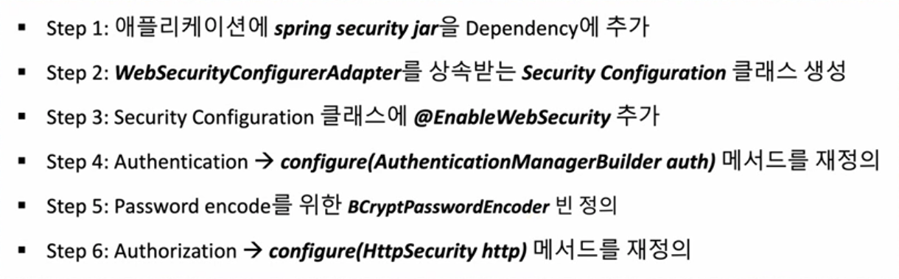

# Srping Security
* Authentication + Authorization

## Authentication
* 내가 누구인지 확인 및 검증

## Authorization
* 나의 권한은 어디까지인가 확인 및 검증

## HTTP 통신의 이해
* 서버가 클라이언트 상태를 보존하지 않음
  + 서버의 리소스 절약
  + 서버 확장성에 용이
  + 상태를 보존하지 않는다.

---
# 쿠키

# 세션

1. 클라이언트가 서버에 접속 시 세션ID를 발급
2. 클라이언트는 세션 ID를 쿠키로 저장
3. 클라이언트는 요청할 때 세션 ID와 함께 서버에 요청
4. 서버는 세션 ID로 저장되어 있는 클라이언트 정보를 확인

* 장점
  + 서버에 저장되기 떄문에 쿠키보다 비교적 안전
* 단점
  + 서버를 확장하는데 부담
  + 멀티 디바이스 환경에 신경써야 한다
  + 유저 정보를 서버 메모리에 들고 있게 된다

# 토큰
토큰은 브라우저에 저장

1. 클라이언트 로그인
2. 정보다 맞다면 서버는 클라이언트에게 토큰을 제공
3. 다음 요청부터는 Authorization 헤더에 토큰을 포함해 요청

장점
* 서버의 메모리에 부담이 적다
* 서버를 확장하는데 부담이 없다
* 멀티 디바이스 환경에서 사용하기 편하다

단점
* 강제로 토큰을 만료할 수 없다

---

## Oath2

## Basic HTTP

## Actuator
