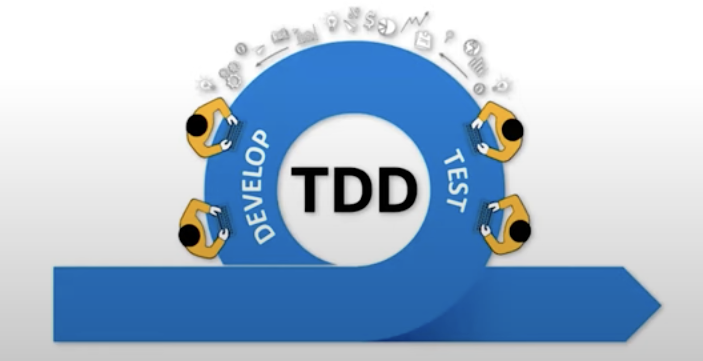
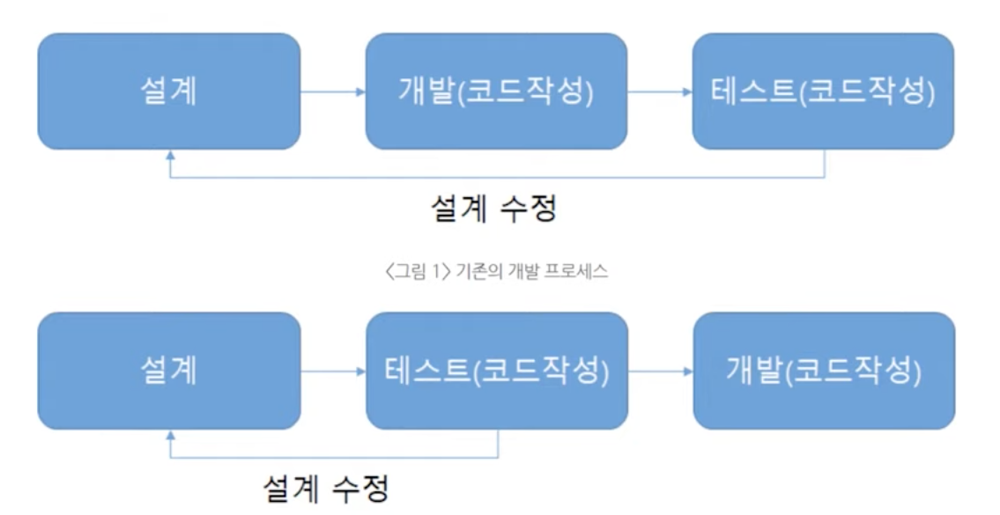
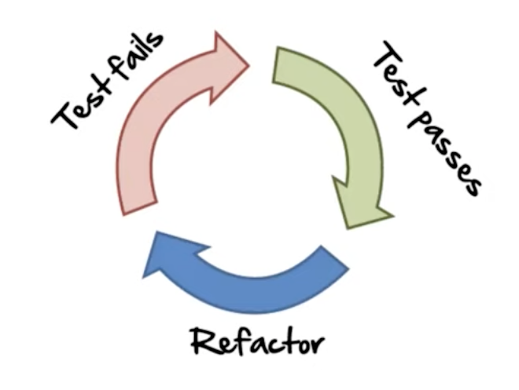
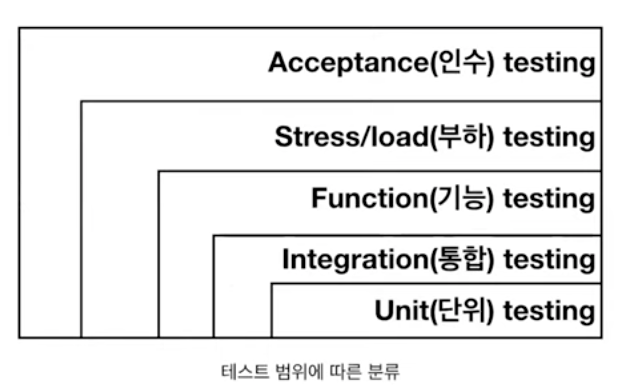

# TDD

> 프로그램을 작성하기 전에 테스트를 먼저 하라!
> Test the programe before you write it!
> -Kent Beck-

* TDD (Test-Driven-Development)
* 테스트 코드를 먼저 만들고, 실제 프로덕션 코드를 나중에 구현하는 개발 방법론

## TDD 를 사용하는 이유

* 변화에 대한 두려움을 줄여줌
* 문서 역활
* TDD를 사용하면, 테스트 커버리지가 높아짐
* 오버 엔지니어링 방지
  - 요구 사항에 맞게 개발을 진행
  - 불필요한 개발 방지
* 설계에 대한 피드백이 빠름

# 테스트의 범위

* 통합 테스트: 여러 작업 단위가 연계된 워크 플로우를 테스트하기 위한 수단 (객체 간, 서비스 간, 시스템 간)
* 기능 테스트: 공개된 API의 가장 바깥쪽에 해당하는 코드 검사 (Controller, Security, Http)
* 부하 테스트: 주어진 단위 시간 동안 어플리케이션이 얼마나 많은 요청을 처리할 수 있는지 검사
* 인수 테스트: 고객 또는 대리인이 정의되어진 모든 목적에 부합되는지 확인해보고자 하는 검사
