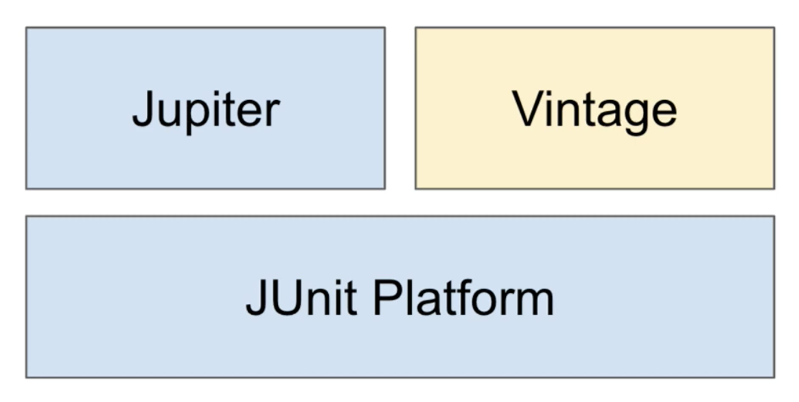

# JUnit Framework
* Java 개발자 93%가 사용하는 테스트 프레임워크
  + [JetBrains 통계](https://www.jetbrains.com/lp/devecosystem-2019/java/)
* 현재 버전 JUnit5
* 스프링 부트 2.2 버전 이상부터 기본적으로 의존성이 주입되어 사용가능
* JUnit 외에 다양한 테스트 프레임워크

# JUnit 기본 구성



* Platform: 테스트를 실행해주는 런처 제공 (TestEngine API 제공)
* Jupiter: JUnit5를 지원하는 TestEngine API 구현체
* Vintage: JUnit4, 3를 지원하는 TestEngin API 구현체

## 속성


* LifeCycle
  + @BeforeAll: 해당 클래스에 위치한 모든 테스트 메서드 실행 전에 딱 한번 실행되는 메서드
  + @AfterAll: 해당 클래스에 위치한 모든 테스트 메서드 실행 후에 딱 한번 실행되는 메서드
  ```java
  @BeforeAll

  @Test
  @Test
  @Test
  @Test
  ```
  + @BeforEach: 해당 클래스에 위치한 모든 테스트 메서드 실행 전에 실행되는 메서드
  + @AfterEach: 해당 클래스에 위치한 모든 테스트 메서드 실행 후에 실행되는 메서드
  ```java
  @BeforEach
  @Test

  @BeforEach
  @Test

  @BeforEach
  @Test

  @BeforEach
  @Test
  ```
* 표현
  + @DisplayName: 어떤 테스트인지 쉽게 표현 or 설명
* 반복테스트
  + @RepeatedTest: 반복하는 테스트
  + @ParameterizedTest: 여러 매개변수를 대입해가며 반복 실행 테스트
* 테스트 결과 판별
  + Assertions
    - `assertAll()`
    - 추가로 assertJ의 다양한 assert 메소드를 사용
