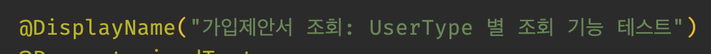
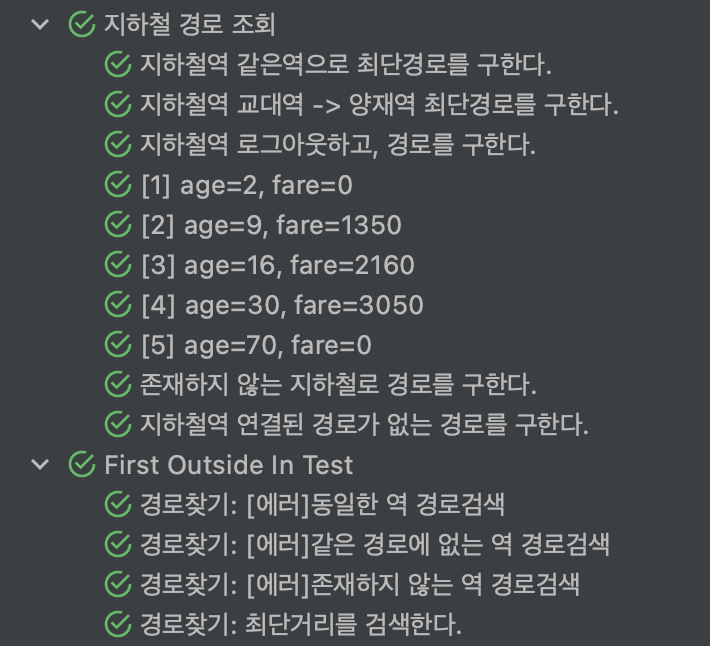
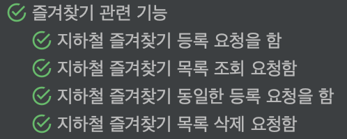
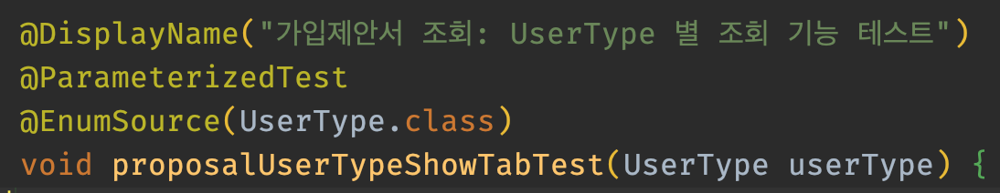
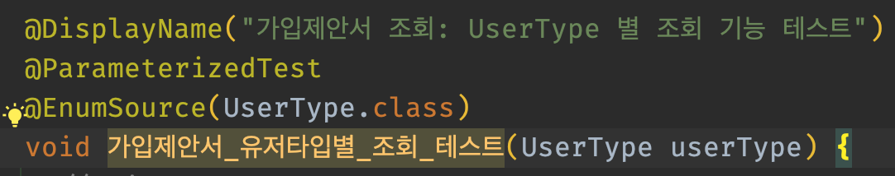
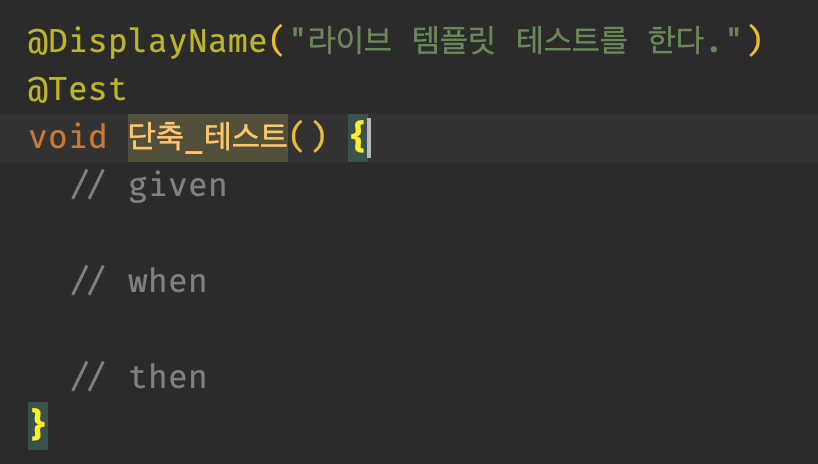
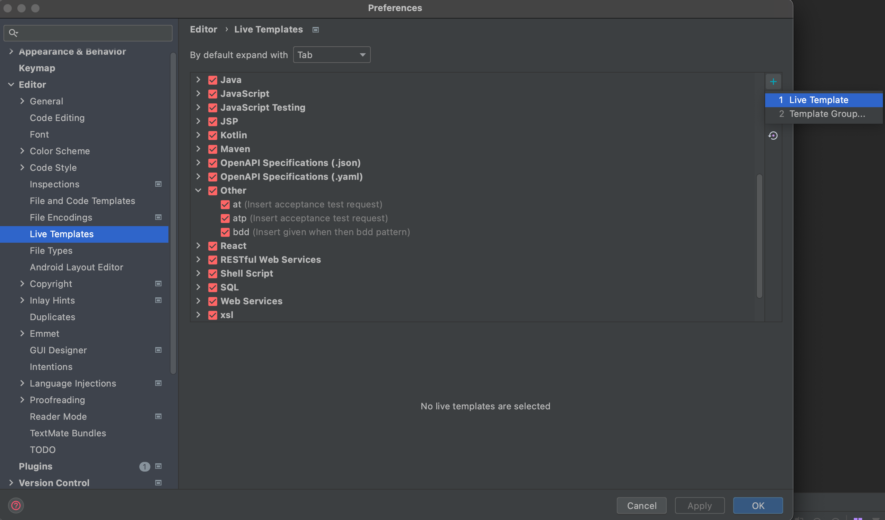
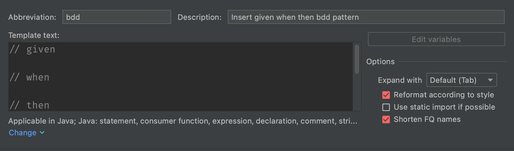
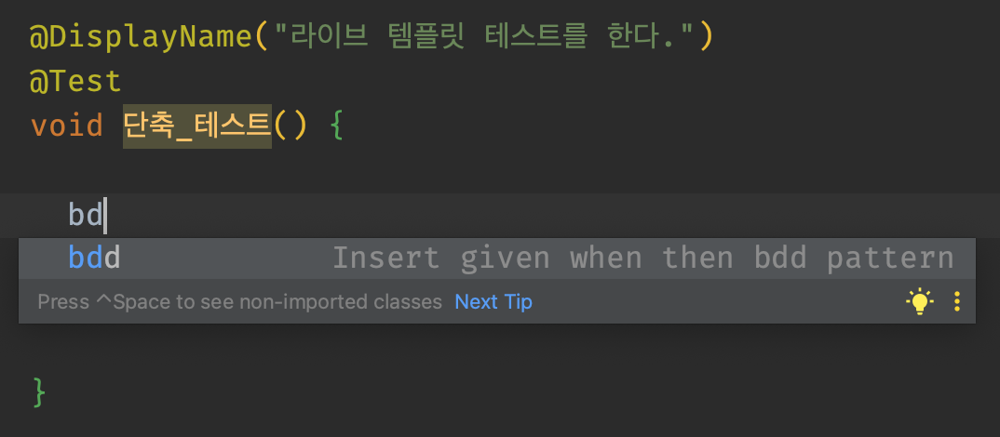

# Test Code Rule

* 요구사항을 명확하고 온전하게 이해
* 테스트 케이스 메서드명은 의미있고 쉽게 의도를 파악 가능하도록 생성
  + 메서드 명을 한글로 작성 가능(컨벤션 정의)
  + 테스트의 의도를 명확하게 드러내기(주석이 필요 없음)
* 테스트 가독성이 중요한 이유
  + 가독성이 좋지 않으면 방치되는 테스트가 될 가능성이 높다(@Ignore or @Disabled)
  + 변경 사항에 대해서 수정하기 어렵다. -> 방치될 가능성이 높다(@Ignore or @Disabled)
  + 가독성이 좋으면 해당 기능의 스펙을 나타낼 수 있다.
  > 프로덕션 코드의 가독성이 중요한 만큼 테스트 코드의 가독성도 중요함

* 테스트 코드 중복 제거
  + 반복되는 코드는 메서드로 분리

## 테스트 케이스 작성 팁

* 실패하는 테스트 케이스 먼저 작성
  - 로직상 일어나는 에러 케이스
  - 테스트가 예상과 다른 식으로 실패하면 뭔가를 잘못 이해했거나 테스트 코드의 미완성
* 간단한 성공 케이스 작성
  - 동작 가능한 가장 간단한 성공 케이스로 시작
  - 테스트가 동작하면 실제 구조에 관해 더 좋은 생각이 떠오를 수 있음
  - 그 과정에서 발생 가능한 실패를 처리하는것과 성공 케이스 사이에서 우선순위를 가늠
* BDD - Given/When/Then
  - When -> Then -> Given 순서로 작성하는 것이 자연스러움

# Test Code Convention

* @DisplayName 규칙
  
  
  
* 유닛 테스트 메서드 명명 규칙
  1. 영어
  
  2. 한글
  

* bdd
  


## 자동 생성 설정

1. IntelliJ -> Settings/Preferences > Editor -> Live Templates.

  * 오른쪽 `+` Button `Click`
    1. `Template Group` 에서 `Other` 새로 생성
    2. `Other` 하위에 새로운 `Live Template` 추가


1. `Abbreviation(단축어)` 와 `Description` 입력
2. `Template Text` 에 아래 내용 입력
    ```java
    // given

    // when

    // then
    ```
3. Define > Java > Statement 선택
4. Option > Reformate according to style 선택(활성)
5. 편집기에서 Abbreviation(단축어)로 지정한 단어를 입력 후 엔터


