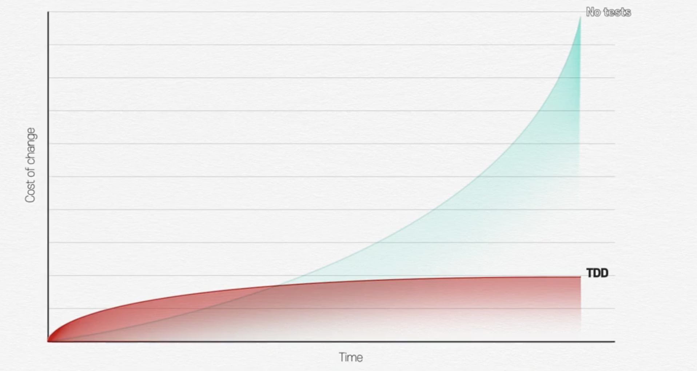
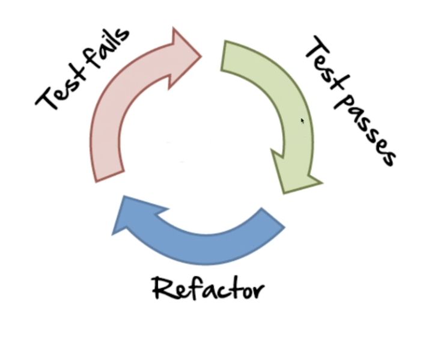

# Test Driven Development

* 테스트코드 or 단위테스트 와 TDD는 다른 개념
* TDD = TFD(Test First Development) + 리펙토링(설계 활동)
  + 프로덕션 코드를 만들기 전에 테스트 코드를 먼저 구현하는 개발방법론
  + 단위 테스트와 TDD는 전혀 다름
  + 프로덕션(서비스) 코드와 테스트 코드로 구분
  + **리펙토링**: 기능에 대한 변경점 없이, 클래스 구조 변경, 메서드 분리 같은 설계 활동
    - 즉 TDD를 통해  작은 기능 단위의 테스트 사이클로 지속적인 리펙토링(설계활동)을 거쳐 완성도를 끌어올리는 개발방법론

> TDD의 아이러니 중 하나는 테스트 기술이 아니라는 점이다. TDD는 분석 기술이며, 설계 기술이기도 하다 - 켄트백, Test Driven Development by example 중

* 장점
  + 디버깅 시간 감소한다.
  + 동작하는 문서 역활을 한다.
  + 변화에 대한 두려움을 줄여준다.
* 단점
  - 시간이 오래 걸린다?
  - 버그가 계속 발생한다?

# TDD 사이클

1. 실패하는 테스트를 구현
2. 테스트가 성공하도록 프로덕션 코드 구현
3. 프로덕션 코드와 테스트 코드 리펙토링

# TDD 원칙

* 원칙.1: 실패하는 단위 테스트를 작성할 때까지, 프로덕션 코드를 작성하지 않는다.
* 원칙.2: 컴파일은 실패하지 않으면서 실행이 실패하는 정도로만 단위 테스트를 작성한다.
* 원칙.3: 현재 실패하는 테스트를 통과할 정도로만 실제 코드를 작성한다.

> 너무 많은 기능을 만족하는 or 미래를 예측해서 개발하지 않고, 현재 딱 필요한 정도로만 개발을 하자.

# 숫자 야구 게임

* 1부터 9까지 서로 다른 수로 이루어진 3자리의 수를 맞추는 게임
* 같은 수가 같은 자리에 있으면 `STRIKE`, 다른 자리에 있으면 `BALL` 같은 수가 전혀 없으면 `NOTHING`
    + [Example](): 상대방(컴퓨터)의 수가 `425` 일 때,
        - `123` 을 제시한 경우 : `1 STRIKE`
        - `456` 을 제시한 경우 : `1 STRIKE`, `1 BALL`
        - `789` 를 제시한 경우 : `NOTHING`
* 위 숫자 야구게임에서 상대방의 역할은 컴퓨터
    + 컴퓨터는 `1 ~ 9` 까지 서로 다른 임의의 수 3개를 선택
    + 게임 플레이어는 컴퓨터의 수를 예측하여 3개의 숫자를 입력하고, 컴퓨터는 입력한 숫자에 대한 결과 출력
    + 위 과정을 반복해 컴퓨터가 선택한 3개의 숫자를 모두 맞히면 `게임 종료`

## 구현할 기능 목록 작성하기(Todo List)

* 구현할 기능 목록을 작성 후 TDD 개발
* 아무것도 없는 상태에서 새롭게 구현하는것은 쉽지만, 레거시 코드를 리펙토링하는 개발은 몇 배 더 어렵다.

> TDD는 버그를 완전히 없애기 위해서 하는게 아니고, 우리가 미리 인지한 버그들을 최대한 빨리 발견해서 고객이 인지하기 전에 대응하기 위해 사용하는 것이 바람직하다.

> TDD는 불안함을 지루함으로 변경해주는 마법의 돌
