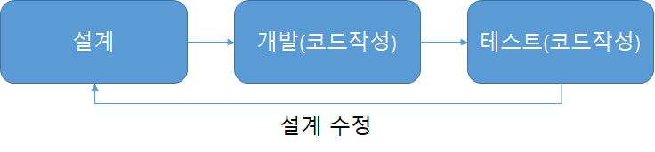
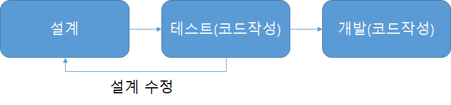

# Test Driven Development

* 반복 테스트를 이용하여, 작은 단위의 테스트 케이스를 작성하고 이를 통과하는 코드를 추가하는 단계를 반복하여 구현
* TDD = TFD(Test First Development) + 리펙토링(설계 활동)
  + 프로덕션 코드를 만들기 전에 테스트 코드를 먼저 구현하는 개발방법론
  + **단위 테스트와 TDD는 전혀 다름**
  + 프로덕션(서비스) 코드와 테스트 코드로 구분
  + **리펙토링**: 기능에 대한 변경점 없이, 클래스 구조 변경, 메서드 분리 같은 설계 활동
    - 즉 TDD를 통해  작은 기능 단위의 테스트 사이클로 지속적인 리펙토링(설계활동)을 거쳐 완성도를 끌어올리는 개발방법론
* 짧은 개발 주기의 반복에 의존하는 개발 프로세스
* 애자일 방법론 중 하나인 eXtream Programming(XP)의 'Test-First' 개념에 기반을 둔 단순한 설계를 중점
  + 미래에 대한 예측을 최대한 하지 않는다.
  + 지속적으로 프로토타입을 완성하는 애자일 방법론

> TDD의 아이러니 중 하나는 테스트 기술이 아니라는 점이다.
TDD는 분석 기술이며, 설계 기술이기도 하다 - 켄트백, Test Driven Development by example 중

<h2>결함은 일찍 찾을 수록 고치는 비용이 적게 든다</h2>

# 개발 방식 비교

🔸 일반 개발 방식

- 보통의 개발 방식은 '요구사항 분석 -> 설계 -> 개발 -> 테스트 -> 배포'의 형태의 개발 주기를 갖는데 이러한 방식은 소프트웨어 개발을 느리게 하는 잠재적 위험이 존재한다. 그 이유로는,

소비자의 요구사항이 처음부터 명확하지 않을 수 있다.

따라서 처음부터 완벽한 설계는 어렵다.

자체 버그 검출 능력 저하 또는 소스코드의 품질이 저하될 수 있다.

자체 테스트 비용이 증가할 수 있다.

 이러한 문제점들이 발생되는 이유는 간단하게 말해서, 어느 프로젝트든 초기 설계가 완벽하다고 말할 수 없기 때문이다. 고객의 요구사항 또는 디자인의 오류 등 많은 외부 또는 내부 조건에 의해 재설계하여 점진적으로 완벽한 설계로 나아간다. 재설계로 인해 개발자는 코드를 삽입, 수정, 삭제 하는 과정에서 불필요한 코드가 남거나 중복처리 될 가능성이 크다.

❌ 결론적으로 이러한 코드들은 재사용이 어렵고 관리가 어려워져 유지보수를 어렵게 만든다.

 작은 부분의 기능 수정에도 모든 부분을 테스트해야 하므로 전체적인 버그를 검출하기 어려워진다. 따라서 자체 버그 검출 능력이 저하된다. 그 결과 어디서 버그가 발생할지 모르기 때문에 잘못된 코드도 고치지 않으려 하는 현상이 나타나고 이 현상은 소스코드의 품질 저하과 직결된다. 이렇게 작은 수정에도 모든 기능을 다시 테스트해야 하는 문제가 발생하여 자체 테스트 비용이 증가된다.

🔸 TDD 개발 방식

- TDD와 일반적인 개발 방식의 가장 큰 차이점은 테스트 코드를 작성한 뒤에 실제 코드를 작성한다는 점이다.
디자인(설계) 단계에서 프로그래밍 목적을 반드시 미리 정의해야만 하고, 또 무엇을 테스트해야 할지 미리 정의(테스트 케이스 작성)해야만 한다.
 테스트 코드를 작성하는 도중에 발생하는 예외 사항(버그, 수정사항)들은 테스트 케이스에 추가하고 설계를 개선한다. 이후 테스트가 통과된 코드만을 코드 개발 단계에서 실제 코드로 작성한다.

🔆 이러한 반복적인 단계가 진행되면서 자연스럽게 코드의 버그가 줄어들고, 소스코드는 간결해진다.

또한, 테스트 케이스 작성으로 인해 자연스럽게 설계가 개선됨으로 재설계 시간이 절감된다.

# TDD 장단점

* 장점
  + 디버깅 시간 절약
  + 동작하는 문서 역활
  + 변화에 대한 두려움을 줄여줌 (리펙토링)
  + 오버 엔지니어링 방지
  + 설계에 대한 피드백이 빠름 -> 설계 수정 용이
* 단점
  - 시간이 오래 걸린다?
  - 버그가 계속 발생한다?  

🍀 TDD 개발 방식의 장점

 보다 튼튼한 객체 지향적인 코드 생산
- TDD는 코드의 재사용 보장을 명시하므로 TDD를 통한 소프트웨어 개발 시 기능 별 철저한 모듈화가 이뤄진다. 이는 종속성과 의존성이 낮은 모듈로 조합된 소프트웨어 개발을 가능하게 하며 필요에 따라 모듈을 추가하거나 제거해도 소프트웨어 전체 구조에 영향을 미치지 않게 된다.

 재설계 시간의 단축
- 테스트 코드를 먼저 작성하기 때문에 개발자가 지금 무엇을 해야하는지 분명히 정의하고 개발을 시작하게 된다. 또한 테스트 시나리오를 작성하면서 다양한 예외사항에 대해 생각해볼 수 있다. 이는 개발 진행 중 소프트웨어의 전반적인 설계가 변경되는 일을 방지할 수 있다.

 디버깅 시간의 단축
- 이는 유닛 테스팅을 하는 이점이기도 하다. 예를 들면 사용자의 데이터가 잘못 나온다면 DB의 문제인지, 비즈니스 레이어의 문제인지 UI의 문제인지 실제 모든 레이러들을 전부 디버깅 해야하지만, TDD의 경우 자동화 된 유닛테스팅을 전재하므로 특정 버그를 손 쉽게 찾아낼 수 있다.

 테스트 문서의 대체 가능
- 주로 SI 프로젝트 진행 과정에서 어떤 요소들이 테스트 되었는지 테스트 정의서를 만든다. 이것은 단순 통합 테스트 문서에 지나지 않는다. 하지만 TDD를 하게 될 경우 테스팅을 자동화 시킴과 동시에 보다 정확한 테스트 근거를 산출할 수 있다.

 추가 구현의 용이함
- 개발이 완료된 소프트웨어에 어떤 기능을 추가할 때 가장 우려되는 점은 해당 기능이 기존 코드에 어떤 영향을 미칠지 알지 못한다는 것이다. 하지만 TDD의 경우 자동화된 유닛 테스팅을 전제하므로 테스트 기간을 획기적으로 단축시킬 수 있다.

⚠️ 이러한 TDD의 장점에도 불구하고 모두가 이 개발 프로세스를 따르지 않는다. 그 이유는 무엇일까?

❗ TDD 개발 방식의 단점
가장 큰 단점은 바로 생산성의 저하이다.

- 개발 속도가 느려진다고 생각하는 사람이 많기 때문에 TDD에 대해 반신반의 한다.
왜냐하면 처음부터 2개의 코드를 짜야하고, 중간중간 테스트를 하면서 고쳐나가야 하기 때문이다.
TDD 방식의 개발 시간은 일반적인 개발 방식에 비해 대략 10~30% 정도로 늘어난다.
- SI 프로젝트에서는 소프트웨어의 품질보다 납기일 준수가 훨씬 중요하기 때문에 TDD 방식을 잘 사용하지 않는다.

# TDD를 하기 어려운 이유?

이제까지 자신이 개발하던 방식을 많이 바꿔야 한다.
- 몸에 체득한 것이 많을 수록 바꾸기가 어렵다.
- 오히려 개발을 별로 해보지 않은 사람들에겐 적용하기가 쉽다.

TDD는 이렇게 해야된다는 이미지/틀이 있다.
- 반드시 툴(단위 테스트 프레임워크)을 써서 개발해야 된다. 라고 생각한다.
- 이러한 규칙에 얽매이는 것은 애자일 방식이 아니다.
- 결국엔 규칙에 얽매여 똑같은 테스트를 copy&paste 한다.
- 도구/규칙에 집착하다 보니, TDD가 어려워지는 것이다.

# TDD 사이클

1. <b>RED: </b>실패하는 테스트를 구현
2. <b>GREEN: </b>테스트가 성공하도록 프로덕션 코드 구현
3. <b>YELLOW: </b>프로덕션 코드와 테스트 코드 리펙토링

# TDD 원칙

* 원칙.1: 실패하는 단위 테스트를 작성할 때까지, 프로덕션 코드를 작성하지 않는다.
* 원칙.2: 컴파일은 실패하지 않으면서 실행이 실패하는 정도로만 단위 테스트를 작성한다.
* 원칙.3: 현재 실패하는 테스트를 통과할 정도로만 실제 코드를 작성한다.

> 너무 많은 기능을 만족하는 or 미래를 예측해서 개발하지 않고, 현재 딱 필요한 정도로만 개발을 하자.
₩
# 객체지향 생활 체조
객체지향 생활 체조 원칙은 소트웍스 앤솔러지 책에서 다루고 있는 내용으로 객체지향 프로그래밍을 잘 하기 위한 9가지 원칙을 제시하고 있다.
이 책에서 주장하는 9가지 원칙은 다음과 같다.

* 규칙 1: 한 메서드에 오직 한 단계의 들여쓰기(indent)만 한다.
* 규칙 2: else 예약어를 쓰지 않는다.
* 규칙 3: 모든 원시값과 문자열을 포장한다.
* 규칙 4: 한 줄에 점을 하나만 찍는다.
* 규칙 5: 줄여쓰지 않는다(축약 금지).
* 규칙 6: 모든 엔티티를 작게 유지한다.
* 규칙 7: 3개 이상의 인스턴스 변수를 가진 클래스를 쓰지 않는다.
* 규칙 8: 일급 콜렉션을 쓴다.
* 규칙 9: 게터/세터/프로퍼티를 쓰지 않는다.

# 숫자 야구 게임

* 1부터 9까지 서로 다른 수로 이루어진 3자리의 수를 맞추는 게임
* 같은 수가 같은 자리에 있으면 `STRIKE`, 다른 자리에 있으면 `BALL` 같은 수가 전혀 없으면 `NOTHING`
    + [Example](): 상대방(컴퓨터)의 수가 `425` 일 때,
        - `123` 을 제시한 경우 : `1 STRIKE`
        - `456` 을 제시한 경우 : `1 STRIKE`, `1 BALL`
        - `789` 를 제시한 경우 : `NOTHING`
* 위 숫자 야구게임에서 상대방의 역할은 컴퓨터
    + 컴퓨터는 `1 ~ 9` 까지 서로 다른 임의의 수 3개를 선택
    + 게임 플레이어는 컴퓨터의 수를 예측하여 3개의 숫자를 입력하고, 컴퓨터는 입력한 숫자에 대한 결과 출력
    + 위 과정을 반복해 컴퓨터가 선택한 3개의 숫자를 모두 맞히면 `게임 종료(3 STRIKE)`

> TDD 방식으로 알고리즘 풀기

## 구현할 기능 목록 작성하기(Todo List)

* 구현할 기능 목록을 작성 후 TDD 개발
* 아무것도 없는 상태에서 새롭게 구현하는것은 쉽지만, 레거시 코드를 리펙토링하는 개발은 몇 배 더 어렵다.

> TDD는 버그를 완전히 없애기 위해서 하는게 아니고, 우리가 미리 인지한 버그들을 최대한 빨리 발견해서 고객이 인지하기 전에 대응하기 위해 사용하는 것이 바람직하다.

> **TDD는 불안함을 지루함으로 변경해주는 마법의 돌**
