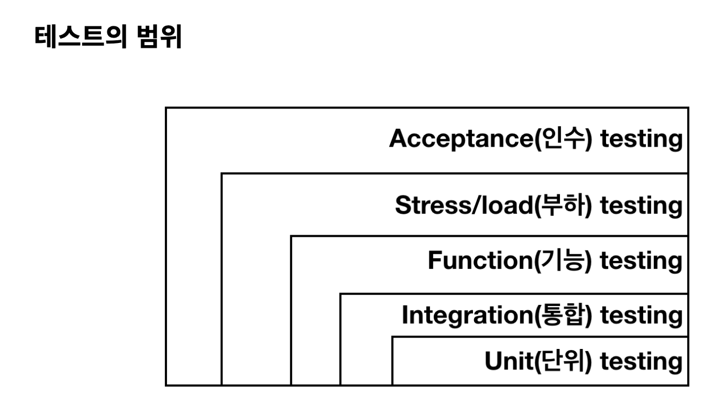

# Test

* 단위 테스트: 메소드 단위 테스트
* 통합 테스트: 여러 작업 단위가 연계된 워크 플로우 테스트(객체 간, 서비스 간, 시스템 간)
* 기능 테스트: 공개된 API의 가장 바깥쪽에 해당하는 코드 테스트(Controller, Security, http)
* 부하 테스트: 주어진 단위 시간 동안 어플리케이션이 얼마나 많은 요청을 처리할 수 있는지 검사
* 인수 테스트: 고객 또는 대리인이 정의되어진 모든 목적에 부합되는지 확인하는 테스트

# 단위 테스트

단위 테스트는 테스트 유형에 따라 논리 단위 테스트, 통합 단위 테스트 등으로 나눔

* 논리 단위 테스트 : 한 메서드에 집중한 테스트로 mock이나 stub을 이용해 테스트 메서드의 경계를 제어할 수 있습니다.
* 통합 단위 테스트 : 실제 운영 환경(혹은 그 일부, 또는 개발환경)에서 컴포넌트 간 연동에 치중한 테스트, 예를 들어 데이터베이스를 사용하는 코드라면 데이터베이스를 효과적으로 호출하여 유기적인 서비스 테스트

# 단위 테스트가 필요한 이유

* 전체적으로 말했을 때 유닛테스트는 버그를 줄이고 코드 퀄리티를 높이기 위해
* 단위 테스트는 메서드 단위의 테스트로 어플리케이션이 기대한 대로 **잘 동작함을 증명**
* **버그를 조기에 잡아내는 것을 기본 목적**
* 큰 프로젝트에서는 여러 컴포넌트를 각각 개발하는 경우
  - 단위 테스트를 사용한다면 연관 컴포넌트가 개발되지 않더라도 개발이 마무리 됬다고 증명
* Class 설계 변경에 대한 **리펙토링**이 일어날 때 정당성 부여 가능
* 단위 테스트는 **리펙토링에 의해 기존의 코드가 망가지지 않는다는 것을 보장**
* 구현 코드의 **예제 소스 역할** -> 문서화 기능

# 단위 테스트 작성 방법
* 버그를 찾는다.
  + 버그를 고쳤을 때 통과할만한 테스트를 작성
  + 테스트를 통과할 때까지 코드를 수정
* 새로운 기능이 동작할 때 통과할만한 테스트를 작성
  + 테스트가 통과할 때까지 코드를 수정 -> 리펙토링

---

# Spring boot Test 

## @WebMvcTest
* MVC를 위한 테스트, 컨트롤러가 예상되로 동작하는지 테스트
* @WebMvcTest 어노테이션을 사용시 하위 내용만 스캔하도록 제한(가벼운 테스팅 가능)
  - @Controller
  - @ControllerAdvice
  - @JsonComponent
  - Converter
  - GenericConverter
  - Filter
  - HandlerInterceptor
  - WebMvcConfigurer
* @MockBean, @MockMVC를 자동 구성하여 테스트
* 장점
  - Spring Security 지원
  - WebApplication 관련된 Bean들만 등록하기 때문에 통합 테스트 보다 빠름
  - 통합 테스트를 진행하기 어려운 테스트 진행 가능
* 단점
  - 요청부터 응답까지 모든 테스트를 Mock기반으로 테스트 하기 때문에 실제 환경에서는 제대로 동작하지 않을 있음

## @WebFluxTest
* 비동기-논블록킹 리액티브 개발에 사용되며 서비스간 호출이 많은 마이크로 아키텍처에 적합

## @DataJpaTest
* JPA 관련된 설정만 로드
* 설정이 정상적인지, JPA를 사용해서 데이터를 올바르게 조회,생성,수정,삭제 하는지 테스트
* @Entity 클래스를 스캔하여 스프링 데이터 JPA 저장소를 구성(다른 컴포넌트를 스캔하지 않음)
* @Transactional 어노테이션을 포함하고 있기 때문에 따로 선언하지 않아도 됨

## @RestClientTest
* @RestClientTest 를 사용하여 REST 클라이언트 테스트
* REST 통신의 JSON 형식이 예상대로 응답을 반환하는지 테스트
* Apache HttpClient나 Spring의 RestTemplate을 사용하여 외부 서버에 웹 요청을 보내는 경우에 이에 응답할 Mock서버를 만드는 것이라고 생각하면 됨

## @JsonTest
* @JsonTest 는 JSON serialization과 deserialization 테스트를 편하게 가능
* JSON의 직렬화, 역직렬화를 수행하는 라이브러리인 Gson과 Jackson의 테스트 제공
