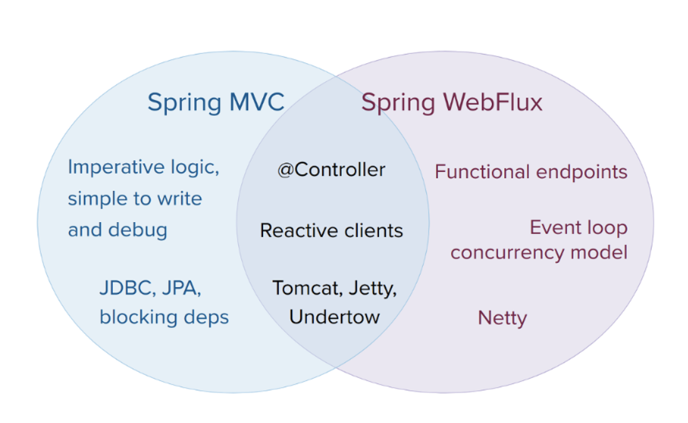
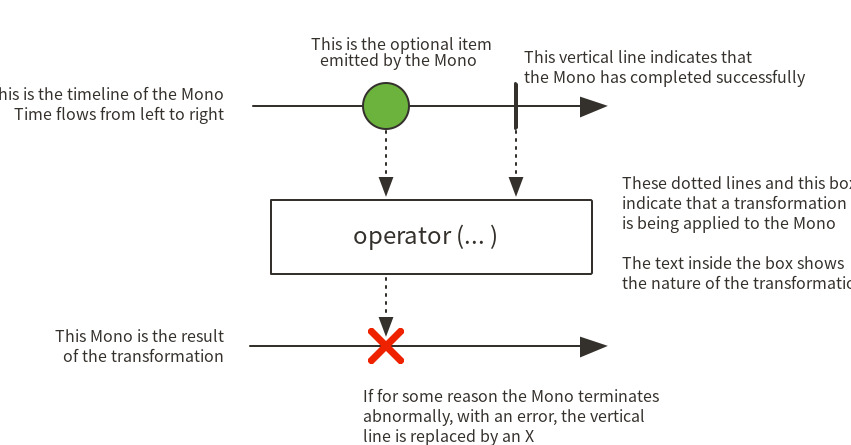
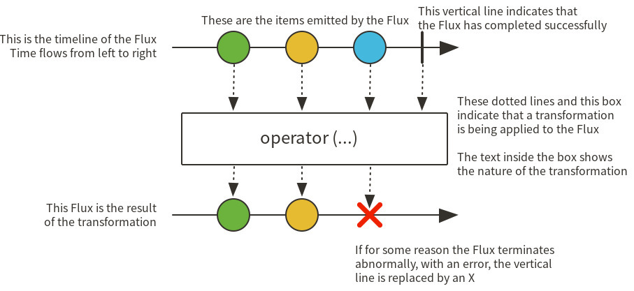

# Spring Boot WebFlux


* Spring 5에서 새롭게 추가된 모듈
* WebFlux는 클라이언트, 서버에서 `reactive` 스타일의 어플리케이션 개발을 도와주는 모듈
* `reactive-stack web framework` 이며, `non-blocking`을 지원하는 비동기 시스템과 `reactive stream`을 지원

* 기존의 서블릿 기반의 Spring Boot는 Tomcat 기반으로 동작
* 반면 Spring Boot WebFlux는 다양한 종류를 선택할 수 있으며, `Default: Netty`를 사용
  + `Netty`를 사용하는 이유: `Tomcat`은 요청 당 하나의 스레드가 동작하는 반면, `Netty`는 1개의 이벤트를 받는 스레드와 다수의 worker 스레드로 동작

## Netty 동작 방식
* Netty는 channel에서 발생하는 이벤트를 `EventLoop`가 처리하는 구조로 동작
  + `EventLoop`: 이벤트를 실행하기 위한 무한루프 스레드
  
  + 위 이미지와 같이 객체에서 발생한 이벤트는 이벤트 큐에 `Push`되고 이벤트 루프는 이벤트 큐에 입력된 이벤트가 있을 때 해당 이벤트를 꺼내서 실행
* 이벤트 루프는 지원하는 스레드의 종류에 따라서 단일 스레드와 다중 스레드 루프로 구성
  + 이벤트 루프가 처리한 이벤트의 결과를 돌려주는 방식에 따라 `콜백 패턴`과 `퓨처 패턴` 나누어지게 되고, `Netty`는 두 가지 패턴을 모두 지원
  + 싱글 스레드
    - 장점
    - 단일 스레드로 동작하기 떄문에 예측 가능한 동작을 보장
    - 이벤트 루프의 구현이 단순
    - 단점
    - 처리시간이 긴 작업이 들어오면 전체 작업 지연시간이 늘어남
    - 멀티 코어 cpu 환경에서 cpu 자원을 효율적으로 사용할 수 없다

  + 멀티 스레드
    - 장점
    - 싱글 스레드 이벤트 루프에 비해 프레임워크 구현이 복잡하지만, 스레드들이 이벤트 메서드를 병렬로 수행하기 떄문에 멀티 코어 cpu 자원을 효율적으로 사용
    - 단점
    - 여러 이벤트 스레드가 하나의 이벤트 큐에 접근하기 떄문에 동시성 문제가 발생할 수 있다.
    - 이벤트들이 병렬로 처리되기 때문에 이벤트의 발생순서와 실행 순서가 일치 하지 않는다.

* `Netty`에서는 멀티 스레드 이벤트 루프의 단점인 발생 순서와 실행 순서가 일치하지 않는다는 문제를 아래와 같은 방법으로 해결한다.
  + `Netty`의 이벤트는 `Channel`에서 발생
  + 각가의 이벤트 루프 객체는 개인의 이벤트 큐를 가지고 있습니다.
  + `Netty Channel`은 하나의 이벤트 루프에 등록
  + 하나의 이벤트 루프 스레드에는 여러 채널이 등록될 수 있습니다.
* 멀티 스레드 이벤트 모델에서 이벤트 실행 순서가 일치하지 않는 이유는 루프들이 이벤트 큐를 공유하기 때문에 발생
  + 따라서 `Netty`는 이벤트 큐를 이벤트 루프 스레드 내부에 둠으로써 실행 순서의 불일치 원인을 제거
  + 즉 이벤트 루프 스레드마다 개인의 이벤트 큐를 가짐으로써, 해당 이벤트를 처리하는 스레드가 지정되어 있기 때문에, 공유된 하나의 이벤트 큐에 스레드들이 접근하지 않게 된다.


## Spring MVC vs WebFlux



Spring MVC와 WebFlux의 공통점은 @Controller, Reactive 클라이언트입니다. 둘 다 Tomcat, Jetty, Undertow와 같은 서버에서 실행할 수 있습니다. Spring MVC에서는 명령형 논리, JDBC, JPA를 가질 수 있습니다. Spring WebFlux에서는 기능적 엔드 포인트, 이벤트 루프, 동시성 모델을 가질 수 있습니다. Spring WebFlux는 Netty 서버에서 실행할 수 있다는 장점이 있습니다.


(Webflux 는 Asynchronous Non-blocking I/O 을 방식을 활용하여 성능을 끌어 올릴 수 있는 장점이 있다. 그런데 이 말은 즉, Non Blocking 기반으로 코드를 작성해야 한다. 만약 Blocking 코드가 있다면 Webflux를 사용하는 의미가 떨어지게 된다. 얼마 전까지는 Java 진영에 Non Blocking 을 지원하는 DB Driver가 없었지만, 최근에 R2DBC 가 릴리즈되어 이제는 Java 에서도 Non Blocking 으로 DB 를 접근할 수 있게 되었다.)


## Mono와 Flux 개념

* Spring WebFlux에서 사용하는 reactive library가 `Reactor`
  + `Reactor`는 `Reactive Streams` 구현체.
* WebFlux의 동작 구조를 이해하려면, `Mono`와 `Flux`를 알아야 한다.
  + Flux: 0 ~ N 개의 데이터 전달
  + Mono: 0 ~ 1 개의 데이터 전달


### Mono

`Mono`는 `Reactive Streams` 의 `Publisher` 인터페이스를 구현하는 구현체로, 0 ~ 1개의 데이터를 처리


```java
Mono.fromCallable(System::currentTimeMillis)
  .flatMap(time -> Mono.first(serviceA.findRecent(time), serviceB.findRecent(time)))
  .timeout(Duration.ofSeconds(3), errorHandler::fallback)
  .doOnSuccess(r -> serviceM.incrementSuccess())
  .subscribe(System.out::println);
````

### Flux

`Flux`는 `Reactive Streams`의 `Publisher` 인터페이스의 구현체로서, 0 ~ N 개의 데이터를 발행(전달, 방출) 한다.

* 하나의 데이터를 전달할 때마다, `onNext` 이벤트를 발생
* Flux 내의 모든 데이터의 전달 처리가 완료되면, `onComplete` 이벤트가 발생
* Flux 내의 모든 데이터의 전달 처리 도중 오류가 발생하면 `onError` 이벤트가 발생




```java
Flux.fromIterable(getSomeLongList())        
  .mergeWith(Flux.interval(100))
  .doOnNext(serviceA::someObserver) .map(d -> d * 2)
  .take(3)
  .onErrorResume(errorHandler::fallback)
  .doAfterTerminate(serviceM::incrementTerminate)
  .subscribe(System.out::println);
```

# DataBuffer

* DataBufferFactory: 데이터 베퍼의 할당(allocation)과 랩핑(wrapping)을 제공하는 데이터 버퍼의 팩토리(인터페이스)
* DataBuffer: 데이터 버퍼에 대한 추상화
* DataBufferUtils: 데이터 버퍼를 위한 유틸리티 메서드

## DataBufferFactory
[DataBufferFactory](https://docs.spring.io/spring-framework/docs/current/javadoc-api/org/springframework/core/io/buffer/DataBufferFactory.html)는 데이터 버퍼를 생성하기 위한 인터페이스

* 데이터 버퍼를 생성하는 2가지 방법
  1. [allocateBuffer](https://docs.spring.io/spring-framework/docs/current/javadoc-api/org/springframework/core/io/buffer/DataBufferFactory.html#allocateBuffer-int-) 메서드를 이용해서 새로운 데이터 버퍼를 할당
    * 사이즈(capacity)를 명시하지 않으면 동적으로(on-demand) 사이즈가 변경될 수 있는데, 생성 단계에서 사이즈를 지정해주는게 더 효율적
  2. [wrap](https://docs.spring.io/spring-framework/docs/current/javadoc-api/org/springframework/core/io/buffer/DataBufferFactory.html#wrap-byte:A-) 메서드를 이용하여 이미 존재하는 `byte array`나 `ByteBuffer`를 랩핑

> 참고로 WebFlux 애플리케이션은 DataBufferFactory를 직접 생성하지 않고, 클라이언트 측의 ClientHttpRequest나 ServerHttpResponse를 통해 접근
> 팩토리의 타입은 Reactor Netty의 NettyDataBufferFactory이나 DefaultDataBufferFactory 처럼 클라이언트나 서버에 의존적이다.

## DataBuffer
[DataBuffer](https://docs.spring.io/spring-framework/docs/current/javadoc-api/org/springframework/core/io/buffer/DataBuffer.html) 인터페이스는 ByteBuffer와 유사한 연산을 제공하지만, Netty의 ByteBuf에서 영감을 얻은 몇가지를 추가로 제공

* 독립적인 위치에서 Read, Write가 가능
  + 즉 Read, Write를 번갈아 수행하기 위해 `flip()` 메서드를 호출할 필요가 없다
* 자바의 StringBuilder 처럼 요청시 용량(capacity)이 확장
* PooledDataBuffer를 통한 레퍼런스 카운팅(referentce counting)과 풀링된 버퍼(Pooled buffers)
* 버퍼를 ByteBuffer, InputStream또는 OutputStream으로 바라본다
* 주어진 바이트에 대한 index 또는 마지막 index를 결정한다.
