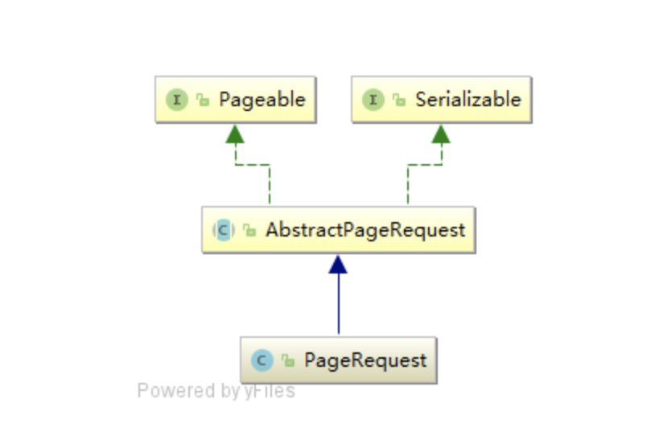

# JPA Page Request

[JPA Page Request 정리](https://velog.io/@conatuseus/JPA-Paging-%ED%8E%98%EC%9D%B4%EC%A7%80-%EB%82%98%EB%88%84%EA%B8%B0-o7jze1wqhj)

몇 페이지, 한 페이지의 사이즈, Sorting 방법(Option)을 가지고,
Repository에 Paging을 요청할 때 사용하는 것

# PageRequest 구조

위와 같이 인터페이스인 Pageable과 Serializable을 implements하는 AbstractPageRequest라는 추상 클래스가 있다.
그리고 PageRequest class는 이 AbstractPageRequest를 상속한다.

# Pagerequest 생성자

PageRequest의 생성에는 찾을 page와 한 페이지의 size를 필수 인자로 받는다.
그리고 정렬해서 paging을 하는 경우에, Sort를 생성자 인자로 추가해서 PageRequest를 생성할 수 있다.
아래는 PageRequest class의 생성자 코드.
현재 다른 생성자들은 deprecated되고,
가장 아래 코드에서 보이는 정적 팩토리 메서드로 생성해야 한다. (of 메서드)
