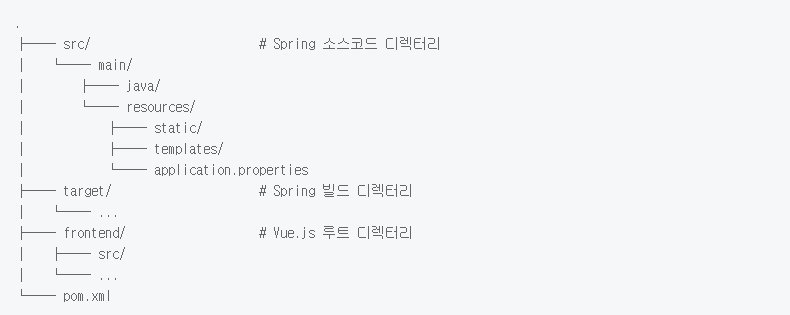

# Spring Boot

개발환경 구성

## Spring Boot + Vue.js 연동

### 프로젝트 구조

Vue.js 파일들을 관리의 편의성을 위해 frontend 디렉터리 하위에 두어 Spring 파일들과 분리시켜 줍니다. Vue.js를 신규 셋팅을 하는 상황이라면, vue-cli를 이용하여 vue init webpack frontend와 같이 명령어를 입력하시면 됩니다. Vue.js 개발환경 셋팅에 대한 자세한 내용은 [vue-cli] Webpack 템플릿으로 vue.js 개발환경 구축하기를 참조하세요.
