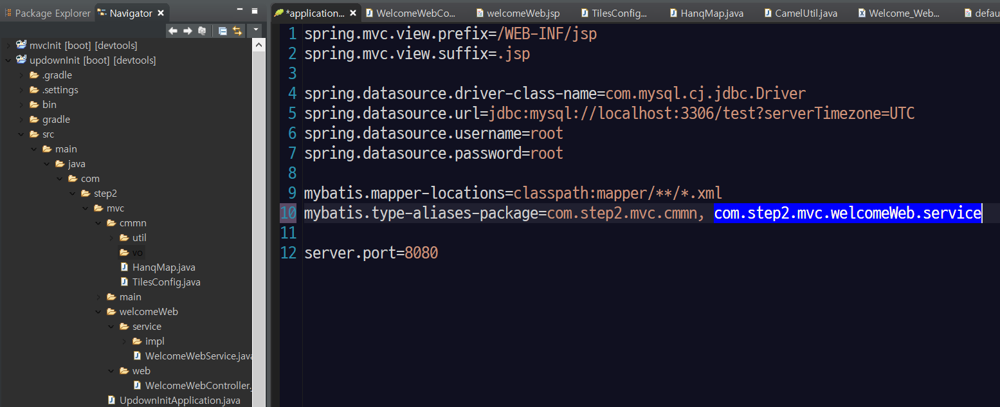
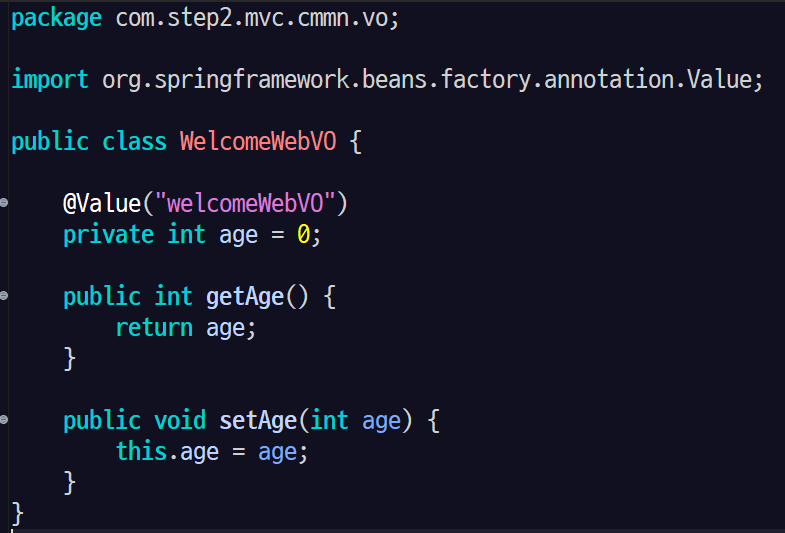

# STS (Spring Tool Suite) Framework

# First Web Start Path Setiing

```java
@RequestMapping({"/main.do", "/"})
public String initMain() throws Exception{

  return "main/main.tiles";
}
```
@RequestMapping을 이용해 초기 URL설정 혹은 여러 URL의 경로를 맵핑할 수 있다.(STS, Egov)


# STS VO Setting


STS에서는 VO관리를 EgovFramework처럼 사용하려면, VO 클래스 하나 생성 할 때마다, 위와 같이 mybatis 경로를 설정해 줘야 한다.

> STS에서 이런 반복적인 일을 줄이기 위해서 공통 폴더에 VO 관리 폴더를 생성하여 VO들을 하나로 관리한다.
> 




Egovframework와 다르게 VO를 만들었을때, @Value 어노테이션을 사용하여, VO 클래스에 별칭을 주입시켜 준다.

```java
package com.step2.mvc.cmmn.vo;

import org.springframework.beans.factory.annotation.Value;

public class WelcomeWebVO {

	@Value("welcomeWebVO")
	private int age = 0;

	public int getAge() {
		return age;
	}

	public void setAge(int age) {
		this.age = age;
	}
}
```
