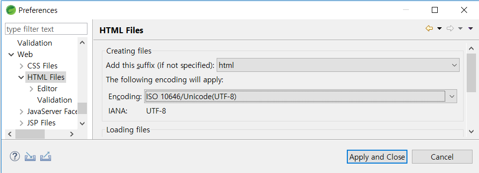
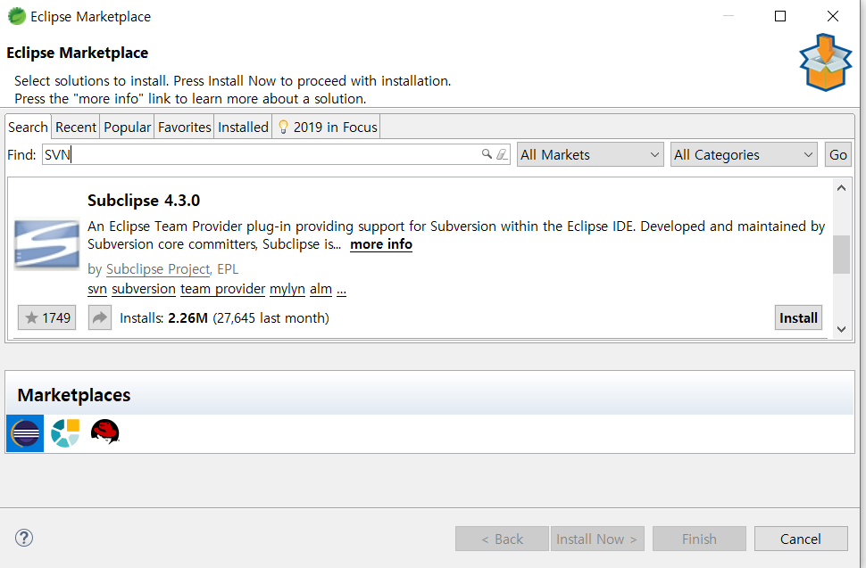
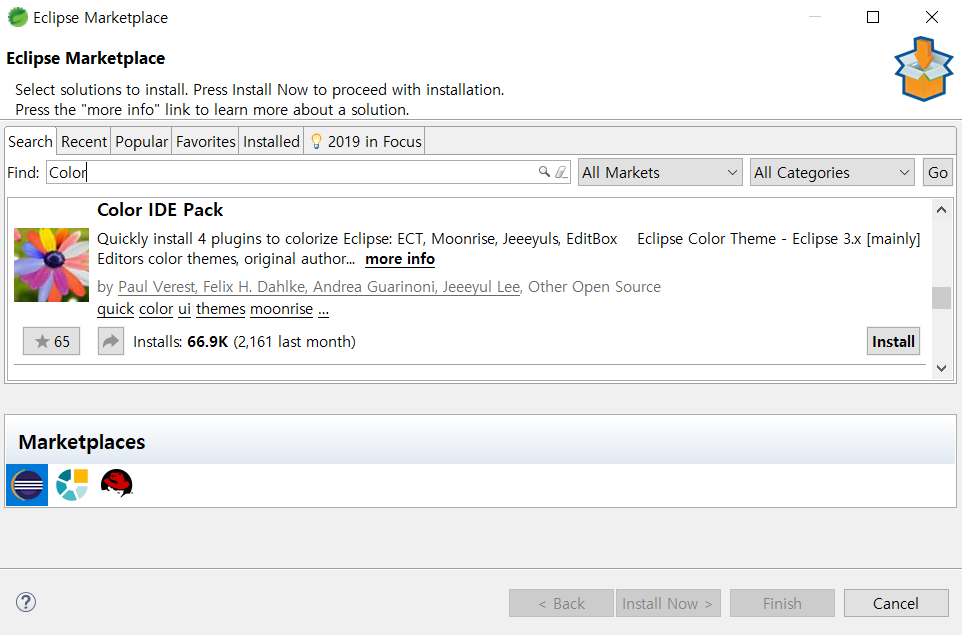
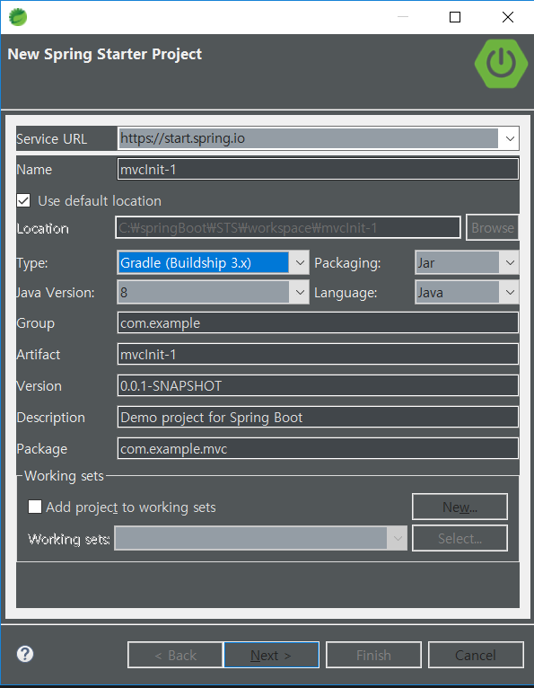

# Install And First Init Setting

  * **Check Java Version**
  
  * characters Set UTF-8
      + Workspace
      
      + CSS
      
      + HTML
      
      + JSP
      
  * SVN Install & Connect - Subclipse 4.3.0
  
  * Mavin Location Setting
  

  * Color Theme Install
  


# New project

  * Gradle Nature New Project
  

  * Gradle Config Setting

  ```JavaScript
    plugins {id 'org.springframework.boot' version '2.1.5.RELEASE'
  	id 'java'
    }

    apply plugin: 'io.spring.dependency-management'

    group = 'com.example'
    version = '0.0.1-SNAPSHOT'
    sourceCompatibility = '1.8'

    configurations {
    	developmentOnly
    	runtimeClasspath {
    		extendsFrom developmentOnly
    	}
    }

    repositories {
    	mavenCentral()
    }

    dependencies {
    	implementation 'org.springframework.boot:spring-boot-starter-web'
    	implementation 'org.springframework.boot:spring-boot-starter-web-services'
    	implementation 'org.mybatis.spring.boot:mybatis-spring-boot-starter:2.0.1'
    	developmentOnly 'org.springframework.boot:spring-boot-devtools'
    	runtimeOnly 'mysql:mysql-connector-java'
    	testImplementation 'org.springframework.boot:spring-boot-starter-test'
    	compile group: 'org.apache.tomcat.embed', name: 'tomcat-embed-jasper', version: '9.0.19'
    	compile group: 'javax.servlet', name: 'jstl', version: '1.2'
    	compile group: 'org.apache.tiles', name: 'tiles-servlet', version: '3.0.8'
    	compile group: 'org.apache.tiles', name: 'tiles-extras', version: '3.0.8'
    	compile group: 'org.apache.tiles', name: 'tiles jsp', version: '3.0.8'
    }

  ```

  * application.properties Setting(DB.Connection, JSP Setting)
  
  ```java
  spring.mvc.view.prefix=/WEB-INF/jsp
  spring.mvc.view.suffix=.jsp

  spring.datasource.driver-class-name=com.mysql.cj.jdbc.Driver
  spring.datasource.url=jdbc:mysql://localhost:3306/test?serverTimezone=UTC
  spring.datasource.username=root
  spring.datasource.password=root

  mybatis.mapper-locations=classpath:mapper/**/*.xml
  ```


# Visual Studio Code Theme

[추천 테마 카테고리 별 정리 사이트](https://vscodethemes.com/)
