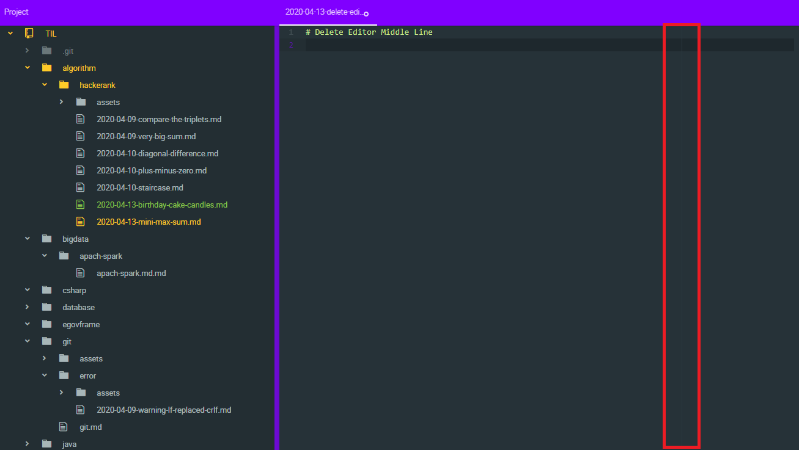
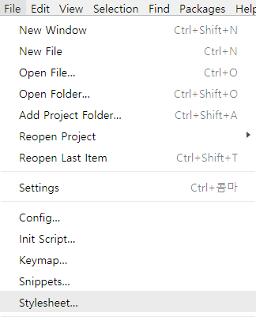
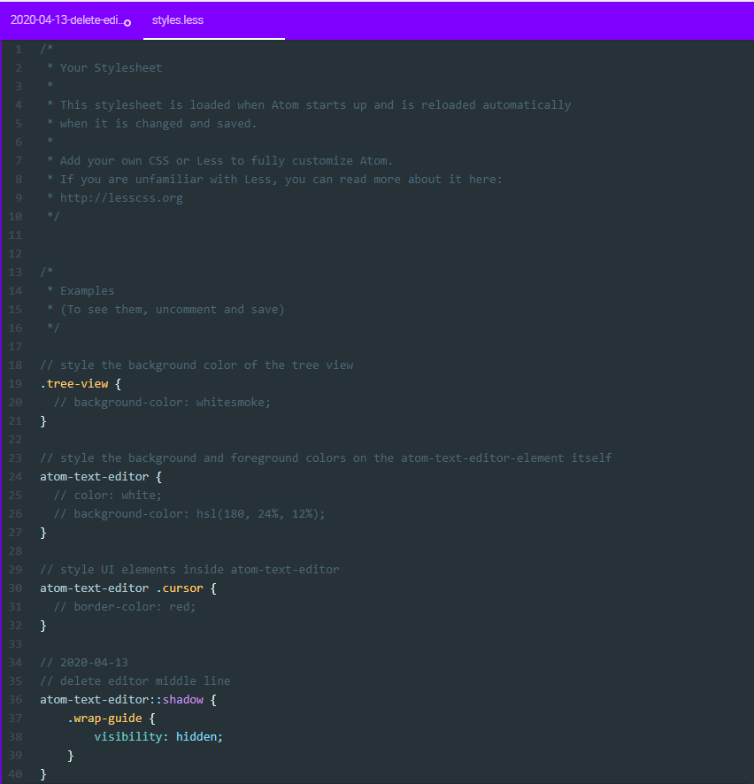

# Delete Editor Middle Line

아톰 에디터를 설치해서 사용하는데 가운데에 용도를 모를 선이 있습니다.
사용하는데 은근히 불편함을 느껴서 제거하는 방법을 찾아 정리했습니다.



## Menu - File - Stylesheet

아톰 에디터의 스타일를 설정할 수 있습니다.


아래 코드를 추가하면 가운데 선을 제거 할 수 있습니다.

```less
atom-text-editor::shadow {
    .wrap-guide {
        visibility: hidden;
    }
}
```


