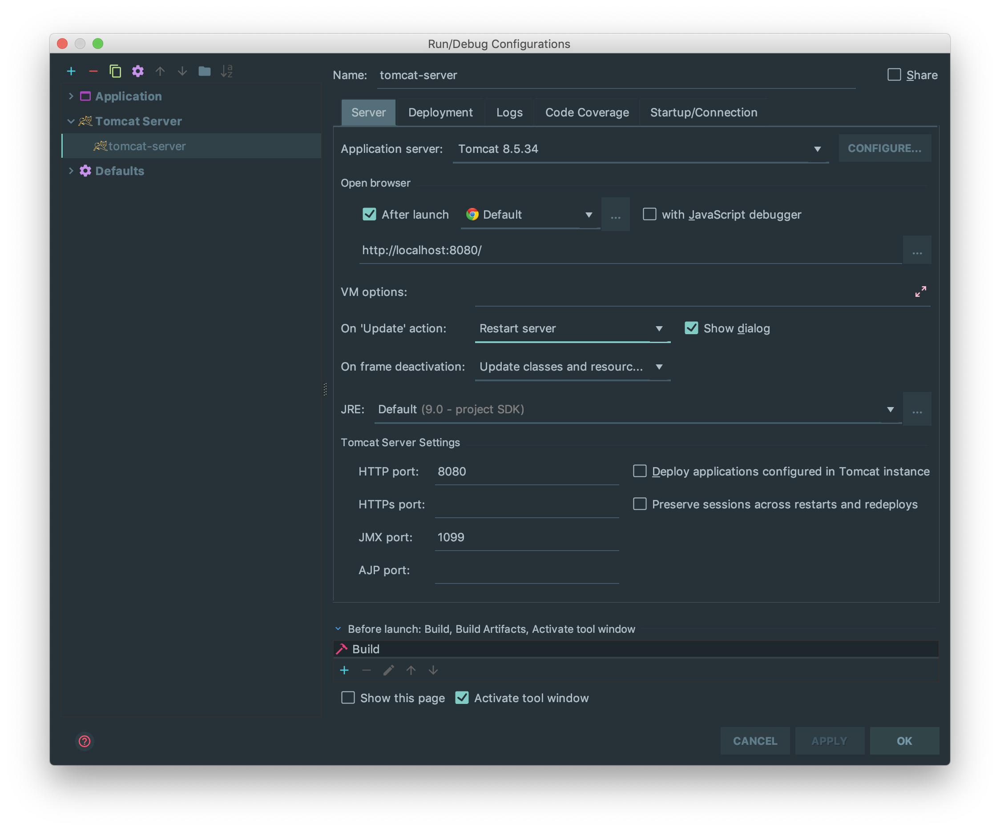

# Jsp Resource Update ERROR

* Spring jsp 파일을 수정했는데 자동으로 브라우저에 반영되지 않는 경우
* IntelliJ에서 resource 파일 변경이 반영되지 않는 경우

## Setting

1. Run > Edit Configurations

> Server tab > On frame deactivation : Update classes and resources

2. Restart Server
 수정한 클래스나 JSP 파일이 자동으로 반영된다.
