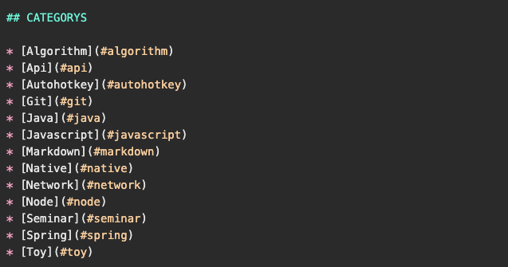
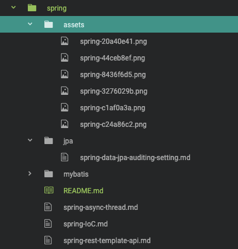
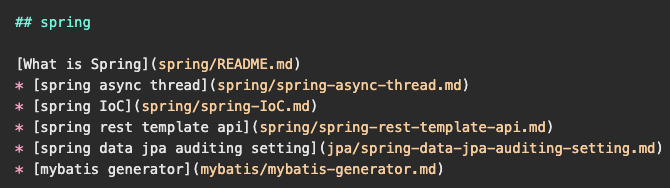

# TIL README GENERATOR

Create Generate README.md about Markdown

TIL Project Folder List

## Features

- Create Mardown Language TIL README FIle.
- ⚡️ **It's FAST** - 20~100x times faster.

# Create Rules

* Directory would be lowercase only.
* Follow GFM(Github Flavored Markdown)
* Cannot include `\, /, *, ?, ", <, >, |`, (space character), `,`, `#`
* Include the date in the file name.

## Create Categorys

## Create Projects List

## Generate Markdown Project List

## 📝 License

Copyright © 2021 [charllossDev](https://github.com/charllossDev). 
This project is [MIT](https://opensource.org/licenses/MIT) licensed.
