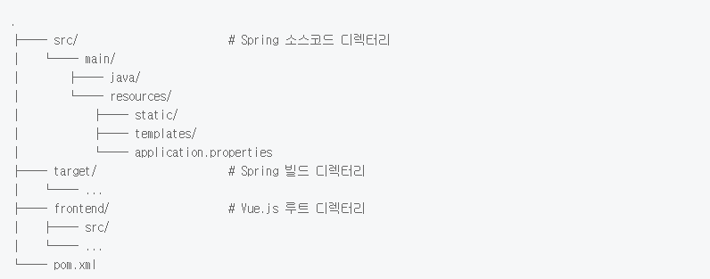
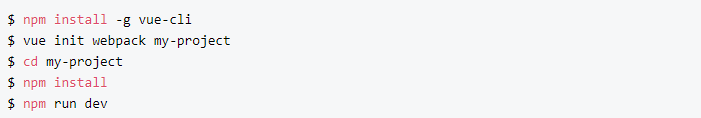
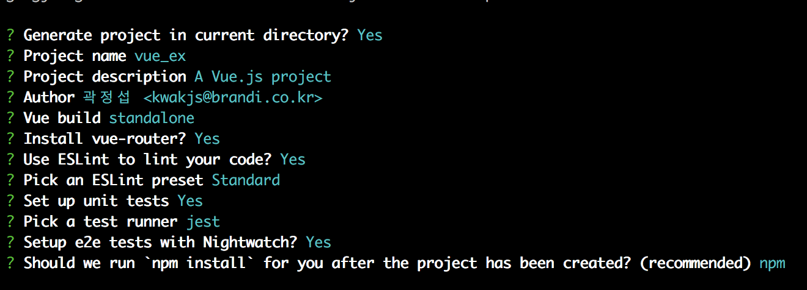
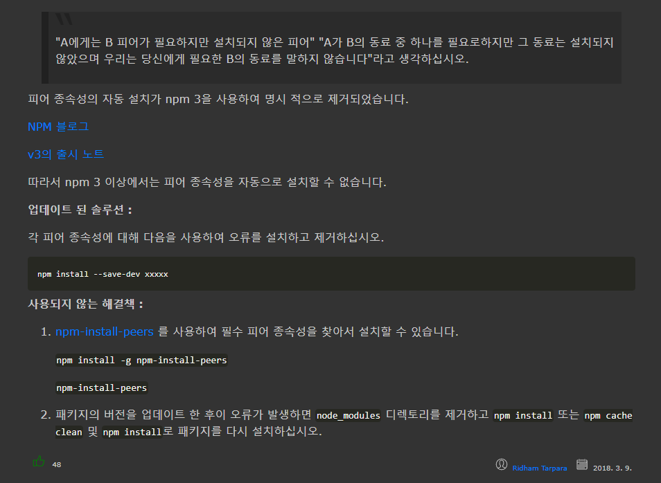

# Spring Boot + Vue.js 연동

## Vue Cli
Vue CLI는 React의 `create-react-app`처럼 Vue 프로젝트를 손쉽게 만들 수 있도록 도와주는 커맨드 라인 도구 입니다.

현재 Vue Cli 버전은 2가지
* Vue-Cli 2
* Vue-Cli 3

### 프로젝트 구조



Vue.js 파일들을 관리의 편의성을 위해 frontend 디렉터리 하위에 두어 Spring 파일들과 분리시켜 줍니다. Vue.js를 신규 셋팅을 하는 상황이라면, vue-cli를 이용하여 vue init webpack frontend와 같이 명령어를 입력하시면 됩니다. Vue.js 개발환경 셋팅에 대한 자세한 내용은 [vue-cli] Webpack 템플릿으로 vue.js 개발환경 구축하기를 참조하세요.

# vue Cli 3

### Vue Cli 3 Install

> 2020.01.03 Vue Cli 2 버전이 오래되어서 vue 프로젝트 생성 후 빌드가 되지 않는 오류가 생김(Mac)

Vue Cli 3
Vue CLI 패키지 이름이 바뀌었습니다.
기존 Vue CLI 2는 `vue-cli` 였는데, 이번 Vue CLI 3는 `@vue/cli`라는 새로운 패키지 이름을 사용하고 있습니다.
참고로 @ 마크는 NPM에 최근에 도입된 Scoped package를 의미합니다.

먼저 기존에 Vue CLI 2를 사용하고 있었다면,
vue라는 커맨드의 네임스페이스가 꼬일지도 모르니 Vue CLI 2를 제거하겠습니다.

```node
1 $ npm r -g vue-cli
```

그리고 Vue CLI 3를 전역으로 설치합니다.

```ruby
1 $ npm i -g @vue/cli
2 $ vue --version
3 3.0.0
```

### Vue Project Init

```ruby
$ vue create hello-vue-cli
Vue CLI v3.0.0
? Please pick a preset: (Use arrow keys)
❯ default (babel, eslint)
  Manually select features
```


---
# Vue Cli 2

### Vue Cli 2 Install




### Vue Project Init
```ruby
# 해당 프로젝트 폴더에서 실행
$ vue init webpack

# 현재 디렉토리에서 프로젝트 생성 여부
? Generate project in current directory? (Y/n)
# 프로젝트 이름
? Project name (vue_ex)
# 프로젝트 설명
? Project description (A Vue.js project)
# 프로젝트 작성자
? Author (곽정섭 <kwakjs@brandi.co.kr>)
# 빌드 방식
? Vue build (Use arrow keys)
# vue-router를 설치 여부
? Install vue-router? (Y/n)
# 코드를 보완하기 위해 ESLint를 사용 여부
? Use ESLint to lint your code? (Y/n)
# ESLint 사전 설정 선택
? Pick an ESLint preset (Use arrow keys)
# 단위 테스트 섧정
? Set up unit tests (Y/n)
# 테스트 러너 선택
? Pick a test runner (Use arrow keys)
# Nightwatch로 e2e 테스트를 설정 여부
? Setup e2e tests with Nightwatch? (Y/n)
# 프로젝트가 생성 된 후에`npm install`을 실행해야합니까?
? Should we run `npm install` for you after the project has been created? (recommended) (Use arrow keys)
```







## Vue Example Git Site

```ruby
vue.js + spring boot app
https://github.com/jonashackt/spring-boot-vuejs


https://github.com/boylegu/SpringBoot-vue


https://github.com/kucharzyk/vuejs-java-starter


https://github.com/jamesjieye/vuejs.spring-boot


Spring Boot and Vue.js
https://randyyaj.github.io/post/20161129_vue_spring/


Spring Boot 와 Vue.js 연동하여
https://www.gitbook.com/book/c774c9c0d658/springboot-vue-js/details


Creating a blog with Spring Boot and Vue.js
https://www.youtube.com/watch?v=yRfivQ90vcs
```
